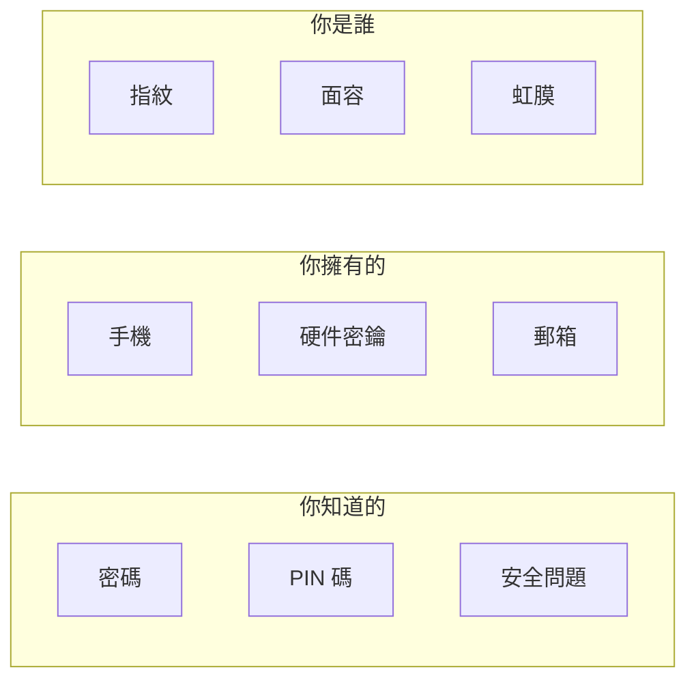

# 6.2.5 多因素認證：增強賬戶安全性

## 一句話破題

多因素認證（MFA）通過要求多種驗證方式，即使密碼泄露，攻擊者也無法登錄賬戶。

## 認證因素的三種類型



**MFA 要求至少使用兩種不同類型的因素。**

## 常見 MFA 方案對比

| 方案 | 安全性 | 用戶體驗 | 實現難度 |
|------|--------|----------|----------|
| TOTP（驗證器應用） | ⭐⭐⭐⭐ | ⭐⭐⭐ | 中等 |
| 短信驗證碼 | ⭐⭐ | ⭐⭐⭐⭐ | 簡單 |
| 郵箱驗證碼 | ⭐⭐ | ⭐⭐⭐ | 簡單 |
| 硬件密鑰（WebAuthn） | ⭐⭐⭐⭐⭐ | ⭐⭐⭐⭐ | 複雜 |
| 推送通知 | ⭐⭐⭐⭐ | ⭐⭐⭐⭐⭐ | 複雜 |

## TOTP 實現

TOTP（Time-based One-Time Password）是最常用的 MFA 方案：

### 1. 安裝依賴

```bash
npm install otplib qrcode
```

### 2. 生成密鑰

```typescript
import { authenticator } from 'otplib'
import QRCode from 'qrcode'

async function setupTOTP(userId: string, email: string) {
  // 生成密鑰
  const secret = authenticator.generateSecret()
  
  // 保存密鑰到數據庫（加密存儲）
  await db.user.update({
    where: { id: userId },
    data: { totpSecret: encrypt(secret) }
  })
  
  // 生成二維碼供用戶掃描
  const otpauth = authenticator.keyuri(email, 'YourAppName', secret)
  const qrCodeUrl = await QRCode.toDataURL(otpauth)
  
  return { qrCodeUrl, secret }
}
```

### 3. 驗證 TOTP

```typescript
import { authenticator } from 'otplib'

async function verifyTOTP(userId: string, token: string) {
  const user = await db.user.findUnique({ where: { id: userId } })
  const secret = decrypt(user.totpSecret)
  
  const isValid = authenticator.verify({
    token,
    secret,
  })
  
  return isValid
}
```

### 4. 登錄流程集成

```typescript
async function login(email: string, password: string, totpToken?: string) {
  // 第一步：驗證密碼
  const user = await verifyPassword(email, password)
  if (!user) throw new Error('密碼錯誤')
  
  // 第二步：如果啓用了 MFA，驗證 TOTP
  if (user.totpEnabled) {
    if (!totpToken) {
      return { requireMFA: true }
    }
    
    const isValidTOTP = await verifyTOTP(user.id, totpToken)
    if (!isValidTOTP) {
      throw new Error('驗證碼錯誤')
    }
  }
  
  // 登錄成功
  return createSession(user)
}
```

## 恢復碼

如果用戶丟失了手機，需要恢復碼作爲備份：

```typescript
function generateRecoveryCodes(count = 10) {
  const codes: string[] = []
  for (let i = 0; i < count; i++) {
    // 生成 8 位隨機恢復碼
    codes.push(crypto.randomBytes(4).toString('hex').toUpperCase())
  }
  return codes
}

// 用戶設置 MFA 時生成並顯示恢復碼
// 恢復碼使用後即失效
```

## 安全建議

### 防止暴力破解

```typescript
const MAX_ATTEMPTS = 5
const LOCKOUT_DURATION = 15 * 60 * 1000 // 15 分鐘

async function verifyWithRateLimit(userId: string, token: string) {
  const attempts = await getLoginAttempts(userId)
  
  if (attempts >= MAX_ATTEMPTS) {
    throw new Error('嘗試次數過多，請稍後再試')
  }
  
  const isValid = await verifyTOTP(userId, token)
  
  if (!isValid) {
    await incrementLoginAttempts(userId)
  } else {
    await resetLoginAttempts(userId)
  }
  
  return isValid
}
```

### 敏感操作重新驗證

```typescript
async function sensitiveAction(session: Session, totpToken: string) {
  // 即使已登錄，敏感操作也要求重新驗證 MFA
  const isValid = await verifyTOTP(session.userId, totpToken)
  
  if (!isValid) {
    throw new Error('請驗證身份')
  }
  
  // 執行敏感操作...
}
```

::: tip MFA 實現檢查清單
1. [ ] TOTP 密鑰加密存儲
2. [ ] 生成足夠數量的恢復碼
3. [ ] 實現登錄嘗試限制
4. [ ] 敏感操作要求重新驗證
5. [ ] 提供禁用 MFA 的安全流程
:::
