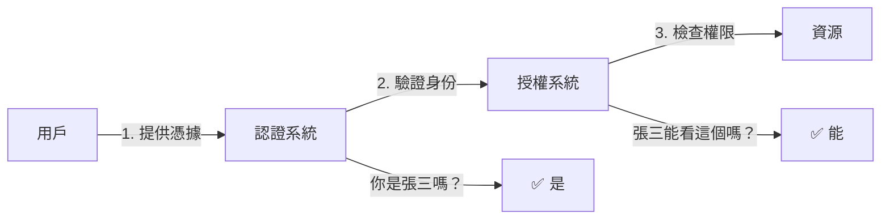

# 6.2 你是誰與你能做什麼——認證與授權安全

## 認知重構：認證與授權的本質區別

很多人把"認證"和"授權"混爲一談，但它們解決的是完全不同的問題：

- **認證（Authentication）**：驗證"你是誰"——確認用戶身份的真實性
- **授權（Authorization）**：判斷"你能做什麼"——決定用戶可以訪問哪些資源



## 爲什麼需要關注認證安全

認證是整個安全體系的第一道防線。如果認證被突破：

- 攻擊者可以冒充任意用戶
- 所有後續的授權檢查都失去意義
- 用戶數據面臨泄露風險

## 本節內容

| 小節 | 核心問題 | 你將學會 |
|------|----------|----------|
| 6.2.1 JWT 安全 | Token 被盜怎麼辦？ | 密鑰管理、過期策略、刷新機制 |
| 6.2.2 Session 安全 | Session 如何防劫持？ | 安全存儲、傳輸加密、固定攻擊防護 |
| 6.2.3 Cookie 安全 | Cookie 怎麼設置才安全？ | HttpOnly/Secure/SameSite 屬性詳解 |
| 6.2.4 OAuth 2.0 安全 | OAuth 流程有哪些風險？ | 授權碼模式、PKCE、state 參數 |
| 6.2.5 多因素認證 | 密碼不夠安全怎麼辦？ | TOTP、短信驗證、硬件密鑰 |

## 認證方案對比

| 方案 | 適用場景 | 優點 | 缺點 |
|------|----------|------|------|
| **Session** | 傳統 Web 應用 | 服務端可控、即時失效 | 需要存儲、擴展性差 |
| **JWT** | 微服務、API | 無狀態、易擴展 | 無法即時撤銷 |
| **OAuth 2.0** | 第三方登錄 | 標準協議、用戶體驗好 | 實現複雜 |

## 安全設計原則

### 1. 縱深防禦

不要只依賴一層防護：

```typescript
// 多層驗證
async function protectedAction(request: Request) {
  // 第一層：驗證 Token 有效性
  const token = await verifyToken(request)
  
  // 第二層：驗證用戶狀態
  const user = await getUser(token.userId)
  if (user.status !== 'active') throw new Error('賬號已禁用')
  
  // 第三層：驗證操作權限
  if (!user.permissions.includes('write')) {
    throw new Error('無權執行此操作')
  }
}
```

### 2. 最小權限

只授予必要的權限：

```typescript
// ❌ 過度授權
const token = jwt.sign({ 
  userId, 
  role: 'admin',  // 太寬泛
  permissions: ['*']  // 危險
})

// ✅ 最小權限
const token = jwt.sign({
  userId,
  permissions: ['posts:read', 'posts:write']  // 具體權限
})
```

### 3. 安全默認

默認拒絕，顯式允許：

```typescript
// ❌ 默認允許
function checkPermission(user, resource) {
  if (resource.isRestricted) {
    return user.hasAccess(resource)
  }
  return true  // 默認允許
}

// ✅ 默認拒絕
function checkPermission(user, resource) {
  if (resource.isPublic) {
    return true
  }
  return user.hasAccess(resource)  // 默認需要驗證
}
```

## AI 協作提示

在讓 AI 幫你實現認證功能時，務必強調：

- "使用 HttpOnly 和 Secure 標誌設置 Cookie"
- "JWT 過期時間設置爲較短時間，並實現 refresh token 機制"
- "對敏感操作要求重新驗證身份"
- "實現登錄失敗次數限制"

::: warning 審查要點
AI 生成的認證代碼，重點檢查：
1. 密鑰是否硬編碼？
2. Token 過期時間是否合理？
3. 錯誤信息是否泄露敏感信息？
4. 是否有防暴力破解機制？
:::
