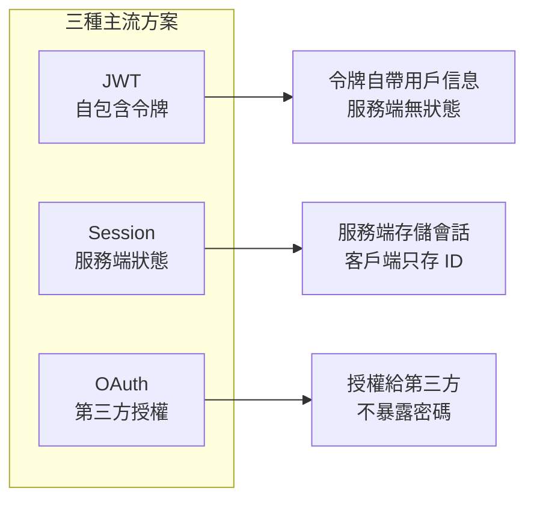
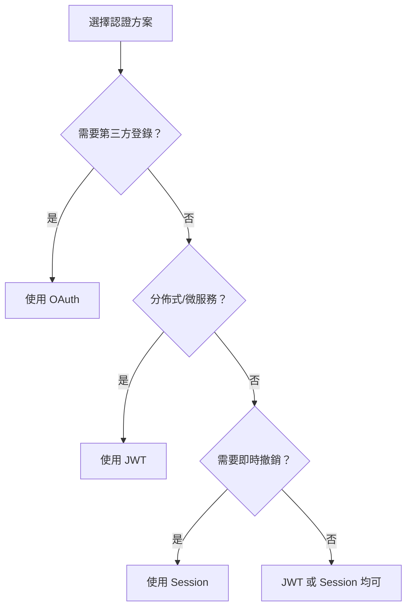

# 6.3.1 認證與授權：JWT/Session/OAuth 選擇與實現

## 本質還原

API 認證的核心問題只有一個：**這個請求是誰發的？** 不同的認證方案，本質上是用不同的方式回答這個問題。



## 三種方案的本質差異

| 方案 | 狀態存儲 | 適用場景 | 撤銷難度 |
|------|----------|----------|----------|
| **JWT** | 客戶端（令牌自包含） | 分佈式系統、微服務 | 困難 |
| **Session** | 服務端（內存/Redis） | 單體應用、需要即時撤銷 | 簡單 |
| **OAuth** | 授權服務器 | 第三方登錄、開放 API | 中等 |

## JWT 實現

JWT 把用戶信息編碼在令牌中，服務端無需查詢數據庫即可驗證身份。

```typescript
// lib/jwt.ts
import { SignJWT, jwtVerify } from 'jose'

const secret = new TextEncoder().encode(process.env.JWT_SECRET!)

export async function signToken(payload: { userId: string; role: string }) {
  return new SignJWT(payload)
    .setProtectedHeader({ alg: 'HS256' })
    .setIssuedAt()
    .setExpirationTime('15m')
    .sign(secret)
}

export async function verifyToken(token: string) {
  const { payload } = await jwtVerify(token, secret)
  return payload
}
```

```typescript
// API 路由中驗證
export async function GET(request: Request) {
  const token = request.headers.get('Authorization')?.replace('Bearer ', '')
  
  if (!token) {
    return Response.json({ error: '未提供令牌' }, { status: 401 })
  }
  
  try {
    const payload = await verifyToken(token)
    // 繼續處理業務邏輯
    return Response.json({ userId: payload.userId })
  } catch {
    return Response.json({ error: '令牌無效' }, { status: 401 })
  }
}
```

## Session 實現

Session 方案將狀態存儲在服務端，客戶端只持有一個 Session ID。

```typescript
// 使用 iron-session 實現
import { getIronSession } from 'iron-session'
import { cookies } from 'next/headers'

interface SessionData {
  userId?: string
  role?: string
}

export async function getSession() {
  return getIronSession<SessionData>(await cookies(), {
    password: process.env.SESSION_SECRET!,
    cookieName: 'session',
    cookieOptions: {
      httpOnly: true,
      secure: process.env.NODE_ENV === 'production',
      sameSite: 'lax',
      maxAge: 60 * 60 * 24 * 7, // 7 天
    },
  })
}

// 登錄時設置 session
export async function login(userId: string, role: string) {
  const session = await getSession()
  session.userId = userId
  session.role = role
  await session.save()
}

// 登出時銷燬 session
export async function logout() {
  const session = await getSession()
  session.destroy()
}
```

## 如何選擇？



### 決策清單

- **選 JWT**：無服務器函數（Vercel/Cloudflare Workers）、多服務共享認證
- **選 Session**：傳統單體應用、需要隨時踢人下線、對安全要求極高
- **選 OAuth**：接入 Google/GitHub 等社交登錄、對外開放 API

## 混合方案：NextAuth 的做法

NextAuth 默認使用 JWT 存儲會話，但也支持數據庫會話：

```typescript
// JWT 策略（默認）
session: {
  strategy: "jwt",
  maxAge: 30 * 24 * 60 * 60, // 30 天
}

// 數據庫策略（需要 adapter）
session: {
  strategy: "database",
  maxAge: 30 * 24 * 60 * 60,
}
```

::: tip 實踐建議
對於大多數 Next.js 應用，推薦使用 NextAuth 的 JWT 策略 + Refresh Token 機制。簡單夠用，又能在需要時撤銷令牌。
:::
