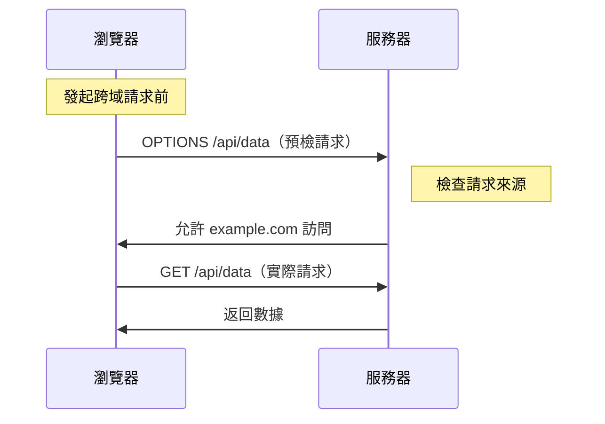

# 6.3.2 預檢不是麻煩是保護：CORS 機制

## 本質還原

CORS（Cross-Origin Resource Sharing）不是瀏覽器在刁難你，而是在保護用戶。它的本質是：**瀏覽器在問服務器"這個外來請求，你允許嗎？"**



## 爲什麼需要 CORS？

假設沒有 CORS 保護：

1. 你登錄了銀行網站 `bank.com`，Cookie 中存有登錄憑證
2. 你訪問了惡意網站 `evil.com`
3. `evil.com` 的 JS 向 `bank.com/api/transfer` 發起請求
4. 瀏覽器自動帶上 `bank.com` 的 Cookie
5. 你的錢就被轉走了

**CORS 的存在，就是爲了阻止這種跨站請求。**

## 簡單請求 vs 預檢請求

並非所有跨域請求都需要預檢。瀏覽器會根據請求特徵自動判斷：

### 簡單請求（無需預檢）

滿足以下所有條件的請求：

- 方法：`GET`、`HEAD`、`POST`
- 請求頭：僅限 `Accept`、`Accept-Language`、`Content-Language`、`Content-Type`
- Content-Type：僅限 `text/plain`、`multipart/form-data`、`application/x-www-form-urlencoded`

```typescript
// 這是簡單請求，直接發送
fetch('https://api.example.com/data')
```

### 預檢請求

只要不滿足簡單請求的條件，瀏覽器就會先發一個 `OPTIONS` 請求：

```typescript
// 這會觸發預檢請求（因爲有自定義 header）
fetch('https://api.example.com/data', {
  headers: {
    'Authorization': 'Bearer xxx',
    'Content-Type': 'application/json'
  }
})
```

## Next.js 中配置 CORS

### 方式一：API 路由中處理

```typescript
// app/api/data/route.ts
const corsHeaders = {
  'Access-Control-Allow-Origin': 'https://your-frontend.com',
  'Access-Control-Allow-Methods': 'GET, POST, PUT, DELETE, OPTIONS',
  'Access-Control-Allow-Headers': 'Content-Type, Authorization',
  'Access-Control-Max-Age': '86400', // 預檢結果緩存 24 小時
}

export async function OPTIONS() {
  return new Response(null, { headers: corsHeaders })
}

export async function GET() {
  return Response.json(
    { data: 'Hello' },
    { headers: corsHeaders }
  )
}
```

### 方式二：Middleware 統一處理

```typescript
// middleware.ts
import { NextResponse } from 'next/server'
import type { NextRequest } from 'next/server'

const allowedOrigins = [
  'https://your-frontend.com',
  'http://localhost:3000',
]

export function middleware(request: NextRequest) {
  const origin = request.headers.get('origin')
  
  // 檢查是否是允許的源
  if (origin && allowedOrigins.includes(origin)) {
    // 處理預檢請求
    if (request.method === 'OPTIONS') {
      return new NextResponse(null, {
        headers: {
          'Access-Control-Allow-Origin': origin,
          'Access-Control-Allow-Methods': 'GET, POST, PUT, DELETE, OPTIONS',
          'Access-Control-Allow-Headers': 'Content-Type, Authorization',
          'Access-Control-Max-Age': '86400',
        },
      })
    }
    
    // 普通請求，添加 CORS 頭
    const response = NextResponse.next()
    response.headers.set('Access-Control-Allow-Origin', origin)
    return response
  }
  
  return NextResponse.next()
}

export const config = {
  matcher: '/api/:path*',
}
```

## 常見問題與排查

### 問題一：`Access-Control-Allow-Origin` 不能用 `*` 配合憑證

```typescript
// ❌ 錯誤：帶憑證時不能用通配符
{
  'Access-Control-Allow-Origin': '*',
  'Access-Control-Allow-Credentials': 'true',
}

// ✅ 正確：必須指定具體域名
{
  'Access-Control-Allow-Origin': 'https://your-frontend.com',
  'Access-Control-Allow-Credentials': 'true',
}
```

### 問題二：預檢請求未正確處理

```typescript
// ❌ 問題：沒有處理 OPTIONS 請求
export async function POST(request: Request) {
  // ...
}

// ✅ 正確：顯式處理 OPTIONS
export async function OPTIONS() {
  return new Response(null, {
    headers: {
      'Access-Control-Allow-Origin': '*',
      'Access-Control-Allow-Methods': 'POST, OPTIONS',
      'Access-Control-Allow-Headers': 'Content-Type',
    },
  })
}

export async function POST(request: Request) {
  // ...
}
```

## 安全配置建議

::: warning CORS 安全清單
1. [ ] 永遠不要在生產環境使用 `Access-Control-Allow-Origin: *`
2. [ ] 維護一個允許的域名白名單
3. [ ] 設置合理的 `Access-Control-Max-Age` 減少預檢請求
4. [ ] 敏感接口必須驗證 `Origin` 頭
5. [ ] 使用 `Access-Control-Allow-Credentials` 時格外小心
:::
