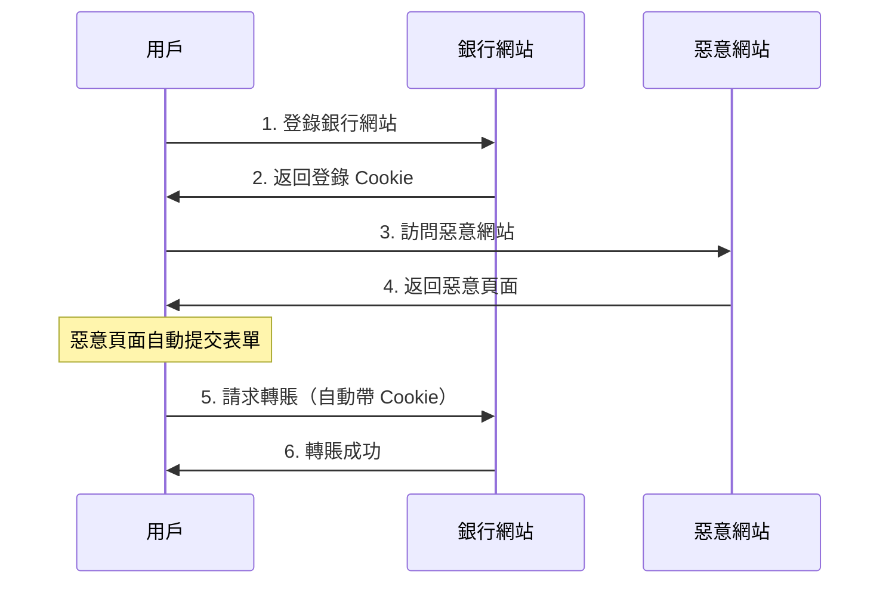

# 6.3.4 身份被借用的防線：CSRF 攻擊

## 本質還原

CSRF（Cross-Site Request Forgery）的本質是：**攻擊者借用你的身份，讓你的瀏覽器替他發送請求**。你已經登錄了某網站，攻擊者誘導你訪問惡意頁面，該頁面自動向目標網站發起請求，瀏覽器會自動帶上你的 Cookie。



## CSRF vs XSS 的區別

| 攻擊類型 | 攻擊方式 | 攻擊目標 |
|----------|----------|----------|
| **XSS** | 在目標網站注入腳本 | 竊取數據、劫持會話 |
| **CSRF** | 借用用戶身份發請求 | 執行敏感操作 |

關鍵區別：CSRF 不需要在目標網站執行任何代碼，只需要誘導用戶訪問惡意頁面。

## 攻擊示例

惡意網站的隱藏表單：

```html
<!-- evil.com 的頁面 -->
<h1>恭喜你中獎了！</h1>

<!-- 隱藏的自動提交表單 -->
<form id="csrf-form" action="https://bank.com/transfer" method="POST" style="display:none">
  <input name="to" value="attacker-account" />
  <input name="amount" value="10000" />
</form>

<script>
  document.getElementById('csrf-form').submit()
</script>
```

用戶只要訪問這個頁面，表單就會自動提交，瀏覽器會帶上 `bank.com` 的 Cookie。

## 防護策略

### 策略一：CSRF Token

服務端生成隨機令牌，嵌入表單中，提交時驗證：

```typescript
// 生成 CSRF Token
import { randomBytes } from 'crypto'

export function generateCsrfToken(): string {
  return randomBytes(32).toString('hex')
}

// 服務端 Action
export async function transferMoney(formData: FormData) {
  const token = formData.get('csrfToken')
  const session = await getSession()
  
  if (token !== session.csrfToken) {
    throw new Error('CSRF 驗證失敗')
  }
  
  // 執行轉賬邏輯
}
```

```tsx
// 表單中包含 Token
export default async function TransferForm() {
  const session = await getSession()
  
  return (
    <form action={transferMoney}>
      <input type="hidden" name="csrfToken" value={session.csrfToken} />
      <input name="to" placeholder="收款賬號" />
      <input name="amount" type="number" placeholder="金額" />
      <button type="submit">轉賬</button>
    </form>
  )
}
```

### 策略二：SameSite Cookie

現代瀏覽器支持 `SameSite` 屬性，限制 Cookie 的發送場景：

```typescript
// NextAuth 配置
cookies: {
  sessionToken: {
    name: 'session-token',
    options: {
      httpOnly: true,
      sameSite: 'lax',  // 或 'strict'
      secure: true,
    },
  },
}
```

SameSite 取值：

| 值 | 效果 |
|-----|------|
| `Strict` | 跨站請求完全不發送 Cookie |
| `Lax` | 跨站 GET 請求發送，POST 不發送（推薦） |
| `None` | 總是發送（需配合 Secure） |

### 策略三：驗證 Origin/Referer

檢查請求來源：

```typescript
export async function POST(request: Request) {
  const origin = request.headers.get('origin')
  const allowedOrigins = ['https://your-domain.com']
  
  if (!origin || !allowedOrigins.includes(origin)) {
    return Response.json({ error: '非法來源' }, { status: 403 })
  }
  
  // 繼續處理
}
```

### 策略四：雙重 Cookie 驗證

將 Token 同時放在 Cookie 和請求頭中：

```typescript
// 設置 Cookie
response.cookies.set('csrf-token', token, {
  httpOnly: false,  // 前端需要讀取
  sameSite: 'strict',
  secure: true,
})

// 前端發送請求時讀取 Cookie 放入 Header
fetch('/api/transfer', {
  method: 'POST',
  headers: {
    'X-CSRF-Token': getCookie('csrf-token'),
  },
  body: JSON.stringify(data),
})

// 服務端驗證
const cookieToken = request.cookies.get('csrf-token')
const headerToken = request.headers.get('X-CSRF-Token')

if (cookieToken !== headerToken) {
  throw new Error('CSRF 驗證失敗')
}
```

## Next.js Server Actions 的內置保護

Next.js 的 Server Actions 已內置 CSRF 保護：

```typescript
// 這是安全的，Next.js 自動處理 CSRF
'use server'

export async function createPost(formData: FormData) {
  // Server Action 會驗證請求來源
  const title = formData.get('title')
  // ...
}
```

::: tip 實踐建議
使用 Next.js Server Actions 時，框架已自動處理 CSRF。但如果使用 API Routes，仍需手動實現防護。
:::

## 安全配置清單

::: warning CSRF 防護清單
1. [ ] 敏感操作使用 POST/PUT/DELETE，不用 GET
2. [ ] Cookie 設置 `SameSite=Lax` 或 `Strict`
3. [ ] 表單提交驗證 CSRF Token
4. [ ] API 驗證 Origin/Referer 頭
5. [ ] 使用 Server Actions 獲得內置保護
:::
