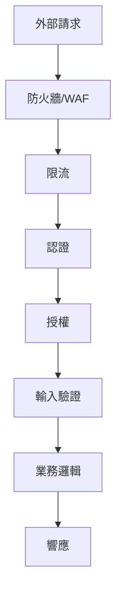

# 6.3 守好程序的大門——API 安全防護實踐

## 認知重構

API 是你應用與外界交互的窗口。每一個暴露的接口，都是潛在的攻擊入口。API 安全不是"加個驗證"那麼簡單，而是需要從認證、授權、輸入驗證、限流、日誌等多個維度構建防護體系。



## 本節內容

| 小節 | 核心問題 | 你將學會 |
|------|----------|----------|
| 6.3.1 認證方法 | 如何驗證請求者身份？ | JWT/Session/API Key 的選擇 |
| 6.3.2 CORS 機制 | 爲什麼會有跨域問題？ | 預檢請求與安全配置 |
| 6.3.3 XSS 防護 | 如何防止腳本注入？ | 輸出編碼與 CSP |
| 6.3.4 CSRF 防護 | 如何防止僞造請求？ | Token 驗證與 SameSite |
| 6.3.5 API 限流 | 如何防止接口被濫用？ | 速率限制與異常檢測 |

## API 安全層級

### 第一層：傳輸安全

```typescript
// 強制 HTTPS
if (process.env.NODE_ENV === 'production') {
  if (request.headers.get('x-forwarded-proto') !== 'https') {
    return Response.redirect(`https://${request.headers.get('host')}${request.url}`)
  }
}
```

### 第二層：認證與授權

```typescript
// middleware.ts
import { getToken } from 'next-auth/jwt'

export async function middleware(request: NextRequest) {
  const token = await getToken({ req: request })
  
  if (!token) {
    return Response.json({ error: '未授權' }, { status: 401 })
  }
  
  // 檢查權限
  if (request.nextUrl.pathname.startsWith('/api/admin')) {
    if (token.role !== 'admin') {
      return Response.json({ error: '禁止訪問' }, { status: 403 })
    }
  }
}
```

### 第三層：輸入驗證

```typescript
import { z } from 'zod'

const CreatePostSchema = z.object({
  title: z.string().min(1).max(100),
  content: z.string().min(1).max(10000),
  tags: z.array(z.string()).max(10).optional(),
})

export async function POST(request: Request) {
  const body = await request.json()
  
  const result = CreatePostSchema.safeParse(body)
  if (!result.success) {
    return Response.json(
      { error: '參數錯誤', details: result.error.issues },
      { status: 400 }
    )
  }
  
  // 使用驗證後的數據
  const { title, content, tags } = result.data
}
```

### 第四層：限流防護

```typescript
import { Ratelimit } from '@upstash/ratelimit'
import { Redis } from '@upstash/redis'

const ratelimit = new Ratelimit({
  redis: Redis.fromEnv(),
  limiter: Ratelimit.slidingWindow(10, '10 s'), // 10秒10次
})

export async function middleware(request: NextRequest) {
  const ip = request.ip ?? '127.0.0.1'
  const { success } = await ratelimit.limit(ip)
  
  if (!success) {
    return Response.json(
      { error: '請求過於頻繁' },
      { status: 429 }
    )
  }
}
```

## 安全響應頭

```typescript
// next.config.js
const securityHeaders = [
  {
    key: 'X-DNS-Prefetch-Control',
    value: 'on'
  },
  {
    key: 'X-Frame-Options',
    value: 'SAMEORIGIN'
  },
  {
    key: 'X-Content-Type-Options',
    value: 'nosniff'
  },
  {
    key: 'Referrer-Policy',
    value: 'origin-when-cross-origin'
  },
]

module.exports = {
  async headers() {
    return [
      {
        source: '/:path*',
        headers: securityHeaders,
      },
    ]
  },
}
```

## AI 協作提示

向 AI 描述 API 安全需求時：

- "實現請求限流，每個 IP 每分鐘最多 60 次請求"
- "對用戶輸入使用 zod 進行嚴格驗證"
- "添加 CORS 配置，只允許指定域名訪問"
- "在響應頭中添加安全相關的 HTTP 頭"

::: warning API 安全審查清單
1. [ ] 所有接口都有認證檢查
2. [ ] 敏感操作有授權驗證
3. [ ] 用戶輸入經過驗證和轉義
4. [ ] 實現了請求限流
5. [ ] 配置了安全響應頭
6. [ ] 錯誤信息不泄露敏感信息
:::
