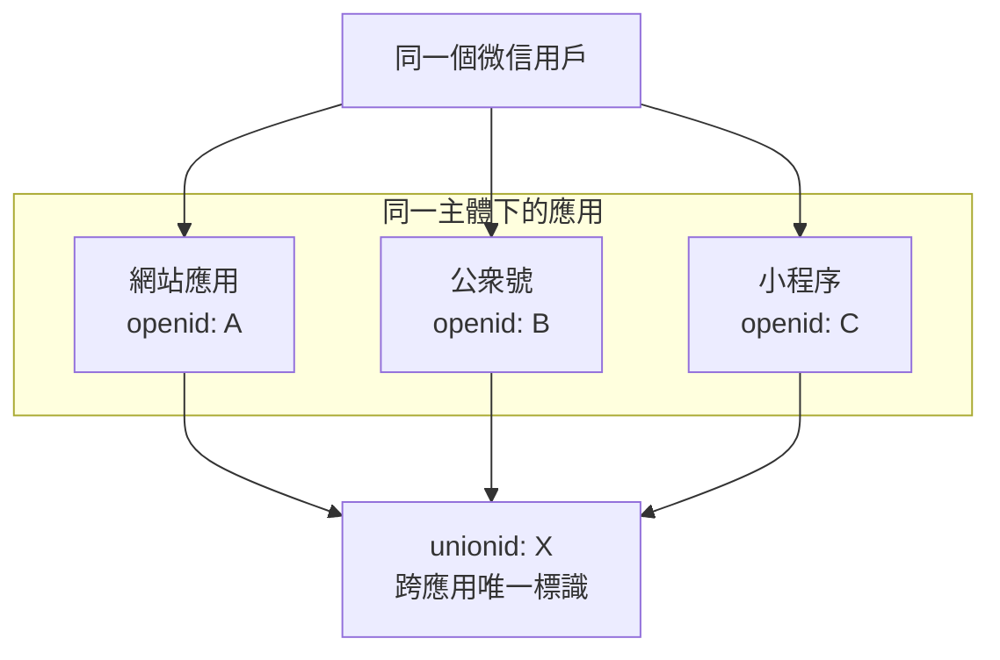

# 6.5.2 微信登錄：微信開放平臺與公衆號登錄

## 一句話破題

微信登錄分兩種場景：**網頁掃碼登錄**（開放平臺）和**公衆號內登錄**（公衆平臺）。二者 API 不同，需要分別接入。

## 核心價值

理解微信登錄能讓你：
- 爲 C 端產品提供最主流的登錄方式
- 理解 openid vs unionid 的區別
- 在公衆號場景實現無感登錄

## 兩種登錄方式對比

| 場景 | 平臺 | 用戶體驗 | 適用產品 |
|------|------|----------|----------|
| 網頁掃碼 | 微信開放平臺 | 打開微信掃碼 | 獨立網站/PC端 |
| 公衆號內 | 微信公衆平臺 | 點擊授權 | 公衆號 H5 |

## 網頁掃碼登錄

### 前置條件

1. 註冊[微信開放平臺](https://open.weixin.qq.com/)賬號
2. 創建網站應用，通過審覈
3. 獲取 AppID 和 AppSecret

### 實現代碼

```typescript
// app/api/auth/wechat/route.ts
export async function GET() {
  const state = generateSecureState()
  
  const params = new URLSearchParams({
    appid: process.env.WECHAT_OPEN_APP_ID!,
    redirect_uri: 'https://your-site.com/api/auth/wechat/callback',
    response_type: 'code',
    scope: 'snsapi_login',
    state,
  })
  
  return Response.redirect(
    `https://open.weixin.qq.com/connect/qrconnect?${params}#wechat_redirect`
  )
}
```

```typescript
// app/api/auth/wechat/callback/route.ts
export async function GET(request: Request) {
  const { searchParams } = new URL(request.url)
  const code = searchParams.get('code')
  
  // 換取 access_token
  const tokenRes = await fetch(
    `https://api.weixin.qq.com/sns/oauth2/access_token?` +
    `appid=${process.env.WECHAT_OPEN_APP_ID}` +
    `&secret=${process.env.WECHAT_OPEN_APP_SECRET}` +
    `&code=${code}&grant_type=authorization_code`
  )
  
  const { access_token, openid, unionid } = await tokenRes.json()
  
  // 獲取用戶信息
  const userRes = await fetch(
    `https://api.weixin.qq.com/sns/userinfo?access_token=${access_token}&openid=${openid}`
  )
  
  const { nickname, headimgurl } = await userRes.json()
  
  // 使用 unionid 關聯用戶（跨應用統一標識）
  const user = await findOrCreateUser({
    unionid,
    openid,
    nickname,
    avatar: headimgurl,
  })
  
  await createSession(user)
  return Response.redirect('/dashboard')
}
```

## 公衆號內登錄

### 前置條件

1. 擁有已認證的服務號
2. 在公衆號後臺配置授權域名

### 兩種授權模式

| 模式 | scope | 用戶感知 | 獲取信息 |
|------|-------|----------|----------|
| 靜默授權 | `snsapi_base` | 無 | 僅 openid |
| 彈窗授權 | `snsapi_userinfo` | 授權彈窗 | 完整信息 |

### 實現代碼

```typescript
// 檢測是否在微信內
function isWechatBrowser(ua: string) {
  return /MicroMessenger/i.test(ua)
}

// 公衆號授權入口
export async function GET(request: Request) {
  const ua = request.headers.get('user-agent') || ''
  
  if (!isWechatBrowser(ua)) {
    // 非微信環境，使用掃碼登錄
    return redirectToQrLogin()
  }
  
  // 微信內，使用網頁授權
  const params = new URLSearchParams({
    appid: process.env.WECHAT_MP_APP_ID!,
    redirect_uri: encodeURIComponent('https://your-site.com/api/auth/wechat-mp/callback'),
    response_type: 'code',
    scope: 'snsapi_userinfo',  // 或 snsapi_base
    state: generateSecureState(),
  })
  
  return Response.redirect(
    `https://open.weixin.qq.com/connect/oauth2/authorize?${params}#wechat_redirect`
  )
}
```

## openid vs unionid



::: tip 關鍵理解
- `openid`：同一用戶在不同應用中不同
- `unionid`：同一用戶在同一主體下的應用中相同
- 要獲取 unionid，需要在開放平臺綁定公衆號/小程序
:::

## 避坑指南

::: danger 新手最容易犯的錯
1. 混淆開放平臺和公衆平臺的 API
2. 沒有區分網頁掃碼和公衆號內場景
3. 用 openid 而非 unionid 做用戶唯一標識
4. 忘記處理用戶拒絕授權的情況
:::
