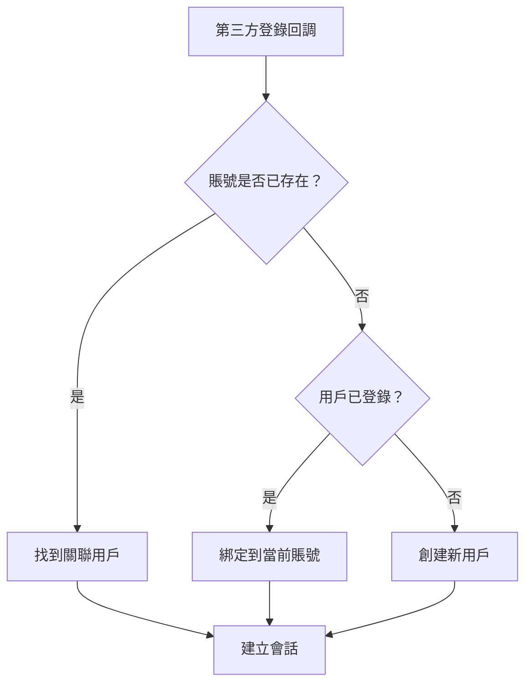

# 6.5.5 多平臺賬號如何統一——用戶賬號綁定與解綁

## 一句話破題

當用戶可以通過微信、QQ、手機號等多種方式登錄時，需要一套機制將這些身份**關聯到同一個賬號**，避免用戶創建多個賬號。

## 核心價值

理解賬號綁定能讓你：
- 避免用戶因換登錄方式而丟失數據
- 提供更靈活的登錄體驗
- 構建完整的用戶身份體系

## 數據模型設計

```typescript
// prisma/schema.prisma
model User {
  id        String   @id @default(cuid())
  email     String?  @unique
  phone     String?  @unique
  name      String?
  avatar    String?
  accounts  Account[]
  createdAt DateTime @default(now())
}

model Account {
  id                String  @id @default(cuid())
  userId            String
  provider          String  // 'wechat' | 'qq' | 'dingtalk'
  providerAccountId String  // openid 或 unionid
  accessToken       String?
  refreshToken      String?
  user              User    @relation(fields: [userId], references: [id])

  @@unique([provider, providerAccountId])
}
```

## 登錄與綁定策略



## 實現代碼

```typescript
// lib/account-linking.ts
interface OAuthUserInfo {
  provider: 'wechat' | 'qq' | 'dingtalk'
  providerAccountId: string  // unionid 優先，否則 openid
  email?: string
  name?: string
  avatar?: string
}

export async function handleOAuthLogin(
  oauthInfo: OAuthUserInfo,
  currentUserId?: string  // 如果用戶已登錄
) {
  // 1. 查找是否已有此第三方賬號
  const existingAccount = await prisma.account.findUnique({
    where: {
      provider_providerAccountId: {
        provider: oauthInfo.provider,
        providerAccountId: oauthInfo.providerAccountId,
      },
    },
    include: { user: true },
  })

  // 情況 A：賬號已存在，直接登錄
  if (existingAccount) {
    return existingAccount.user
  }

  // 情況 B：用戶已登錄，綁定到當前賬號
  if (currentUserId) {
    await prisma.account.create({
      data: {
        userId: currentUserId,
        provider: oauthInfo.provider,
        providerAccountId: oauthInfo.providerAccountId,
      },
    })
    return prisma.user.findUnique({ where: { id: currentUserId } })
  }

  // 情況 C：嘗試通過郵箱/手機號匹配現有用戶
  if (oauthInfo.email) {
    const existingUser = await prisma.user.findUnique({
      where: { email: oauthInfo.email },
    })
    if (existingUser) {
      await prisma.account.create({
        data: {
          userId: existingUser.id,
          provider: oauthInfo.provider,
          providerAccountId: oauthInfo.providerAccountId,
        },
      })
      return existingUser
    }
  }

  // 情況 D：創建新用戶
  return prisma.user.create({
    data: {
      name: oauthInfo.name,
      avatar: oauthInfo.avatar,
      email: oauthInfo.email,
      accounts: {
        create: {
          provider: oauthInfo.provider,
          providerAccountId: oauthInfo.providerAccountId,
        },
      },
    },
  })
}
```

## 賬號解綁

```typescript
// app/api/account/unbind/route.ts
export async function POST(request: Request) {
  const session = await getSession()
  if (!session?.userId) {
    return Response.json({ error: '未登錄' }, { status: 401 })
  }

  const { provider } = await request.json()

  // 檢查是否至少保留一種登錄方式
  const accounts = await prisma.account.findMany({
    where: { userId: session.userId },
  })

  const user = await prisma.user.findUnique({
    where: { id: session.userId },
  })

  const hasPassword = !!user?.password
  const hasEmail = !!user?.email
  const otherAccounts = accounts.filter((a) => a.provider !== provider)

  if (!hasPassword && !hasEmail && otherAccounts.length === 0) {
    return Response.json(
      { error: '至少保留一種登錄方式' },
      { status: 400 }
    )
  }

  // 解綁
  await prisma.account.deleteMany({
    where: {
      userId: session.userId,
      provider,
    },
  })

  return Response.json({ success: true })
}
```

## 避坑指南

::: danger 新手最容易犯的錯
1. 用 openid 而非 unionid 做賬號關聯——導致同一用戶在不同應用中無法關聯
2. 沒有檢查解綁後是否還有登錄方式——用戶可能無法登錄
3. 沒有處理賬號合併衝突——兩個賬號都有數據時如何處理
4. 沒有通知用戶綁定狀態變更——用戶不知道自己綁定了哪些賬號
:::
