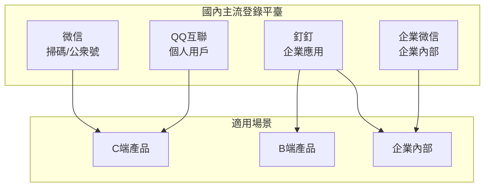

# 6.5 接入微信/QQ 登錄——第三方登錄集成深度

## 認知重構

國內第三方登錄和 Google/GitHub 登錄的技術原理完全相同——都是 OAuth 2.0 授權碼模式。但實際接入時會遇到很多"中國特色"：

- 申請流程複雜，需要企業資質
- 微信生態碎片化（開放平臺 vs 公衆號）
- 釘釘/企微主要面向企業內部應用
- 文檔和 SDK 的使用體驗參差不齊



## 本節內容

| 小節 | 核心問題 | 你將學會 |
|------|----------|----------|
| 6.5.1 OAuth 流程 | 授權碼模式是什麼？ | 理解第三方登錄的通用原理 |
| 6.5.2 微信登錄 | 微信登錄怎麼接？ | 開放平臺與公衆號登錄 |
| 6.5.3 QQ 登錄 | QQ 登錄怎麼接？ | QQ 互聯平臺配置 |
| 6.5.4 釘釘登錄 | 釘釘登錄怎麼接？ | 企業應用與第三方應用 |
| 6.5.5 賬號綁定 | 多平臺賬號怎麼統一？ | 用戶賬號合併策略 |
| 6.5.6 錯誤處理 | 登錄失敗怎麼辦？ | 異常情況與用戶提示 |

## 平臺對比速覽

| 平臺 | 申請難度 | 適用場景 | 是否需要企業資質 |
|------|----------|----------|------------------|
| 微信開放平臺 | 高 | C 端產品 | 是 |
| 微信公衆號 | 中 | H5/公衆號內 | 是（服務號） |
| QQ 互聯 | 中 | C 端產品 | 否（但需審覈） |
| 釘釘 | 低 | B 端/企業內 | 企業入駐即可 |
| 企業微信 | 低 | 企業內部 | 企業入駐即可 |

## 通用開發模式

無論接入哪個平臺，代碼結構都類似：

```typescript
// 1. 生成授權 URL，重定向用戶
export async function GET(request: Request) {
  const authUrl = buildAuthUrl({
    client_id: process.env.PLATFORM_CLIENT_ID,
    redirect_uri: 'https://your-site.com/api/auth/callback',
    state: generateState(),  // 防 CSRF
    scope: 'user_info',
  })
  return Response.redirect(authUrl)
}

// 2. 接收回調，換取 access_token
export async function GET(request: Request) {
  const { code, state } = getSearchParams(request)
  
  // 驗證 state
  if (!verifyState(state)) {
    return Response.redirect('/login?error=invalid_state')
  }
  
  // 用 code 換 token
  const tokenResponse = await fetch(TOKEN_URL, {
    method: 'POST',
    body: new URLSearchParams({
      code,
      client_id: process.env.CLIENT_ID,
      client_secret: process.env.CLIENT_SECRET,
    }),
  })
  
  const { access_token } = await tokenResponse.json()
  
  // 3. 用 token 獲取用戶信息
  const userInfo = await fetchUserInfo(access_token)
  
  // 4. 創建或關聯本地用戶
  const user = await findOrCreateUser(userInfo)
  
  // 5. 創建會話
  await createSession(user)
  
  return Response.redirect('/dashboard')
}
```

## AI 協作提示

向 AI 描述國內第三方登錄需求時：

- "實現微信掃碼登錄，使用 OAuth 2.0 授權碼模式"
- "在服務端存儲 state 防止 CSRF 攻擊"
- "處理用戶首次登錄和賬號綁定的邏輯"
- "添加登錄失敗的錯誤處理和用戶提示"

::: warning 國內登錄接入清單
1. [ ] 準備好企業資質材料
2. [ ] 在各平臺完成應用註冊
3. [ ] 配置正確的回調地址
4. [ ] 實現 state 參數防 CSRF
5. [ ] 處理多平臺賬號綁定邏輯
6. [ ] 完善錯誤提示和異常處理
:::
