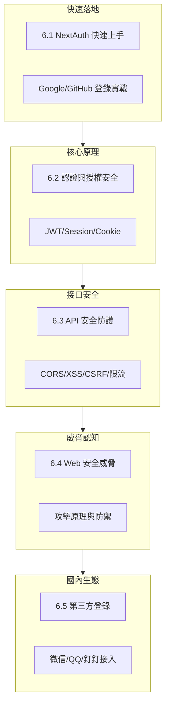

# 6 ｜認證與安全（Web 安全高級）

## 爲什麼安全是你繞不開的必修課

在 Vibe Coding 時代，AI 能幫你快速生成登錄註冊、表單提交、API 接口等代碼。但 AI 不會主動替你思考安全問題——它可能漏掉 CSRF 防護、忘記對輸入進行驗證、或者把敏感信息暴露在客戶端。

**安全不是"錦上添花"，而是"底線要求"。** 一個沒有安全意識的產品，上線後可能面臨：

- 用戶數據泄露 → 法律風險
- 賬號被盜 → 用戶流失
- 接口被濫用 → 服務崩潰
- 支付漏洞 → 直接經濟損失

## 本章的學習路徑

## 章節概覽

| 章節 | 核心問題 | 你將學會 |
|------|----------|----------|
| **6.1 NextAuth 快速上手** | 如何快速實現登錄功能？ | 10 分鐘搭建 Google/GitHub 登錄 |
| **6.2 認證與授權安全** | JWT 和 Session 怎麼選？ | 理解各種認證方案的安全邊界 |
| **6.3 API 安全防護** | 接口如何防止被濫用？ | CORS 配置、限流、輸入驗證 |
| **6.4 Web 安全威脅** | 黑客怎麼攻擊網站？ | XSS/CSRF/注入的原理與防禦 |
| **6.5 第三方登錄集成** | 如何接入國內登錄？ | 微信/QQ/釘釘 OAuth 實戰 |

## 安全思維的核心原則

在深入技術細節之前，先建立正確的安全思維：

### 1. 永遠不信任客戶端

來自瀏覽器的任何數據都可能被篡改。所有驗證必須在服務端再做一次。

### 2. 最小權限原則

用戶只能訪問他需要的資源，代碼只能擁有它需要的權限。

### 3. 縱深防禦

不要依賴單一防護手段。認證、授權、輸入驗證、加密——每一層都要設防。

### 4. 安全是持續過程

安全不是一次性配置。定期更新依賴、審計代碼、監控異常行爲。

## AI 協作提示

在讓 AI 生成安全相關代碼時，可以使用以下關鍵詞提示：

- "請添加 CSRF 防護"
- "對用戶輸入進行驗證和轉義"
- "使用 HttpOnly 和 Secure 標誌設置 Cookie"
- "實現請求限流防止濫用"
- "確保敏感信息不會暴露在客戶端"

::: warning 安全代碼審查清單
無論 AI 生成什麼代碼，務必檢查：
1. 敏感信息是否暴露在前端？
2. 用戶輸入是否經過驗證？
3. 數據庫查詢是否有注入風險？
4. Cookie 是否設置了安全屬性？
5. API 是否有訪問控制？
:::
