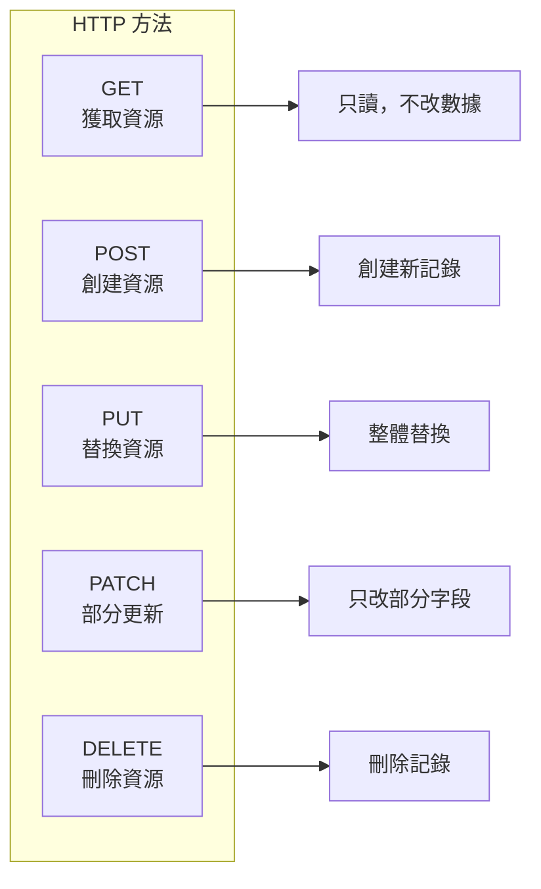

# 7.1.1 HTTP 方法語義

## 一句話破題

HTTP 方法就是告訴服務器"你要幹什麼"——GET 是看，POST 是創建，PUT 是改，DELETE 是刪。用錯方法就像用菜刀去擰螺絲。

## 五種核心方法



| 方法 | 語義 | 冪等性 | 請求體 | 典型場景 |
|------|------|--------|--------|----------|
| **GET** | 獲取 | ✅ 是 | ❌ 無 | 獲取用戶列表、查看詳情 |
| **POST** | 創建 | ❌ 否 | ✅ 有 | 註冊用戶、提交訂單 |
| **PUT** | 替換 | ✅ 是 | ✅ 有 | 更新用戶全部信息 |
| **PATCH** | 部分更新 | ✅ 是 | ✅ 有 | 只改用戶暱稱 |
| **DELETE** | 刪除 | ✅ 是 | ❌ 無 | 刪除文章 |

## Next.js 中的實現

### API Route 示例

```typescript
// app/api/users/route.ts
import { NextRequest, NextResponse } from 'next/server'

// GET /api/users - 獲取用戶列表
export async function GET(request: NextRequest) {
  const users = await prisma.user.findMany()
  return NextResponse.json(users)
}

// POST /api/users - 創建用戶
export async function POST(request: NextRequest) {
  const body = await request.json()
  const user = await prisma.user.create({ data: body })
  return NextResponse.json(user, { status: 201 })
}
```

```typescript
// app/api/users/[id]/route.ts

// GET /api/users/:id - 獲取單個用戶
export async function GET(
  request: NextRequest,
  { params }: { params: { id: string } }
) {
  const user = await prisma.user.findUnique({
    where: { id: params.id }
  })
  
  if (!user) {
    return NextResponse.json(
      { error: 'User not found' },
      { status: 404 }
    )
  }
  
  return NextResponse.json(user)
}

// PUT /api/users/:id - 替換用戶
export async function PUT(
  request: NextRequest,
  { params }: { params: { id: string } }
) {
  const body = await request.json()
  const user = await prisma.user.update({
    where: { id: params.id },
    data: body,  // 整體替換
  })
  return NextResponse.json(user)
}

// PATCH /api/users/:id - 部分更新
export async function PATCH(
  request: NextRequest,
  { params }: { params: { id: string } }
) {
  const body = await request.json()
  const user = await prisma.user.update({
    where: { id: params.id },
    data: body,  // 只更新傳入的字段
  })
  return NextResponse.json(user)
}

// DELETE /api/users/:id - 刪除用戶
export async function DELETE(
  request: NextRequest,
  { params }: { params: { id: string } }
) {
  await prisma.user.delete({
    where: { id: params.id }
  })
  return new NextResponse(null, { status: 204 })
}
```

## PUT vs PATCH

```typescript
// 用戶原數據
const user = {
  id: '1',
  name: 'Alice',
  email: 'alice@example.com',
  avatar: 'avatar.png',
}

// PUT：需要傳入完整數據
// PUT /api/users/1
// Body: { name: 'Alice New', email: 'alice@example.com', avatar: 'avatar.png' }
// 如果漏傳 avatar，avatar 會被清空

// PATCH：只傳需要改的字段
// PATCH /api/users/1
// Body: { name: 'Alice New' }
// 只改 name，其他字段保持不變
```

| 場景 | 使用方法 |
|------|----------|
| 表單提交（全部字段） | PUT |
| 只改頭像 | PATCH |
| 只改狀態 | PATCH |
| 導入數據覆蓋 | PUT |

## 覺知：常見錯誤

### 1. 用 POST 做所有事

```typescript
// ❌ 錯誤：全用 POST
POST /api/getUser      // 應該用 GET
POST /api/deleteUser   // 應該用 DELETE
POST /api/updateUser   // 應該用 PUT/PATCH

// ✅ 正確：語義清晰
GET /api/users/123
DELETE /api/users/123
PATCH /api/users/123
```

### 2. GET 請求帶 Body

```typescript
// ❌ GET 請求不應該有 Body
GET /api/users
Body: { filter: 'active' }

// ✅ 用查詢參數
GET /api/users?status=active
```

### 3. DELETE 返回被刪除的數據

```typescript
// ❌ 不推薦：返回被刪除的數據
DELETE /api/users/123
Response: { id: '123', name: 'Alice', ... }

// ✅ 推薦：返回 204 No Content
DELETE /api/users/123
Response: (無內容，狀態碼 204)
```

## 本節小結

| 要點 | 說明 |
|------|------|
| **GET 只讀** | 不應該修改任何數據 |
| **POST 創建** | 每次調用可能創建新資源 |
| **PUT 替換** | 需要傳完整數據 |
| **PATCH 更新** | 只傳要改的字段 |
| **DELETE 刪除** | 返回 204 無內容 |
