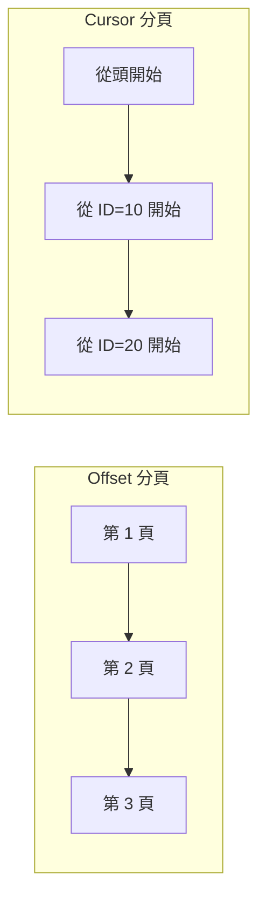
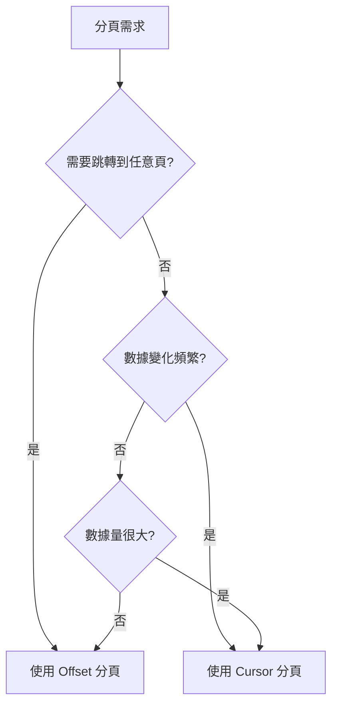

# 7.1.3 分頁策略

## 一句話破題

當數據量超過一屏能顯示的範圍時，分頁是必須的——問題是用哪種分頁方式：傳統的"第幾頁"還是更現代的"從哪條開始"。

## 兩種分頁方式



| 方式 | 原理 | 適用場景 |
|------|------|----------|
| **Offset** | 跳過前 N 條，取 M 條 | 傳統分頁、後臺管理 |
| **Cursor** | 從某個位置開始，取 M 條 | 無限滾動、即時數據 |

## Offset 分頁

### 請求格式

```
GET /api/posts?page=2&pageSize=10
```

### 實現代碼

```typescript
// app/api/posts/route.ts
export async function GET(request: NextRequest) {
  const { searchParams } = new URL(request.url)
  const page = parseInt(searchParams.get('page') || '1')
  const pageSize = parseInt(searchParams.get('pageSize') || '10')
  
  const skip = (page - 1) * pageSize
  
  const [posts, total] = await Promise.all([
    prisma.post.findMany({
      skip,
      take: pageSize,
      orderBy: { createdAt: 'desc' },
    }),
    prisma.post.count(),
  ])
  
  return NextResponse.json({
    data: posts,
    pagination: {
      page,
      pageSize,
      total,
      totalPages: Math.ceil(total / pageSize),
    },
  })
}
```

### 響應示例

```json
{
  "data": [
    { "id": "11", "title": "Post 11" },
    { "id": "12", "title": "Post 12" }
  ],
  "pagination": {
    "page": 2,
    "pageSize": 10,
    "total": 100,
    "totalPages": 10
  }
}
```

### 優缺點

| 優點 | 缺點 |
|------|------|
| 可以跳轉到任意頁 | 數據變化時可能重複或遺漏 |
| 用戶體驗直觀 | 大數據量時性能差 |
| 實現簡單 | 需要 COUNT 查詢 |

## Cursor 分頁

### 請求格式

```
GET /api/posts?cursor=abc123&limit=10
```

### 實現代碼

```typescript
// app/api/posts/route.ts
export async function GET(request: NextRequest) {
  const { searchParams } = new URL(request.url)
  const cursor = searchParams.get('cursor')
  const limit = parseInt(searchParams.get('limit') || '10')
  
  const posts = await prisma.post.findMany({
    take: limit + 1,  // 多取一條判斷是否有下一頁
    ...(cursor && {
      cursor: { id: cursor },
      skip: 1,  // 跳過 cursor 本身
    }),
    orderBy: { createdAt: 'desc' },
  })
  
  const hasMore = posts.length > limit
  const data = hasMore ? posts.slice(0, -1) : posts
  const nextCursor = hasMore ? data[data.length - 1].id : null
  
  return NextResponse.json({
    data,
    nextCursor,
    hasMore,
  })
}
```

### 響應示例

```json
{
  "data": [
    { "id": "abc123", "title": "Post 1" },
    { "id": "def456", "title": "Post 2" }
  ],
  "nextCursor": "def456",
  "hasMore": true
}
```

### 前端使用

```typescript
// 無限滾動加載
const [posts, setPosts] = useState<Post[]>([])
const [cursor, setCursor] = useState<string | null>(null)
const [hasMore, setHasMore] = useState(true)

async function loadMore() {
  const url = cursor 
    ? `/api/posts?cursor=${cursor}&limit=10`
    : '/api/posts?limit=10'
    
  const res = await fetch(url)
  const { data, nextCursor, hasMore } = await res.json()
  
  setPosts(prev => [...prev, ...data])
  setCursor(nextCursor)
  setHasMore(hasMore)
}
```

### 優缺點

| 優點 | 缺點 |
|------|------|
| 數據一致性好 | 不能跳轉到任意頁 |
| 性能穩定 | 實現相對複雜 |
| 適合即時數據 | 不知道總頁數 |

## 如何選擇？



| 場景 | 推薦方式 |
|------|----------|
| 後臺管理列表 | Offset |
| 社交媒體信息流 | Cursor |
| 搜索結果 | Offset |
| 聊天記錄 | Cursor |
| 電商商品列表 | Offset |
| 即時通知 | Cursor |

## 覺知：常見問題

### 1. Offset 分頁的數據錯亂

```
場景：用戶在第 2 頁，此時有人發了新帖子

原本第 1 頁最後一條（第 10 條）被擠到了第 2 頁
用戶刷新第 2 頁，會看到重複的內容
```

### 2. Cursor 不一定是 ID

```typescript
// cursor 可以是任意唯一且有序的值
const cursor = {
  id: 'abc123',           // 按 ID
  createdAt: '2024-01-15', // 按時間
  score: 100,             // 按分數
}

// 編碼後傳遞
const encodedCursor = Buffer.from(JSON.stringify(cursor)).toString('base64')
```

### 3. 分頁參數驗證

```typescript
// 防止惡意請求
const page = Math.max(1, Math.min(100, parseInt(params.page || '1')))
const pageSize = Math.max(1, Math.min(100, parseInt(params.pageSize || '10')))
```

## 本節小結

| 要點 | 說明 |
|------|------|
| **Offset 分頁** | 適合後臺管理、需要跳轉 |
| **Cursor 分頁** | 適合無限滾動、即時數據 |
| **性能考慮** | 大數據量優先 Cursor |
| **一致性考慮** | 數據頻繁變化用 Cursor |
