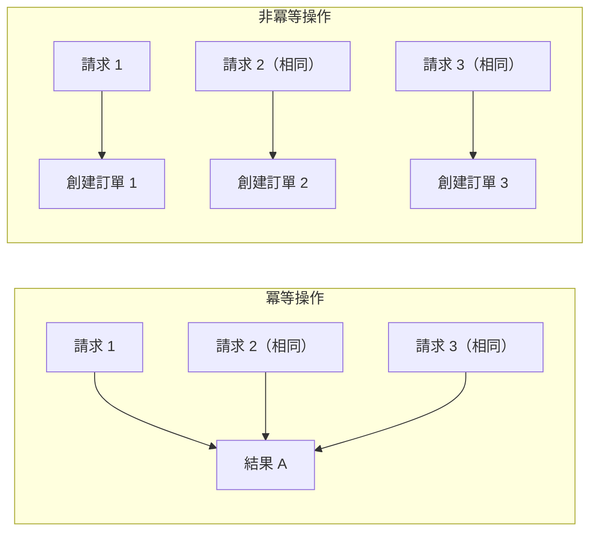

# 7.1.5 冪等性保證

## 一句話破題

冪等性就是"做一次和做一百次效果一樣"——用戶網絡不好多點了幾下提交按鈕，不會創建多個訂單。

## 什麼是冪等性



| HTTP 方法 | 冪等性 | 說明 |
|-----------|--------|------|
| GET | ✅ 是 | 獲取數據，不改變狀態 |
| PUT | ✅ 是 | 替換資源，多次執行結果相同 |
| DELETE | ✅ 是 | 刪除資源，刪一次和刪多次結果相同 |
| PATCH | ✅ 是 | 部分更新，多次執行結果相同 |
| POST | ❌ 否 | 創建資源，每次可能創建新資源 |

## 問題場景

### 用戶重複提交

```
1. 用戶點擊"提交訂單"
2. 網絡慢，頁面沒反應
3. 用戶又點了幾次
4. 網絡恢復，多個請求同時到達服務器
5. 創建了多個重複訂單！
```

### 網絡重試

```
1. 客戶端發送請求
2. 服務器處理成功
3. 響應在網絡中丟失
4. 客戶端認爲失敗，自動重試
5. 服務器又處理了一次
```

## 解決方案

### 方案一：冪等 Key

```typescript
// 客戶端生成唯一 Key
const idempotencyKey = crypto.randomUUID()

fetch('/api/orders', {
  method: 'POST',
  headers: {
    'Content-Type': 'application/json',
    'Idempotency-Key': idempotencyKey,
  },
  body: JSON.stringify(orderData),
})
```

```typescript
// 服務端處理
// app/api/orders/route.ts
export async function POST(request: NextRequest) {
  const idempotencyKey = request.headers.get('Idempotency-Key')
  
  if (!idempotencyKey) {
    return NextResponse.json(
      { error: '缺少 Idempotency-Key' },
      { status: 400 }
    )
  }
  
  // 檢查是否已處理過
  const existing = await prisma.idempotencyRecord.findUnique({
    where: { key: idempotencyKey },
  })
  
  if (existing) {
    // 返回之前的結果
    return NextResponse.json(JSON.parse(existing.response))
  }
  
  // 處理請求
  const body = await request.json()
  const order = await prisma.order.create({ data: body })
  
  // 記錄冪等 Key
  await prisma.idempotencyRecord.create({
    data: {
      key: idempotencyKey,
      response: JSON.stringify(order),
      expiresAt: new Date(Date.now() + 24 * 60 * 60 * 1000), // 24小時後過期
    },
  })
  
  return NextResponse.json(order, { status: 201 })
}
```

### 方案二：業務唯一約束

```typescript
// 利用業務字段的唯一性
// 例如：用戶 + 商品 + 時間窗口 = 唯一訂單

const orderKey = `${userId}_${productId}_${Date.now().toString().slice(0, -3)}`

try {
  const order = await prisma.order.create({
    data: {
      ...orderData,
      orderKey,  // 唯一約束
    },
  })
  return NextResponse.json(order, { status: 201 })
} catch (error) {
  if (error.code === 'P2002') {
    // 唯一約束衝突，說明已經創建過
    const existing = await prisma.order.findUnique({
      where: { orderKey },
    })
    return NextResponse.json(existing)
  }
  throw error
}
```

### 方案三：前端防抖

```typescript
// 按鈕點擊後禁用
function SubmitButton() {
  const [isSubmitting, setIsSubmitting] = useState(false)
  
  async function handleSubmit() {
    if (isSubmitting) return
    
    setIsSubmitting(true)
    try {
      await submitOrder()
    } finally {
      setIsSubmitting(false)
    }
  }
  
  return (
    <button 
      onClick={handleSubmit} 
      disabled={isSubmitting}
    >
      {isSubmitting ? '提交中...' : '提交訂單'}
    </button>
  )
}
```

### 方案四：樂觀鎖

```typescript
// 使用版本號防止併發更新衝突
async function updateInventory(productId: string, quantity: number) {
  const product = await prisma.product.findUnique({
    where: { id: productId },
  })
  
  const updated = await prisma.product.updateMany({
    where: {
      id: productId,
      version: product.version,  // 版本號匹配才更新
    },
    data: {
      stock: { decrement: quantity },
      version: { increment: 1 },
    },
  })
  
  if (updated.count === 0) {
    throw new Error('併發衝突，請重試')
  }
}
```

## 最佳實踐

### 組合使用

```typescript
// 1. 前端：防抖 + 冪等 Key
// 2. 後端：冪等 Key 檢查 + 業務約束

// 前端
const [idempotencyKey] = useState(() => crypto.randomUUID())

async function submit() {
  if (isSubmitting) return
  setIsSubmitting(true)
  
  await fetch('/api/orders', {
    headers: { 'Idempotency-Key': idempotencyKey },
    body: JSON.stringify(data),
  })
}

// 後端
export async function POST(request: NextRequest) {
  const key = request.headers.get('Idempotency-Key')
  
  // 1. 檢查冪等 Key
  const cached = await checkIdempotencyKey(key)
  if (cached) return cached
  
  // 2. 業務處理（有唯一約束兜底）
  try {
    const order = await createOrder(data)
    await saveIdempotencyKey(key, order)
    return NextResponse.json(order)
  } catch (error) {
    if (isDuplicateError(error)) {
      return getExistingOrder(data)
    }
    throw error
  }
}
```

## 覺知：常見誤區

### 1. 只依賴前端防抖

```
❌ 只在前端禁用按鈕
   - 用戶可以刷新頁面重新提交
   - 可以用開發者工具繞過
   
✅ 前端防抖 + 後端冪等保證
```

### 2. 冪等 Key 永久存儲

```typescript
// ❌ 永久存儲會導致數據膨脹
await prisma.idempotencyRecord.create({
  data: { key, response },
})

// ✅ 設置過期時間，定期清理
await prisma.idempotencyRecord.create({
  data: {
    key,
    response,
    expiresAt: new Date(Date.now() + 24 * 60 * 60 * 1000),
  },
})
```

### 3. 忽略響應一致性

```typescript
// ❌ 重複請求返回不同響應
// 第一次: { id: 1, status: 'created' }
// 第二次: { message: '已存在' }

// ✅ 返回相同的響應結構
// 第一次和第二次都返回: { id: 1, status: 'created' }
```

## 本節小結

| 要點 | 說明 |
|------|------|
| **冪等性** | 多次執行效果相同 |
| **冪等 Key** | 客戶端生成，服務端去重 |
| **業務約束** | 利用唯一索引防止重複 |
| **多層防護** | 前端防抖 + 後端校驗 |
