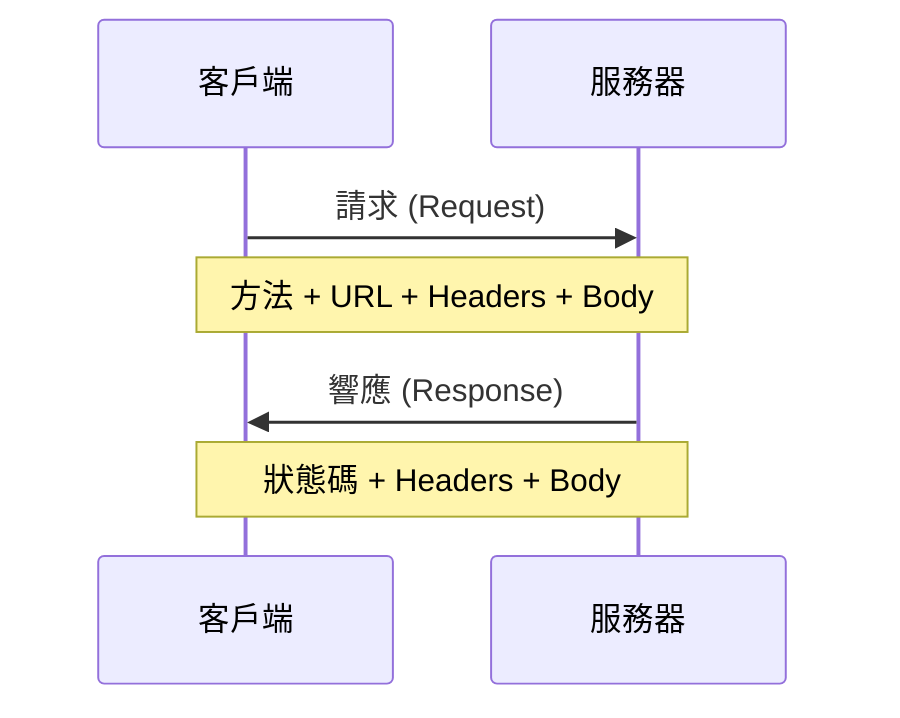

# 7.1 接口是合同不是暗語——HTTP 與 API

## 認知重構

API 接口就像餐廳的菜單：菜名（URL）要清晰、價格（參數）要明確、上菜流程（方法）要規範。如果菜單寫得含糊不清，服務員和廚師都會崩潰。

```
好的 API：GET /users/123 → 獲取 ID 爲 123 的用戶
爛的 API：POST /api/getData?type=user&action=get&id=123
```

## HTTP 請求的本質



一個完整的 HTTP 請求包含：

| 組成部分 | 說明 | 示例 |
|----------|------|------|
| **方法** | 要做什麼操作 | GET, POST, PUT, DELETE |
| **URL** | 操作什麼資源 | /api/users/123 |
| **Headers** | 附加信息 | Authorization, Content-Type |
| **Body** | 請求數據 | JSON 格式的數據 |

## 本節內容

- **7.1.1 HTTP 方法語義**：GET/POST/PUT/DELETE 的正確用法
- **7.1.2 JSON 數據格式**：前後端數據交換的通用語言
- **7.1.3 分頁策略**：數據太多時如何分批獲取
- **7.1.4 過濾與排序**：精確獲取需要的數據
- **7.1.5 冪等性保證**：重複請求不會產生副作用

## 核心原則

| 原則 | 說明 |
|------|------|
| **語義清晰** | URL 和方法要能表達操作意圖 |
| **格式統一** | 請求和響應使用一致的數據格式 |
| **可預測** | 相同的請求總是得到相同類型的響應 |
| **安全重試** | 網絡問題時可以安全地重試請求 |
