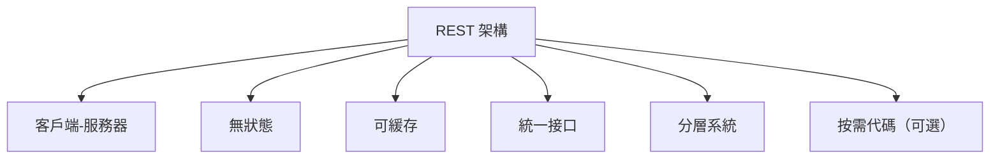
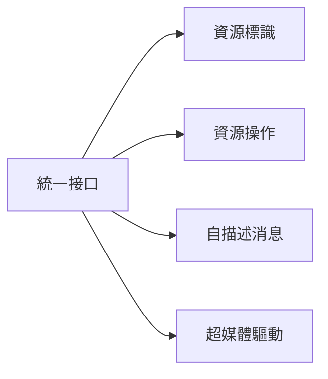
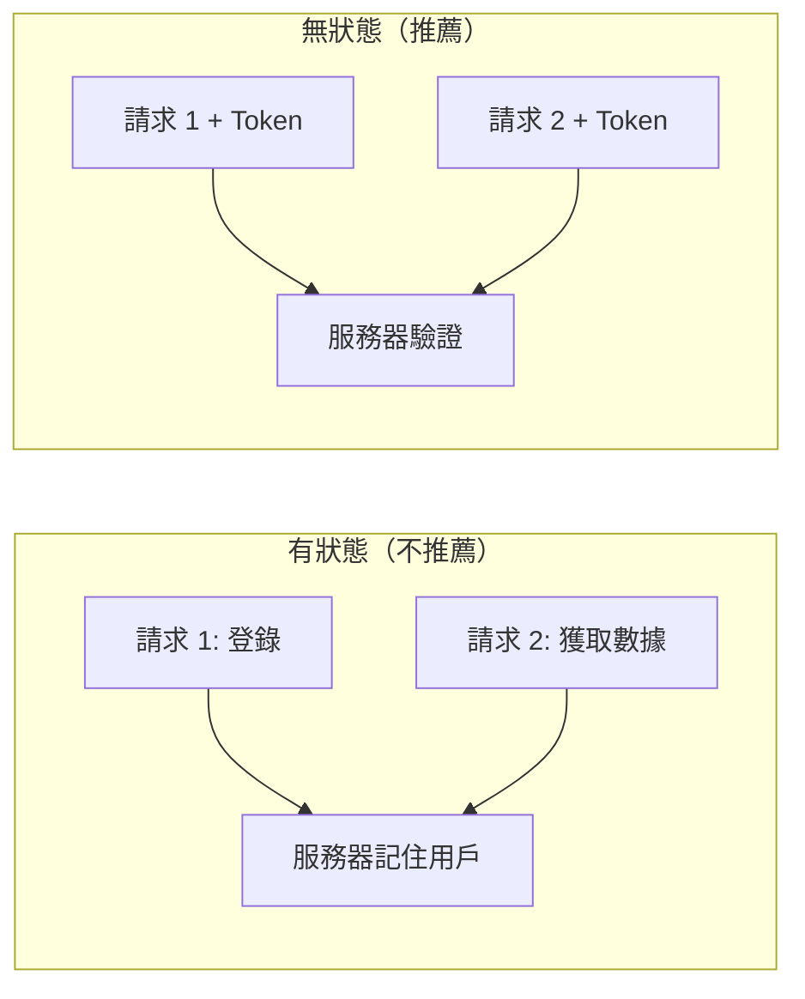
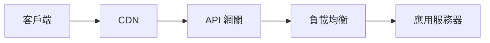

# 7.2.1 REST 約束

## 一句話破題

REST 不是一個技術，而是一套設計約束——遵守這些約束，你的 API 就會變得簡單、可預測、易擴展。

## REST 六大約束



| 約束 | 含義 | 好處 |
|------|------|------|
| **客戶端-服務器** | 前後端分離 | 各自獨立演進 |
| **無狀態** | 服務器不保存會話狀態 | 易於擴展 |
| **可緩存** | 響應可以被緩存 | 提高性能 |
| **統一接口** | 使用標準的 HTTP 方法 | 接口可預測 |
| **分層系統** | 可以有中間層 | 靈活架構 |
| **按需代碼** | 可下載可執行代碼 | 可選特性 |

## 統一接口

### 核心原則

統一接口是 REST 最重要的約束，包含四個子約束：



### 資源標識

```typescript
// 每個資源都有唯一的 URL
/api/users/123        // 用戶資源
/api/posts/456        // 文章資源
/api/users/123/posts  // 用戶的文章
```

### 資源操作

```typescript
// 通過 HTTP 方法表達操作意圖
GET    /api/users/123   // 讀取
POST   /api/users       // 創建
PUT    /api/users/123   // 替換
PATCH  /api/users/123   // 更新
DELETE /api/users/123   // 刪除
```

### 自描述消息

```typescript
// 請求頭包含足夠的元信息
fetch('/api/users', {
  method: 'POST',
  headers: {
    'Content-Type': 'application/json',  // 告知請求體格式
    'Accept': 'application/json',         // 期望響應格式
    'Authorization': 'Bearer xxx',        // 認證信息
  },
  body: JSON.stringify(data),
})
```

## 無狀態

### 什麼是無狀態



### 無狀態的實現

```typescript
// 每個請求都攜帶完整的認證信息
fetch('/api/users', {
  headers: {
    'Authorization': `Bearer ${token}`,  // 每次都帶 Token
  },
})
```

### 好處

| 好處 | 說明 |
|------|------|
| **易擴展** | 請求可以發到任意服務器 |
| **高可用** | 服務器掛了換一臺即可 |
| **簡單** | 不需要維護會話狀態 |

## 可緩存

### 緩存控制頭

```typescript
// app/api/posts/route.ts
export async function GET() {
  const posts = await getPosts()
  
  return NextResponse.json(posts, {
    headers: {
      'Cache-Control': 'public, max-age=60',  // 可公開緩存，60秒有效
      'ETag': generateETag(posts),            // 資源指紋
    },
  })
}
```

### 常用緩存策略

| 策略 | Header | 適用場景 |
|------|--------|----------|
| **不緩存** | `no-store` | 敏感數據 |
| **驗證緩存** | `no-cache` | 頻繁更新 |
| **短期緩存** | `max-age=60` | 列表數據 |
| **長期緩存** | `max-age=31536000` | 靜態資源 |

```typescript
// 不同場景的緩存策略
const cacheStrategies = {
  sensitive: 'private, no-store',           // 用戶敏感數據
  dynamic: 'private, no-cache',             // 個人動態數據
  shared: 'public, max-age=60',             // 公共列表
  static: 'public, max-age=31536000',       // 靜態資源
}
```

## 分層系統



客戶端不需要知道中間有多少層，只需要知道最終的 API 地址。

## RESTful vs 非 RESTful

| 方面 | RESTful | 非 RESTful |
|------|---------|------------|
| URL 設計 | `/api/users/123` | `/api/getUser?id=123` |
| 操作表達 | HTTP 方法 | URL 或參數 |
| 狀態管理 | Token | Session |
| 緩存 | HTTP 緩存頭 | 自定義邏輯 |

## 覺知：常見誤區

### 1. 把動作放到 URL 裏

```
❌ POST /api/createUser
❌ GET  /api/getUsers
❌ POST /api/deleteUser

✅ POST   /api/users
✅ GET    /api/users
✅ DELETE /api/users/123
```

### 2. 濫用 POST

```
❌ 所有操作都用 POST
   POST /api/users/get
   POST /api/users/delete
   
✅ 根據語義選擇方法
   GET    /api/users
   DELETE /api/users/123
```

### 3. 不區分公開和私有緩存

```typescript
// ❌ 用戶私有數據使用公開緩存
headers: { 'Cache-Control': 'public, max-age=3600' }

// ✅ 私有數據使用私有緩存
headers: { 'Cache-Control': 'private, max-age=60' }
```

## 本節小結

| 要點 | 說明 |
|------|------|
| **統一接口** | 用 HTTP 方法表達操作意圖 |
| **無狀態** | 每個請求攜帶完整信息 |
| **可緩存** | 利用 HTTP 緩存機制 |
| **分層系統** | 客戶端不感知中間層 |
