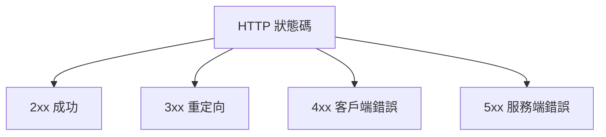
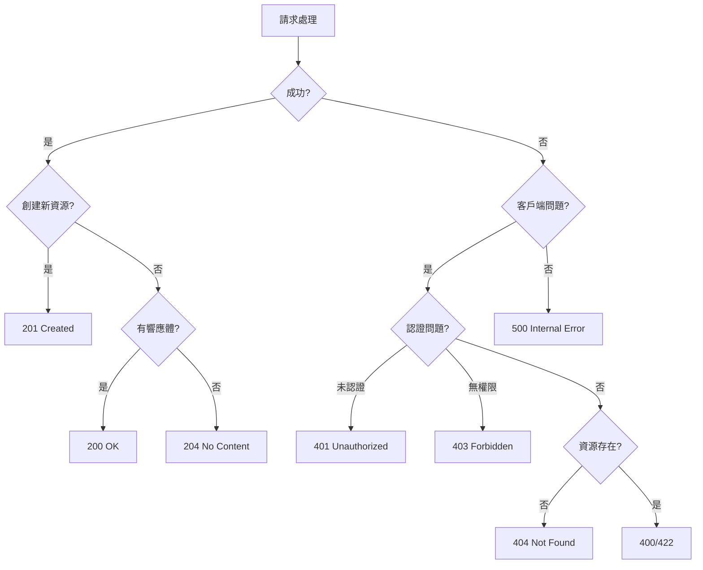

# 7.2.3 HTTP 狀態碼

## 一句話破題

狀態碼是服務器對請求的"判決結果"——2xx 是成功，4xx 是"你錯了"，5xx 是"我錯了"。

## 狀態碼分類



| 分類 | 含義 | 典型場景 |
|------|------|----------|
| **2xx** | 成功 | 請求正常處理 |
| **3xx** | 重定向 | 資源位置變更 |
| **4xx** | 客戶端錯誤 | 請求有問題 |
| **5xx** | 服務端錯誤 | 服務器處理失敗 |

## 常用 2xx 狀態碼

| 狀態碼 | 含義 | 使用場景 |
|--------|------|----------|
| **200 OK** | 請求成功 | GET、PUT、PATCH 成功 |
| **201 Created** | 資源已創建 | POST 創建成功 |
| **204 No Content** | 無內容返回 | DELETE 成功 |

### 使用示例

```typescript
// 200 OK - 獲取成功
export async function GET() {
  const posts = await prisma.post.findMany()
  return NextResponse.json({ data: posts })  // 默認 200
}

// 201 Created - 創建成功
export async function POST(request: NextRequest) {
  const body = await request.json()
  const post = await prisma.post.create({ data: body })
  return NextResponse.json(post, { status: 201 })
}

// 204 No Content - 刪除成功
export async function DELETE() {
  await prisma.post.delete({ where: { id } })
  return new NextResponse(null, { status: 204 })
}
```

## 常用 4xx 狀態碼

| 狀態碼 | 含義 | 使用場景 |
|--------|------|----------|
| **400 Bad Request** | 請求格式錯誤 | 參數驗證失敗 |
| **401 Unauthorized** | 未認證 | 未登錄 |
| **403 Forbidden** | 無權限 | 權限不足 |
| **404 Not Found** | 資源不存在 | 找不到資源 |
| **409 Conflict** | 衝突 | 資源已存在 |
| **422 Unprocessable Entity** | 語義錯誤 | 業務規則驗證失敗 |
| **429 Too Many Requests** | 請求過多 | 觸發限流 |

### 使用示例

```typescript
// 400 Bad Request - 參數格式錯誤
if (!body.email || !isValidEmail(body.email)) {
  return NextResponse.json(
    { error: { code: 'INVALID_EMAIL', message: '郵箱格式不正確' } },
    { status: 400 }
  )
}

// 401 Unauthorized - 未登錄
const token = request.headers.get('Authorization')
if (!token) {
  return NextResponse.json(
    { error: { code: 'UNAUTHORIZED', message: '請先登錄' } },
    { status: 401 }
  )
}

// 403 Forbidden - 無權限
if (post.authorId !== currentUser.id) {
  return NextResponse.json(
    { error: { code: 'FORBIDDEN', message: '無權操作此資源' } },
    { status: 403 }
  )
}

// 404 Not Found - 資源不存在
const post = await prisma.post.findUnique({ where: { id } })
if (!post) {
  return NextResponse.json(
    { error: { code: 'NOT_FOUND', message: '文章不存在' } },
    { status: 404 }
  )
}

// 409 Conflict - 資源衝突
const existing = await prisma.user.findUnique({ where: { email } })
if (existing) {
  return NextResponse.json(
    { error: { code: 'EMAIL_EXISTS', message: '郵箱已被註冊' } },
    { status: 409 }
  )
}

// 429 Too Many Requests - 限流
if (await isRateLimited(ip)) {
  return NextResponse.json(
    { error: { code: 'RATE_LIMITED', message: '請求過於頻繁' } },
    { status: 429 }
  )
}
```

## 常用 5xx 狀態碼

| 狀態碼 | 含義 | 使用場景 |
|--------|------|----------|
| **500 Internal Server Error** | 服務器內部錯誤 | 未知異常 |
| **502 Bad Gateway** | 網關錯誤 | 上游服務失敗 |
| **503 Service Unavailable** | 服務不可用 | 維護中 |
| **504 Gateway Timeout** | 網關超時 | 上游超時 |

### 使用示例

```typescript
export async function GET() {
  try {
    const data = await fetchExternalAPI()
    return NextResponse.json(data)
  } catch (error) {
    console.error('API 調用失敗:', error)
    
    // 500 Internal Server Error
    return NextResponse.json(
      { error: { code: 'INTERNAL_ERROR', message: '服務器內部錯誤' } },
      { status: 500 }
    )
  }
}
```

## 狀態碼選擇指南



## 401 vs 403

| 場景 | 狀態碼 | 說明 |
|------|--------|------|
| 沒有 Token | 401 | 需要登錄 |
| Token 過期 | 401 | 需要重新登錄 |
| Token 有效但無權限 | 403 | 權限不足 |
| 訪問他人資源 | 403 | 無權訪問 |

```typescript
// 認證中間件
async function authMiddleware(request: NextRequest) {
  const token = request.headers.get('Authorization')?.replace('Bearer ', '')
  
  if (!token) {
    return { status: 401, message: '請先登錄' }
  }
  
  try {
    const user = await verifyToken(token)
    return { user }
  } catch {
    return { status: 401, message: 'Token 已過期' }
  }
}

// 權限檢查
if (user.role !== 'admin') {
  return NextResponse.json(
    { error: { code: 'FORBIDDEN', message: '需要管理員權限' } },
    { status: 403 }
  )
}
```

## 400 vs 422

| 場景 | 狀態碼 | 說明 |
|------|--------|------|
| JSON 格式錯誤 | 400 | 語法錯誤 |
| 缺少必填字段 | 400 | 結構不完整 |
| 字段格式錯誤 | 422 | 語義錯誤 |
| 業務規則違反 | 422 | 邏輯錯誤 |

```typescript
// 400 - 請求格式錯誤
if (!request.body) {
  return NextResponse.json(
    { error: { code: 'MISSING_BODY', message: '請求體不能爲空' } },
    { status: 400 }
  )
}

// 422 - 業務規則驗證失敗
if (user.age < 18) {
  return NextResponse.json(
    { error: { code: 'AGE_RESTRICTION', message: '必須年滿 18 歲' } },
    { status: 422 }
  )
}
```

## 覺知：常見錯誤

### 1. 所有錯誤都返回 200

```typescript
// ❌ 把錯誤信息放在響應體裏，狀態碼是 200
return NextResponse.json({
  success: false,
  error: '用戶不存在',
})

// ✅ 使用正確的狀態碼
return NextResponse.json(
  { error: { code: 'NOT_FOUND', message: '用戶不存在' } },
  { status: 404 }
)
```

### 2. 混淆 401 和 403

```typescript
// ❌ 無權限時返回 401
if (user.role !== 'admin') {
  return NextResponse.json({ error: '未授權' }, { status: 401 })
}

// ✅ 無權限應該返回 403
if (user.role !== 'admin') {
  return NextResponse.json(
    { error: { code: 'FORBIDDEN', message: '需要管理員權限' } },
    { status: 403 }
  )
}
```

### 3. 500 暴露內部細節

```typescript
// ❌ 把錯誤堆棧返回給客戶端
return NextResponse.json({ error: error.stack }, { status: 500 })

// ✅ 只返回通用錯誤信息，詳細日誌在服務端
console.error('Internal error:', error)
return NextResponse.json(
  { error: { code: 'INTERNAL_ERROR', message: '服務器內部錯誤' } },
  { status: 500 }
)
```

## 本節小結

| 要點 | 說明 |
|------|------|
| **2xx** | 成功，201 表示創建 |
| **4xx** | 客戶端錯誤 |
| **5xx** | 服務端錯誤 |
| **401 vs 403** | 未認證 vs 無權限 |
