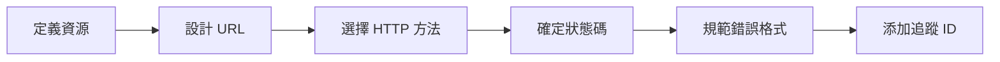

# 7.2 REST 與錯誤處理

## 核心問題

| 問題 | 本節解答 |
|------|----------|
| REST 是什麼？ | 一套 API 設計約束，讓接口更統一可預測 |
| URL 怎麼設計？ | 資源導向，名詞複數，層級清晰 |
| 狀態碼怎麼用？ | 2xx 成功、4xx 客戶端錯誤、5xx 服務端錯誤 |
| 錯誤信息怎麼返回？ | 統一結構，包含錯誤碼、消息、詳情 |
| 怎麼追蹤請求？ | 每個請求分配唯一 Trace ID |

## REST 設計流程



## 本節內容

| 小節 | 主題 | 核心知識點 |
|------|------|------------|
| 7.2.1 | REST 約束 | 統一接口、無狀態、可緩存 |
| 7.2.2 | 資源設計 | URL 路徑、資源映射、命名規範 |
| 7.2.3 | 狀態碼標準 | HTTP 狀態碼使用規範 |
| 7.2.4 | 錯誤響應格式 | 統一的錯誤信息結構 |
| 7.2.5 | 追蹤 ID | 請求鏈路跟蹤與調試 |

## 快速示例

### REST API 設計

```typescript
// 資源: 用戶 (users)
GET    /api/users         // 獲取用戶列表
GET    /api/users/:id     // 獲取單個用戶
POST   /api/users         // 創建用戶
PUT    /api/users/:id     // 更新用戶
DELETE /api/users/:id     // 刪除用戶

// 嵌套資源: 用戶的文章
GET    /api/users/:id/posts      // 獲取用戶的文章
POST   /api/users/:id/posts      // 爲用戶創建文章
```

### 統一錯誤格式

```json
{
  "error": {
    "code": "VALIDATION_ERROR",
    "message": "請求參數驗證失敗",
    "details": [
      { "field": "email", "message": "郵箱格式不正確" }
    ],
    "traceId": "abc-123-xyz"
  }
}
```

## 學習目標

完成本節後，你將能夠：

1. 理解 REST 架構約束及其意義
2. 設計符合 RESTful 規範的 API URL
3. 正確使用 HTTP 狀態碼
4. 實現統一的錯誤響應格式
5. 使用 Trace ID 追蹤請求鏈路
