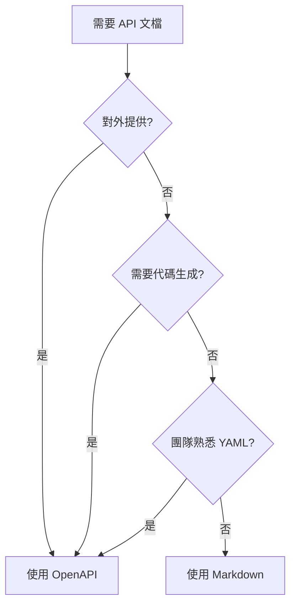

# 7.3.1 文檔格式選擇

## 一句話破題

Markdown 適合快速記錄，OpenAPI 適合正式發佈——選擇取決於誰在讀文檔、怎麼用文檔。

## 兩種格式對比

| 方面 | Markdown | OpenAPI |
|------|----------|---------|
| **學習成本** | 低 | 中 |
| **編寫速度** | 快 | 慢 |
| **可交互性** | 無 | 有 |
| **代碼生成** | 不支持 | 支持 |
| **驗證能力** | 無 | 有 |
| **適用場景** | 內部文檔 | 對外 API |

## Markdown 文檔

### 優勢

- 所有人都會寫
- Git 版本控制友好
- 與代碼放在一起
- 無需額外工具

### 模板示例

```markdown
# 用戶管理 API

## 創建用戶

**POST** `/api/users`

創建一個新的用戶賬戶。

### 認證

需要 `Admin` 權限的 Token。

### 請求

**Headers:**

| Header | 類型 | 必需 | 說明 |
|--------|------|------|------|
| Authorization | string | 是 | Bearer Token |

**Body:**

| 字段 | 類型 | 必需 | 說明 |
|------|------|------|------|
| email | string | 是 | 用戶郵箱，需要唯一 |
| password | string | 是 | 密碼，至少 8 位 |
| name | string | 否 | 顯示名稱 |

**示例:**

\`\`\`json
{
  "email": "user@example.com",
  "password": "securepassword123",
  "name": "張三"
}
\`\`\`

### 響應

**成功 (201 Created):**

\`\`\`json
{
  "data": {
    "id": "user_abc123",
    "email": "user@example.com",
    "name": "張三",
    "createdAt": "2024-01-15T10:30:00Z"
  }
}
\`\`\`

**錯誤 (400 Bad Request):**

\`\`\`json
{
  "error": {
    "code": "VALIDATION_ERROR",
    "message": "請求參數驗證失敗",
    "details": [
      { "field": "email", "message": "郵箱格式不正確" }
    ]
  }
}
\`\`\`

**錯誤 (409 Conflict):**

\`\`\`json
{
  "error": {
    "code": "EMAIL_EXISTS",
    "message": "郵箱已被註冊"
  }
}
\`\`\`
```

### 項目結構

```
docs/
├── api/
│   ├── README.md        # API 概述
│   ├── auth.md          # 認證相關
│   ├── users.md         # 用戶管理
│   ├── posts.md         # 文章管理
│   └── errors.md        # 錯誤碼列表
```

## OpenAPI 文檔

### 優勢

- 標準化格式
- 可生成交互 UI
- 可生成客戶端代碼
- 可做請求驗證

### 基本結構

```yaml
# openapi.yaml
openapi: 3.0.0
info:
  title: 用戶管理 API
  version: 1.0.0
  description: 用戶相關的 API 接口

servers:
  - url: https://api.example.com
    description: 生產環境
  - url: http://localhost:3000
    description: 本地開發

paths:
  /api/users:
    post:
      summary: 創建用戶
      description: 創建一個新的用戶賬戶
      tags:
        - 用戶管理
      security:
        - bearerAuth: []
      requestBody:
        required: true
        content:
          application/json:
            schema:
              $ref: '#/components/schemas/CreateUserRequest'
            example:
              email: user@example.com
              password: securepassword123
              name: 張三
      responses:
        '201':
          description: 創建成功
          content:
            application/json:
              schema:
                $ref: '#/components/schemas/UserResponse'
        '400':
          description: 驗證失敗
          content:
            application/json:
              schema:
                $ref: '#/components/schemas/ErrorResponse'
        '409':
          description: 郵箱已存在
          content:
            application/json:
              schema:
                $ref: '#/components/schemas/ErrorResponse'

components:
  securitySchemes:
    bearerAuth:
      type: http
      scheme: bearer
      bearerFormat: JWT

  schemas:
    CreateUserRequest:
      type: object
      required:
        - email
        - password
      properties:
        email:
          type: string
          format: email
          description: 用戶郵箱
        password:
          type: string
          minLength: 8
          description: 密碼，至少 8 位
        name:
          type: string
          description: 顯示名稱

    UserResponse:
      type: object
      properties:
        data:
          type: object
          properties:
            id:
              type: string
            email:
              type: string
            name:
              type: string
            createdAt:
              type: string
              format: date-time

    ErrorResponse:
      type: object
      properties:
        error:
          type: object
          properties:
            code:
              type: string
            message:
              type: string
            details:
              type: array
              items:
                type: object
                properties:
                  field:
                    type: string
                  message:
                    type: string
```

## 如何選擇？



| 場景 | 推薦格式 |
|------|----------|
| 內部微服務 | Markdown |
| 公開 REST API | OpenAPI |
| 小團隊項目 | Markdown |
| 需要 SDK 生成 | OpenAPI |
| 快速原型 | Markdown |
| 正式產品 API | OpenAPI |

## 混合使用

```
docs/
├── api/
│   ├── overview.md      # Markdown: 概述和快速入門
│   ├── openapi.yaml     # OpenAPI: 詳細接口定義
│   └── examples/        # Markdown: 使用示例
```

## 覺知：常見問題

### 1. 文檔過於簡略

```markdown
❌ 
## 創建用戶
POST /api/users

✅
## 創建用戶
POST /api/users

創建新用戶賬戶。需要管理員權限。

**請求參數：**
| 字段 | 類型 | 必需 | 說明 |
|------|------|------|------|
| email | string | 是 | 有效的郵箱地址 |
...
```

### 2. 缺少錯誤響應

```markdown
❌ 只寫成功響應

✅ 包含所有可能的錯誤
- 400: 參數驗證失敗
- 401: 未認證
- 403: 無權限
- 409: 資源衝突
```

### 3. 示例數據不真實

```json
// ❌ 無意義的示例
{ "name": "test", "email": "test@test.com" }

// ✅ 真實的示例
{ "name": "張三", "email": "zhangsan@company.com" }
```

## 本節小結

| 要點 | 說明 |
|------|------|
| **Markdown** | 簡單快速，適合內部 |
| **OpenAPI** | 標準化，可交互 |
| **選擇依據** | 誰讀、怎麼用 |
| **混合使用** | 概述用 MD，詳情用 OpenAPI |
