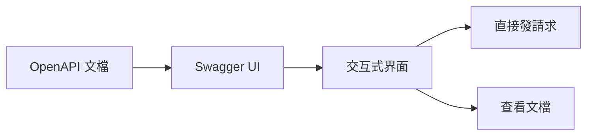

# 7.3.2 Swagger UI

## 一句話破題

Swagger UI 把你的 OpenAPI 文檔變成一個可以直接點擊測試的網頁——比靜態文檔好用得多。

## 什麼是 Swagger UI



| 功能 | 說明 |
|------|------|
| **可視化** | 自動渲染 API 文檔 |
| **可測試** | 在瀏覽器中直接調用 API |
| **認證** | 支持輸入 Token |
| **自動生成** | 根據 OpenAPI 自動生成 |

## 在 Next.js 中使用

### 安裝依賴

```bash
npm install swagger-ui-react next-swagger-doc
```

### 創建 OpenAPI 文檔

```typescript
// lib/swagger.ts
import { createSwaggerSpec } from 'next-swagger-doc'

export const getApiDocs = () => {
  return createSwaggerSpec({
    apiFolder: 'app/api',
    definition: {
      openapi: '3.0.0',
      info: {
        title: '我的 API',
        version: '1.0.0',
        description: 'API 文檔',
      },
      servers: [
        { url: 'http://localhost:3000', description: '開發環境' },
      ],
      components: {
        securitySchemes: {
          bearerAuth: {
            type: 'http',
            scheme: 'bearer',
            bearerFormat: 'JWT',
          },
        },
      },
    },
  })
}
```

### 添加 JSDoc 註釋

```typescript
// app/api/users/route.ts

/**
 * @swagger
 * /api/users:
 *   get:
 *     summary: 獲取用戶列表
 *     tags:
 *       - 用戶管理
 *     security:
 *       - bearerAuth: []
 *     parameters:
 *       - name: page
 *         in: query
 *         schema:
 *           type: integer
 *           default: 1
 *       - name: pageSize
 *         in: query
 *         schema:
 *           type: integer
 *           default: 10
 *     responses:
 *       200:
 *         description: 成功
 *         content:
 *           application/json:
 *             schema:
 *               type: object
 *               properties:
 *                 data:
 *                   type: array
 *                   items:
 *                     $ref: '#/components/schemas/User'
 *   post:
 *     summary: 創建用戶
 *     tags:
 *       - 用戶管理
 *     requestBody:
 *       required: true
 *       content:
 *         application/json:
 *           schema:
 *             $ref: '#/components/schemas/CreateUserRequest'
 *     responses:
 *       201:
 *         description: 創建成功
 */
export async function GET(request: NextRequest) {
  // 實現...
}

export async function POST(request: NextRequest) {
  // 實現...
}
```

### 創建文檔頁面

```typescript
// app/api-docs/page.tsx
'use client'

import dynamic from 'next/dynamic'
import 'swagger-ui-react/swagger-ui.css'

const SwaggerUI = dynamic(() => import('swagger-ui-react'), { ssr: false })

export default function ApiDocsPage() {
  return (
    <div className="swagger-container">
      <SwaggerUI url="/api/docs" />
    </div>
  )
}
```

### 提供 OpenAPI JSON

```typescript
// app/api/docs/route.ts
import { getApiDocs } from '@/lib/swagger'

export async function GET() {
  return Response.json(getApiDocs())
}
```

## 常用註釋語法

### 路徑參數

```typescript
/**
 * @swagger
 * /api/users/{id}:
 *   get:
 *     summary: 獲取單個用戶
 *     parameters:
 *       - name: id
 *         in: path
 *         required: true
 *         schema:
 *           type: string
 *         description: 用戶 ID
 */
```

### 請求體

```typescript
/**
 * @swagger
 * components:
 *   schemas:
 *     CreateUserRequest:
 *       type: object
 *       required:
 *         - email
 *         - password
 *       properties:
 *         email:
 *           type: string
 *           format: email
 *           example: user@example.com
 *         password:
 *           type: string
 *           minLength: 8
 *           example: password123
 */
```

### 錯誤響應

```typescript
/**
 * @swagger
 * /api/users:
 *   post:
 *     responses:
 *       201:
 *         description: 創建成功
 *       400:
 *         description: 參數錯誤
 *         content:
 *           application/json:
 *             schema:
 *               $ref: '#/components/schemas/ErrorResponse'
 *       401:
 *         description: 未認證
 *       409:
 *         description: 郵箱已存在
 */
```

## 定義公共組件

```typescript
// lib/swagger-components.ts

/**
 * @swagger
 * components:
 *   schemas:
 *     User:
 *       type: object
 *       properties:
 *         id:
 *           type: string
 *         email:
 *           type: string
 *         name:
 *           type: string
 *         createdAt:
 *           type: string
 *           format: date-time
 *     
 *     ErrorResponse:
 *       type: object
 *       properties:
 *         error:
 *           type: object
 *           properties:
 *             code:
 *               type: string
 *             message:
 *               type: string
 *             traceId:
 *               type: string
 *     
 *     PaginationMeta:
 *       type: object
 *       properties:
 *         page:
 *           type: integer
 *         pageSize:
 *           type: integer
 *         total:
 *           type: integer
 *         totalPages:
 *           type: integer
 */
```

## 自定義樣式

```css
/* app/api-docs/swagger.css */
.swagger-container {
  margin: 0 auto;
  max-width: 1200px;
}

.swagger-ui .topbar {
  display: none;
}

.swagger-ui .info {
  margin: 20px 0;
}
```

## 覺知：注意事項

### 1. 生產環境保護

```typescript
// 只在開發環境啓用
// app/api-docs/page.tsx
export default function ApiDocsPage() {
  if (process.env.NODE_ENV === 'production') {
    return <div>文檔在生產環境不可用</div>
  }
  
  return <SwaggerUI url="/api/docs" />
}
```

### 2. 認證配置

```typescript
// 在 Swagger UI 中配置默認 Token
<SwaggerUI 
  url="/api/docs"
  requestInterceptor={(req) => {
    req.headers['Authorization'] = `Bearer ${getToken()}`
    return req
  }}
/>
```

### 3. 保持文檔同步

```typescript
// 註釋要緊跟代碼
/**
 * @swagger
 * /api/users:
 *   post:
 *     summary: 創建用戶
 */
export async function POST(request: NextRequest) {
  // 修改代碼時記得更新上面的註釋
}
```

## 本節小結

| 要點 | 說明 |
|------|------|
| **Swagger UI** | 可視化、可交互的 API 文檔 |
| **JSDoc 註釋** | 在代碼中定義 OpenAPI |
| **自動生成** | 從註釋生成文檔 |
| **安全** | 生產環境要保護 |
