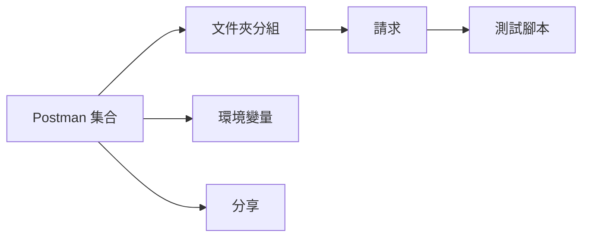

# 7.3.3 Postman 集合

## 一句話破題

Postman 不只是測試工具，更是可以分享給團隊的"活文檔"——一個集合就包含了所有 API 的調用示例。

## 什麼是 Postman 集合



| 組件 | 作用 |
|------|------|
| **集合** | API 請求的容器 |
| **文件夾** | 按模塊分組 |
| **請求** | 具體的 API 調用 |
| **環境** | 不同環境的變量 |
| **腳本** | 自動化測試 |

## 創建集合

### 集合結構

```
我的 API
├── 認證
│   ├── 登錄
│   ├── 註冊
│   └── 刷新 Token
├── 用戶管理
│   ├── 獲取用戶列表
│   ├── 獲取單個用戶
│   ├── 創建用戶
│   ├── 更新用戶
│   └── 刪除用戶
└── 文章管理
    ├── 獲取文章列表
    ├── 創建文章
    └── ...
```

### 環境變量

```json
// 開發環境
{
  "base_url": "http://localhost:3000",
  "token": ""
}

// 生產環境
{
  "base_url": "https://api.example.com",
  "token": ""
}
```

### 請求配置

```
POST {{base_url}}/api/auth/login

Headers:
  Content-Type: application/json

Body:
{
  "email": "user@example.com",
  "password": "password123"
}
```

## 自動化腳本

### 保存 Token

```javascript
// 登錄請求的 Tests 腳本
const response = pm.response.json()

if (response.data && response.data.token) {
  pm.environment.set('token', response.data.token)
  console.log('Token saved!')
}
```

### 使用 Token

```
GET {{base_url}}/api/users

Headers:
  Authorization: Bearer {{token}}
```

### 測試響應

```javascript
// Tests 腳本
pm.test('狀態碼是 200', () => {
  pm.response.to.have.status(200)
})

pm.test('返回數據是數組', () => {
  const response = pm.response.json()
  pm.expect(response.data).to.be.an('array')
})

pm.test('響應時間小於 500ms', () => {
  pm.expect(pm.response.responseTime).to.be.below(500)
})
```

## 預請求腳本

### 生成動態數據

```javascript
// Pre-request Script
const timestamp = Date.now()
const email = `user_${timestamp}@test.com`

pm.environment.set('test_email', email)
```

### 使用動態數據

```json
{
  "email": "{{test_email}}",
  "password": "password123"
}
```

## 導出與分享

### 導出集合

```json
// collection.json
{
  "info": {
    "name": "我的 API",
    "schema": "https://schema.getpostman.com/json/collection/v2.1.0/collection.json"
  },
  "item": [
    {
      "name": "認證",
      "item": [
        {
          "name": "登錄",
          "request": {
            "method": "POST",
            "url": "{{base_url}}/api/auth/login",
            "body": {
              "mode": "raw",
              "raw": "{\"email\":\"user@example.com\",\"password\":\"password123\"}"
            }
          }
        }
      ]
    }
  ]
}
```

### 放入代碼倉庫

```
project/
├── src/
├── docs/
│   └── postman/
│       ├── collection.json      # 集合
│       ├── env.development.json # 開發環境
│       └── env.production.json  # 生產環境
```

## 從 OpenAPI 導入

### 步驟

1. 打開 Postman
2. 點擊 Import
3. 選擇 OpenAPI 文件
4. 自動生成集合

### 同步更新

```bash
# 每次 API 變更後
# 1. 更新 OpenAPI 文檔
# 2. 重新導入到 Postman
# 3. 合併變更
```

## 運行測試

### 使用 Newman（命令行）

```bash
# 安裝
npm install -g newman

# 運行集合
newman run collection.json -e env.development.json

# 生成報告
newman run collection.json -e env.development.json -r html
```

### CI/CD 集成

```yaml
# .github/workflows/api-test.yml
name: API Tests

on: [push]

jobs:
  test:
    runs-on: ubuntu-latest
    steps:
      - uses: actions/checkout@v3
      
      - name: Start server
        run: npm start &
        
      - name: Run Postman tests
        run: |
          npm install -g newman
          newman run docs/postman/collection.json \
            -e docs/postman/env.development.json
```

## 最佳實踐

### 1. 使用變量

```
❌ 硬編碼 URL
   http://localhost:3000/api/users

✅ 使用變量
   {{base_url}}/api/users
```

### 2. 添加描述

```markdown
## 創建用戶

創建一個新的用戶賬戶。

**權限要求：** Admin

**注意事項：**
- 郵箱必須唯一
- 密碼至少 8 位
```

### 3. 保存示例響應

```
每個請求保存至少兩個示例：
- 成功響應
- 常見錯誤響應
```

### 4. 環境隔離

```
開發環境：真實測試數據
測試環境：自動化測試數據
生產環境：只讀操作
```

## 本節小結

| 要點 | 說明 |
|------|------|
| **集合** | 組織所有 API 請求 |
| **環境** | 管理不同環境變量 |
| **腳本** | 自動化測試和數據提取 |
| **分享** | 導出放入代碼倉庫 |
