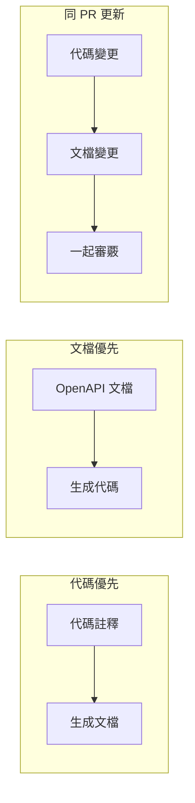

# 7.3.4 文檔同步

## 一句話破題

過時的文檔比沒有文檔更糟糕——讓文檔跟着代碼一起變，才能保證文檔永遠是對的。

## 同步策略



| 策略 | 優勢 | 劣勢 |
|------|------|------|
| **代碼優先** | 代碼即文檔，不會過時 | 註釋可能不夠詳細 |
| **文檔優先** | 設計先行，接口穩定 | 需要額外維護 |
| **同 PR 更新** | 簡單可行 | 依賴人的自覺 |

## 代碼優先：註釋生成文檔

### JSDoc + TypeScript

```typescript
// app/api/users/route.ts

/**
 * @swagger
 * /api/users:
 *   post:
 *     summary: 創建用戶
 *     description: 創建一個新的用戶賬戶
 *     tags: [用戶管理]
 *     requestBody:
 *       required: true
 *       content:
 *         application/json:
 *           schema:
 *             type: object
 *             required: [email, password]
 *             properties:
 *               email:
 *                 type: string
 *                 format: email
 *               password:
 *                 type: string
 *                 minLength: 8
 *     responses:
 *       201:
 *         description: 創建成功
 */
export async function POST(request: NextRequest) {
  // 實現代碼和註釋放在一起
  // 修改代碼時自然會注意到註釋
}
```

### 從類型生成

```typescript
// types/api.ts
import { z } from 'zod'

export const CreateUserSchema = z.object({
  email: z.string().email(),
  password: z.string().min(8),
  name: z.string().optional(),
})

export type CreateUserInput = z.infer<typeof CreateUserSchema>
```

```typescript
// 使用 zod-to-openapi 生成文檔
import { extendZodWithOpenApi } from '@asteasolutions/zod-to-openapi'

extendZodWithOpenApi(z)

const CreateUserSchema = z.object({
  email: z.string().email().openapi({ example: 'user@example.com' }),
  password: z.string().min(8).openapi({ example: 'password123' }),
}).openapi('CreateUserRequest')
```

## 同 PR 更新

### PR 檢查清單

```markdown
## PR Checklist

- [ ] 代碼實現
- [ ] 單元測試
- [ ] API 文檔更新  <-- 強制檢查
- [ ] 更新 Postman 集合（如有需要）
```

### PR 模板

```markdown
<!-- .github/pull_request_template.md -->

## 變更說明

### API 變更

- [ ] 新增接口
- [ ] 修改接口
- [ ] 刪除接口
- [ ] 無 API 變更

### 文檔更新

- [ ] 已更新 JSDoc 註釋
- [ ] 已更新 README
- [ ] 已更新 Postman 集合
- [ ] 不需要更新文檔
```

### CI 檢查

```yaml
# .github/workflows/docs-check.yml
name: Docs Check

on: [pull_request]

jobs:
  check:
    runs-on: ubuntu-latest
    steps:
      - uses: actions/checkout@v3
      
      - name: Check API changes
        run: |
          # 檢查是否修改了 API 文件
          API_CHANGED=$(git diff --name-only origin/main | grep -E "app/api/.*\.ts$" | wc -l)
          
          # 檢查是否更新了文檔
          DOCS_CHANGED=$(git diff --name-only origin/main | grep -E "\.md$|openapi|swagger" | wc -l)
          
          if [ $API_CHANGED -gt 0 ] && [ $DOCS_CHANGED -eq 0 ]; then
            echo "Warning: API files changed but no documentation updated"
            echo "Please update API documentation"
            # exit 1  # 可選：強制失敗
          fi
```

## 自動化工具

### 生成 OpenAPI 文檔

```typescript
// scripts/generate-docs.ts
import { writeFileSync } from 'fs'
import { getApiDocs } from '../lib/swagger'

const spec = getApiDocs()
writeFileSync('docs/openapi.json', JSON.stringify(spec, null, 2))
console.log('OpenAPI spec generated!')
```

```json
// package.json
{
  "scripts": {
    "docs:generate": "ts-node scripts/generate-docs.ts",
    "docs:serve": "npx swagger-ui-watcher docs/openapi.json"
  }
}
```

### 文檔變更檢測

```typescript
// scripts/check-api-changes.ts
import { execSync } from 'child_process'

// 獲取變更的文件
const changedFiles = execSync('git diff --name-only HEAD~1')
  .toString()
  .split('\n')

const apiFiles = changedFiles.filter(f => f.startsWith('app/api/'))
const docFiles = changedFiles.filter(f => 
  f.endsWith('.md') || 
  f.includes('openapi') || 
  f.includes('swagger')
)

if (apiFiles.length > 0 && docFiles.length === 0) {
  console.warn('API 變更但未更新文檔：')
  apiFiles.forEach(f => console.warn(`  - ${f}`))
  process.exit(1)
}
```

## 文檔版本控制

### 與代碼同倉庫

```
project/
├── src/
│   └── app/
│       └── api/           # API 代碼
├── docs/
│   ├── api/               # Markdown 文檔
│   ├── openapi.json       # OpenAPI 規範
│   └── postman/           # Postman 集合
├── scripts/
│   └── generate-docs.ts   # 文檔生成腳本
```

### Git Hooks

```bash
# .husky/pre-commit
#!/bin/sh

# 生成最新文檔
npm run docs:generate

# 添加到提交
git add docs/openapi.json
```

## 覺知：常見問題

### 1. 註釋和代碼不同步

```typescript
// ❌ 註釋說的和代碼做的不一樣
/**
 * @swagger
 * /api/users:
 *   get:
 *     parameters:
 *       - name: status
 *         in: query          // 文檔說有這個參數
 */
export async function GET(request: NextRequest) {
  // 代碼裏沒用 status 參數
}

// ✅ 修改代碼時同步更新註釋
```

### 2. 文檔更新不及時

```
問題：PR 合併後才發現忘了更新文檔

解決：
1. PR 模板強制勾選
2. CI 檢查 API 變更
3. Code Review 時檢查
```

### 3. 示例數據過時

```json
// ❌ 示例還是舊字段
{ "userName": "張三" }

// ✅ 應該是新字段
{ "name": "張三", "displayName": "張三" }
```

## 本節小結

| 要點 | 說明 |
|------|------|
| **代碼優先** | 註釋生成文檔，不會過時 |
| **同 PR 更新** | 代碼和文檔一起提交 |
| **CI 檢查** | 自動檢測 API 變更 |
| **同倉庫** | 文檔和代碼放在一起 |
