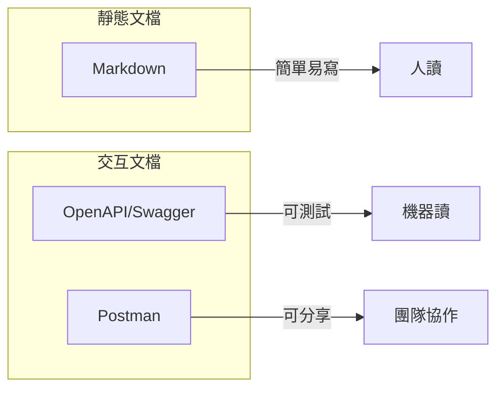

# 7.3 API 文檔

## 核心問題

| 問題 | 本節解答 |
|------|----------|
| 文檔用什麼格式？ | Markdown 簡單直接，OpenAPI 可交互 |
| 怎麼讓文檔可以點着試？ | 使用 Swagger UI |
| 怎麼測試 API？ | 使用 Postman 集合 |
| 代碼改了文檔怎麼同步？ | 代碼註釋自動生成文檔 |

## 文檔類型對比



| 格式 | 優勢 | 適用場景 |
|------|------|----------|
| **Markdown** | 簡單、版本控制友好 | 內部文檔、快速記錄 |
| **OpenAPI** | 標準化、可生成 UI | 正式 API、對外接口 |
| **Postman** | 可測試、可分享 | 接口調試、團隊協作 |

## 本節內容

| 小節 | 主題 | 核心知識點 |
|------|------|------------|
| 7.3.1 | 文檔格式選擇 | Markdown vs OpenAPI |
| 7.3.2 | Swagger UI | 交互式 API 文檔 |
| 7.3.3 | Postman 集合 | API 測試與分享 |
| 7.3.4 | 文檔同步 | 代碼變更驅動文檔更新 |

## 好文檔的標準

### 必備內容

```markdown
## POST /api/users

創建新用戶

### 請求

**Headers:**
- `Authorization: Bearer <token>` (必需)

**Body:**
| 字段 | 類型 | 必需 | 說明 |
|------|------|------|------|
| email | string | 是 | 用戶郵箱 |
| password | string | 是 | 密碼，至少 8 位 |
| name | string | 否 | 顯示名稱 |

### 響應

**成功 (201):**
```json
{
  "data": {
    "id": "user_123",
    "email": "user@example.com",
    "name": "張三"
  }
}
```

**錯誤 (400):**
```json
{
  "error": {
    "code": "VALIDATION_ERROR",
    "message": "郵箱格式不正確"
  }
}
```
```

### 文檔清單

| 項目 | 必需 | 說明 |
|------|------|------|
| 接口地址 | ✅ | 完整 URL 路徑 |
| HTTP 方法 | ✅ | GET/POST/PUT/DELETE |
| 功能描述 | ✅ | 一句話說明作用 |
| 請求參數 | ✅ | 參數名、類型、是否必需 |
| 請求示例 | ✅ | 實際的請求 JSON |
| 響應示例 | ✅ | 成功和錯誤響應 |
| 狀態碼 | ✅ | 可能返回的狀態碼 |
| 認證方式 | ✅ | 需要什麼認證 |
| 錯誤碼 | 推薦 | 業務錯誤碼列表 |

## 學習目標

完成本節後，你將能夠：

1. 選擇合適的文檔格式
2. 編寫清晰的 API 文檔
3. 使用 Swagger UI 創建交互文檔
4. 使用 Postman 測試和分享 API
5. 實現文檔與代碼同步更新
