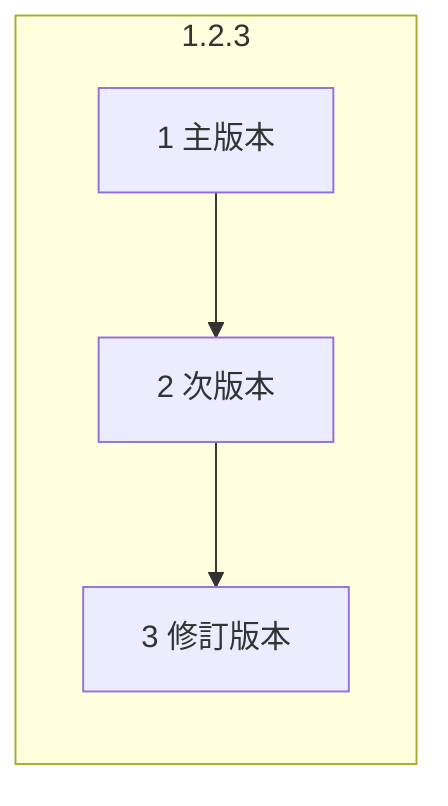
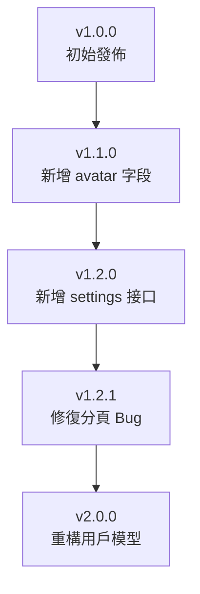

# 7.4.1 語義化版本

## 一句話破題

版本號不是隨便取的數字——主版本變化意味着不兼容的改動，次版本意味着新功能，修訂版本意味着修復。

## 語義化版本格式

```
MAJOR.MINOR.PATCH
主版本.次版本.修訂版本
```



| 部分 | 何時變更 | 示例 |
|------|----------|------|
| **主版本 (MAJOR)** | 不兼容的 API 變更 | 1.0.0 → 2.0.0 |
| **次版本 (MINOR)** | 新增功能，向後兼容 | 1.0.0 → 1.1.0 |
| **修訂版本 (PATCH)** | Bug 修復，向後兼容 | 1.0.0 → 1.0.1 |

## 版本變更規則

### 主版本變更 (MAJOR)

**不兼容的變更**：

```typescript
// v1.0.0
interface User {
  id: string
  name: string
}

// v2.0.0 - 字段重命名，不兼容
interface User {
  id: string
  fullName: string  // name → fullName
}
```

### 次版本變更 (MINOR)

**新增功能，保持兼容**：

```typescript
// v1.0.0
interface User {
  id: string
  name: string
}

// v1.1.0 - 新增可選字段，向後兼容
interface User {
  id: string
  name: string
  avatar?: string  // 新增
}
```

### 修訂版本變更 (PATCH)

**Bug 修復**：

```typescript
// v1.0.0 - 有 Bug
function getAge(birthDate: string) {
  return new Date().getFullYear() - new Date(birthDate).getFullYear()
}

// v1.0.1 - 修復了 Bug
function getAge(birthDate: string) {
  const today = new Date()
  const birth = new Date(birthDate)
  let age = today.getFullYear() - birth.getFullYear()
  // 修復：檢查是否已過生日
  if (today.getMonth() < birth.getMonth()) age--
  return age
}
```

## API 版本控制

### 簡化版本號

對於 API，通常只使用主版本號：

```
/api/v1/users    # 主版本 1
/api/v2/users    # 主版本 2
```

### 何時升級主版本

| 變更類型 | 是否需要新版本 |
|----------|---------------|
| 刪除字段 | ✅ 是 |
| 重命名字段 | ✅ 是 |
| 改變字段類型 | ✅ 是 |
| 改變必填狀態（可選→必填） | ✅ 是 |
| 新增必填字段 | ✅ 是 |
| 新增可選字段 | ❌ 否 |
| 新增接口 | ❌ 否 |
| 修復 Bug | ❌ 否 |

## 版本演進示例



### 版本歷史

```
v1.0.0 (2024-01-01)
- 初始發佈
- 用戶 CRUD 接口

v1.1.0 (2024-02-01)
- 新增: 用戶頭像字段 (avatar)
- 新增: 頭像上傳接口

v1.2.0 (2024-03-01)
- 新增: 用戶設置接口

v1.2.1 (2024-03-15)
- 修復: 分頁參數驗證問題

v2.0.0 (2024-06-01)
- 破壞性變更: name 字段拆分爲 firstName 和 lastName
- 破壞性變更: 刪除廢棄的 nickname 字段
```

## 預發佈版本

```
1.0.0-alpha    # 內部測試
1.0.0-beta     # 公開測試
1.0.0-rc.1     # 發佈候選
1.0.0          # 正式發佈
```

### 適用場景

| 階段 | 用途 |
|------|------|
| **alpha** | 功能不完整，僅內部測試 |
| **beta** | 功能完整，可能有 Bug |
| **rc** | 準備發佈，最後測試 |
| **正式版** | 穩定可用 |

## 版本比較

```typescript
// 版本比較規則
// 1.0.0 < 1.0.1 < 1.1.0 < 2.0.0
// 1.0.0-alpha < 1.0.0-beta < 1.0.0-rc.1 < 1.0.0

function compareVersions(v1: string, v2: string): number {
  const parts1 = v1.split('.').map(Number)
  const parts2 = v2.split('.').map(Number)
  
  for (let i = 0; i < 3; i++) {
    if (parts1[i] > parts2[i]) return 1
    if (parts1[i] < parts2[i]) return -1
  }
  return 0
}
```

## 覺知：常見錯誤

### 1. 版本號隨意增加

```
❌ 修復一個小 Bug 就升到 2.0.0
❌ 每次發佈都升主版本號

✅ 按照語義化規則升級
   - 不兼容變更 → 主版本
   - 新功能 → 次版本
   - Bug 修復 → 修訂版本
```

### 2. 忽視 0.x.x 的含義

```
0.x.x 表示開發階段，API 可能隨時變化
1.0.0 是第一個穩定版本

0.1.0 → 0.2.0  可以有不兼容變更
1.1.0 → 1.2.0  必須向後兼容
```

### 3. API 版本與包版本混淆

```
API 版本: /api/v1/users, /api/v2/users
包版本: 1.2.3, 2.0.0

兩者獨立管理，不需要同步
```

## 本節小結

| 要點 | 說明 |
|------|------|
| **主版本** | 不兼容的變更 |
| **次版本** | 新功能，向後兼容 |
| **修訂版本** | Bug 修復 |
| **API 版本** | 通常只用主版本號 |
