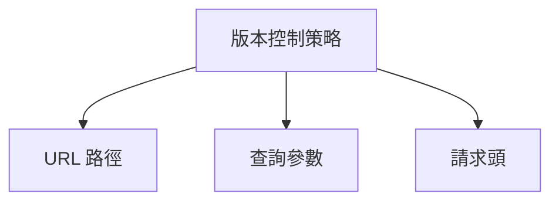
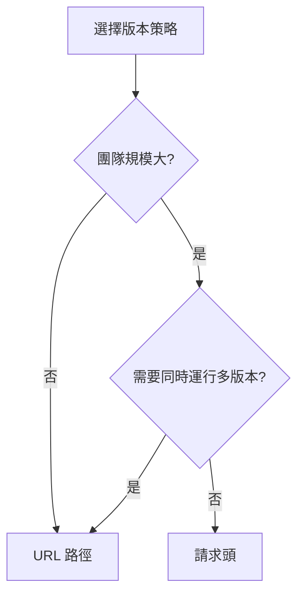

# 7.4.2 版本控制策略

## 一句話破題

版本號放在 URL 裏直觀易懂，放在 Header 裏更加靈活——小項目用 URL，大項目可以考慮 Header。

## 三種策略



| 策略 | 示例 | 優勢 | 劣勢 |
|------|------|------|------|
| **URL 路徑** | `/api/v1/users` | 直觀、易緩存 | URL 變化大 |
| **查詢參數** | `/api/users?v=1` | 簡單、可選 | 不夠語義化 |
| **請求頭** | `Accept: application/vnd.api.v1+json` | 靈活、URL 穩定 | 不直觀 |

## URL 路徑版本

### 實現方式

```
GET /api/v1/users
GET /api/v2/users
```

### Next.js 實現

```
app/
├── api/
│   ├── v1/
│   │   └── users/
│   │       └── route.ts    # v1 版本
│   └── v2/
│       └── users/
│           └── route.ts    # v2 版本
```

```typescript
// app/api/v1/users/route.ts
export async function GET() {
  const users = await prisma.user.findMany({
    select: { id: true, name: true }  // v1: 簡單結構
  })
  return NextResponse.json({ data: users })
}

// app/api/v2/users/route.ts
export async function GET() {
  const users = await prisma.user.findMany({
    select: {
      id: true,
      firstName: true,
      lastName: true,  // v2: 拆分了 name
      avatar: true,
    }
  })
  return NextResponse.json({ data: users })
}
```

### 共享代碼

```typescript
// lib/services/user.service.ts
export class UserService {
  async getUsers() {
    return prisma.user.findMany()
  }
}

// app/api/v1/users/route.ts
export async function GET() {
  const users = await userService.getUsers()
  return NextResponse.json({
    data: users.map(u => ({
      id: u.id,
      name: `${u.firstName} ${u.lastName}`,  // v1 格式
    }))
  })
}

// app/api/v2/users/route.ts
export async function GET() {
  const users = await userService.getUsers()
  return NextResponse.json({
    data: users.map(u => ({
      id: u.id,
      firstName: u.firstName,
      lastName: u.lastName,  // v2 格式
    }))
  })
}
```

## 請求頭版本

### 實現方式

```
GET /api/users
Accept: application/vnd.myapp.v1+json
```

### Next.js 實現

```typescript
// app/api/users/route.ts
export async function GET(request: NextRequest) {
  const accept = request.headers.get('Accept') || ''
  const version = extractVersion(accept) || 'v1'  // 默認 v1
  
  const users = await prisma.user.findMany()
  
  if (version === 'v2') {
    return NextResponse.json({
      data: users.map(formatUserV2),
    })
  }
  
  return NextResponse.json({
    data: users.map(formatUserV1),
  })
}

function extractVersion(accept: string): string | null {
  const match = accept.match(/application\/vnd\.myapp\.(v\d+)\+json/)
  return match ? match[1] : null
}
```

## 如何選擇？



| 場景 | 推薦策略 |
|------|----------|
| 小型項目 | URL 路徑 |
| 公開 API | URL 路徑 |
| 內部微服務 | URL 路徑 |
| 需要細粒度控制 | 請求頭 |
| 移動端 App | URL 路徑 |

## 版本命名規範

### 僅主版本號

```
/api/v1/users
/api/v2/users
```

**適用場景**：大多數 API

### 日期版本

```
/api/2024-01-15/users
/api/2024-06-01/users
```

**適用場景**：頻繁迭代的 API（如 Stripe）

### 無版本號

```
/api/users
```

**適用場景**：GraphQL、內部 API

## 默認版本

```typescript
// 最佳實踐：指定默認版本
export async function GET(request: NextRequest) {
  const version = getVersion(request) || 'v1'  // 默認 v1
  
  // ...
}

// 或者：最新版本爲默認
const LATEST_VERSION = 'v2'
const version = getVersion(request) || LATEST_VERSION
```

## 版本路由中間件

```typescript
// middleware.ts
import { NextResponse } from 'next/server'

export function middleware(request: NextRequest) {
  // 檢查廢棄版本
  if (request.nextUrl.pathname.startsWith('/api/v1')) {
    const response = NextResponse.next()
    response.headers.set(
      'Deprecation',
      'true'
    )
    response.headers.set(
      'Sunset',
      'Sat, 01 Jan 2025 00:00:00 GMT'
    )
    return response
  }
}
```

## 覺知：常見問題

### 1. 版本過多難以維護

```
❌ /api/v1, /api/v2, /api/v3, /api/v4...

✅ 同時只維護 2-3 個版本
   - 當前版本 (v2)
   - 上一版本 (v1) - 廢棄中
   - 下一版本 (v3) - beta
```

### 2. 忘記設置默認版本

```typescript
// ❌ 沒有默認版本，新客戶端不知道用哪個
if (version === 'v1') { ... }
else if (version === 'v2') { ... }
// else ???

// ✅ 設置明確的默認版本
const version = getVersion(request) || 'v2'
```

### 3. URL 版本和實際版本不一致

```
❌ /api/v2 返回的是 v1 的數據結構

✅ 確保版本號與實現一致
   版本號改變 = 數據結構改變
```

## 本節小結

| 要點 | 說明 |
|------|------|
| **URL 路徑** | 最常用，直觀易懂 |
| **請求頭** | 更靈活，URL 不變 |
| **默認版本** | 必須指定 |
| **版本數量** | 同時維護 2-3 個 |
