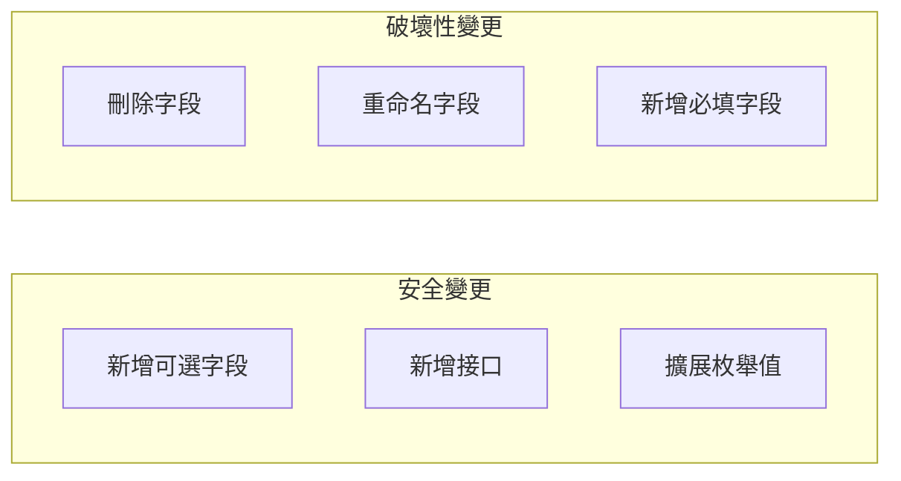
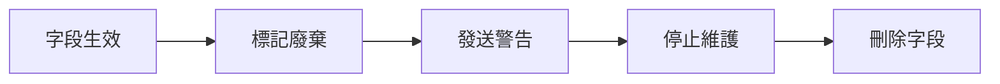

# 7.4.3 向後兼容

## 一句話破題

好的 API 升級就像換飛機引擎——用戶還在飛行中，但引擎悄悄換好了，用戶完全感知不到。

## 兼容性原則



| 變更類型 | 是否兼容 | 處理方式 |
|----------|---------|----------|
| 新增可選字段 | ✅ 兼容 | 直接添加 |
| 新增接口 | ✅ 兼容 | 直接添加 |
| 刪除字段 | ❌ 不兼容 | 先廢棄，再刪除 |
| 重命名字段 | ❌ 不兼容 | 新增 + 廢棄舊字段 |
| 改變字段類型 | ❌ 不兼容 | 新版本 |
| 新增必填字段 | ❌ 不兼容 | 新版本 |

## 安全的變更

### 新增可選字段

```typescript
// 原版本
interface User {
  id: string
  name: string
}

// 新版本 - 新增 avatar，向後兼容
interface User {
  id: string
  name: string
  avatar?: string  // 可選，舊客戶端忽略
}
```

### 新增接口

```typescript
// 原有接口不變
GET /api/users
GET /api/users/:id

// 新增接口，不影響現有客戶端
POST /api/users/:id/avatar
GET /api/users/:id/settings
```

### 擴展枚舉值

```typescript
// 原版本
type Status = 'pending' | 'completed'

// 新版本 - 新增 cancelled，向後兼容
type Status = 'pending' | 'completed' | 'cancelled'

// 客戶端應該處理未知值
function handleStatus(status: string) {
  if (status === 'pending') { ... }
  else if (status === 'completed') { ... }
  else { /* 處理未知狀態 */ }
}
```

## 字段廢棄策略

### 廢棄標記

```typescript
// 響應中包含廢棄警告
interface UserResponse {
  id: string
  name: string        // 將廢棄
  firstName: string   // 新字段
  lastName: string    // 新字段
}

// 設置廢棄響應頭
response.headers.set('Deprecation', 'true')
response.headers.set('Sunset', '2025-01-01')
response.headers.set('Link', '</api/v2/users>; rel="successor-version"')
```

### 廢棄流程



### 時間規劃

| 階段 | 時間 | 行動 |
|------|------|------|
| 廢棄公告 | T+0 | 發佈廢棄通知 |
| 警告期 | T+3個月 | 響應包含警告 |
| 停止更新 | T+6個月 | 不再修復 Bug |
| 刪除 | T+12個月 | 完全移除 |

## 字段重命名

### 錯誤方式

```typescript
// ❌ 直接重命名，破壞兼容性
// 舊版本
{ "name": "張三" }
// 新版本
{ "fullName": "張三" }  // 舊客戶端找不到 name
```

### 正確方式

```typescript
// ✅ 同時返回兩個字段
{
  "name": "張三",        // 廢棄中，將在 2025-01-01 移除
  "fullName": "張三"     // 新字段，請使用這個
}
```

```typescript
// 服務端實現
function formatUser(user: User) {
  return {
    id: user.id,
    name: user.fullName,      // 廢棄，保持兼容
    fullName: user.fullName,  // 新字段
  }
}
```

## 類型變更

### 數字變字符串

```typescript
// 原版本
{ "id": 123 }

// 錯誤：直接改變類型
{ "id": "user_123" }

// 正確：新增字段
{
  "id": 123,              // 保留
  "userId": "user_123"    // 新字段
}
```

### 結構變更

```typescript
// 原版本
{
  "address": "北京市朝陽區xxx"
}

// 正確：新增結構化字段
{
  "address": "北京市朝陽區xxx",  // 保留
  "addressDetail": {              // 新字段
    "province": "北京市",
    "district": "朝陽區",
    "street": "xxx"
  }
}
```

## 請求兼容

### 同時接受新舊格式

```typescript
// app/api/users/route.ts
export async function POST(request: NextRequest) {
  const body = await request.json()
  
  // 同時支持新舊格式
  const name = body.fullName || body.name
  const avatar = body.avatarUrl || body.avatar
  
  const user = await prisma.user.create({
    data: {
      name,
      avatar,
    }
  })
  
  return NextResponse.json(user)
}
```

### 驗證兼容

```typescript
import { z } from 'zod'

const CreateUserSchema = z.object({
  // 新舊字段都可以
  name: z.string().optional(),
  fullName: z.string().optional(),
}).refine(
  data => data.name || data.fullName,
  { message: 'name 或 fullName 至少提供一個' }
)
```

## 客戶端最佳實踐

### 忽略未知字段

```typescript
// ✅ 只取需要的字段
const { id, name } = await response.json()

// ❌ 嚴格校驗所有字段
const user: StrictUser = await response.json()  // 新字段會報錯
```

### 處理新枚舉值

```typescript
function renderStatus(status: string) {
  switch (status) {
    case 'pending':
      return '待處理'
    case 'completed':
      return '已完成'
    default:
      return '未知狀態'  // 處理未來可能新增的值
  }
}
```

## 覺知：常見錯誤

### 1. 直接刪除字段

```typescript
// ❌ 突然刪除
v1: { id, name, nickname }
v2: { id, name }  // nickname 沒了，舊客戶端報錯

// ✅ 漸進式刪除
v1.0: { id, name, nickname }
v1.1: { id, name, nickname: "deprecated" }  // 標記廢棄
v1.2: { id, name }  // 6個月後刪除
```

### 2. 必填變可選

```typescript
// ❌ 客戶端期望有值
v1: { name: "張三" }  // 必填
v2: { name: null }    // 變可選，客戶端可能崩潰

// ✅ 保持必填，或提供默認值
v2: { name: "" }  // 空字符串而非 null
```

### 3. 不通知變更

```
❌ 悄悄修改，沒人知道

✅ 完整的變更流程：
   1. 更新 Changelog
   2. 發送郵件通知
   3. 文檔標記廢棄
   4. 響應頭包含警告
```

## 本節小結

| 要點 | 說明 |
|------|------|
| **安全變更** | 新增可選字段、新增接口 |
| **廢棄流程** | 標記 → 警告 → 刪除 |
| **字段重命名** | 同時返回新舊字段 |
| **客戶端** | 忽略未知字段 |
