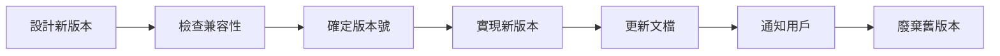

# 7.4 API 版本管理

## 核心問題

| 問題 | 本節解答 |
|------|----------|
| 版本號怎麼定？ | 使用語義化版本：主版本.次版本.修訂版本 |
| 版本號放哪裏？ | URL 路徑簡單直觀，Header 更靈活 |
| 新版本發佈了，舊版本怎麼辦？ | 保持向後兼容，漸進式廢棄 |
| 怎麼通知用戶？ | 維護 Changelog，發送變更通知 |

## 版本管理流程



## 本節內容

| 小節 | 主題 | 核心知識點 |
|------|------|------------|
| 7.4.1 | 語義化版本 | 主版本/次版本/修訂版本 |
| 7.4.2 | 版本控制策略 | URL 路徑 vs 請求頭 |
| 7.4.3 | 向後兼容 | 字段添加與廢棄策略 |
| 7.4.4 | 變更日誌 | API 變更記錄與通知 |

## 快速示例

### URL 版本

```
GET /api/v1/users
GET /api/v2/users
```

### Header 版本

```
GET /api/users
Accept: application/vnd.myapp.v2+json
```

### 向後兼容

```typescript
// 新增字段，不破壞舊客戶端
interface User {
  id: string
  name: string
  email: string
  avatar?: string  // 新增，可選
}
```

## 學習目標

完成本節後，你將能夠：

1. 正確使用語義化版本號
2. 選擇合適的版本控制策略
3. 設計向後兼容的 API
4. 管理 API 變更和廢棄流程
5. 維護清晰的變更日誌
