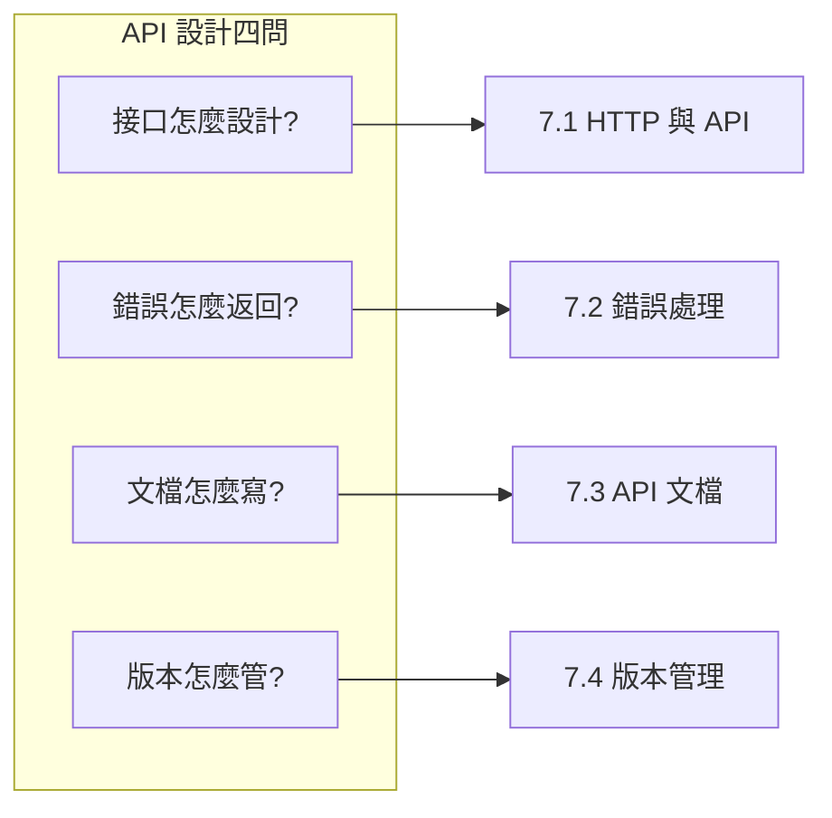

# 7 ｜API 設計與開發規範

## 認知重構

API 不是技術細節，而是**前後端之間的合同**。一份好的合同，雙方都能看懂、都願意遵守；一份爛的合同，開發時吵架、上線後背鍋。

```
傳統認知：API 就是寫幾個接口
正確認知：API 是系統的對外承諾，需要像法律合同一樣嚴謹
```

## 本章核心問題



## 章節導航

### 7.1 接口是合同不是暗語——HTTP 與 API

- HTTP 方法語義：GET/POST/PUT/DELETE 該怎麼用
- JSON 數據格式：序列化與反序列化
- 分頁策略：offset 和 cursor 分頁的取捨
- 過濾與排序：查詢參數的設計規範
- 冪等性保證：重複請求不會搞砸數據

### 7.2 報錯也要說人話——REST 與錯誤處理

- REST 約束：統一接口/無狀態/可緩存
- 資源設計：URL 路徑與資源映射
- 狀態碼標準：404/500 到底什麼意思
- 錯誤響應格式：統一的錯誤信息結構
- 追蹤 ID：請求鏈路跟蹤與調試

### 7.3 活的文檔纔有用——API 文檔

- 文檔格式選擇：Markdown vs OpenAPI
- Swagger UI：可交互的 API 文檔
- Postman 集合：API 測試與分享
- 文檔同步：代碼變更驅動文檔更新

### 7.4 接口升級了舊版怎麼辦——版本管理

- 語義化版本：v1/v2 的講究
- 版本控制策略：URL 路徑 vs 請求頭
- 向前兼容：字段添加與廢棄策略
- 變更日誌：API 變更記錄與通知

## 本章學習目標

| 目標 | 能力 |
|------|------|
| **設計規範的 API** | 遵循 RESTful 原則設計接口 |
| **處理錯誤情況** | 返回清晰、可追蹤的錯誤信息 |
| **維護 API 文檔** | 文檔與代碼同步更新 |
| **管理 API 版本** | 平滑升級，不破壞現有客戶端 |
