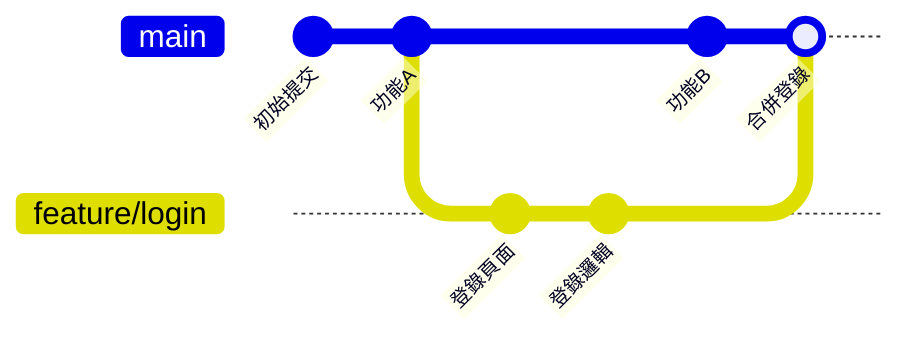
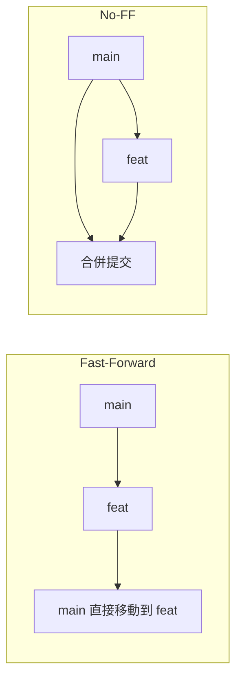

# 8.1.2 平行世界裏寫代碼——分支操作

分支讓你可以在不影響主代碼的情況下進行實驗——就像在平行世界裏開發，滿意了再合併回來。

## 分支的本質

分支本質上是一個指向某個提交的可移動指針。創建分支幾乎不消耗資源，合併分支也只是移動指針。



## 核心分支操作

### 創建與切換分支

```bash
# 查看所有分支
git branch

# 創建新分支
git branch feat/user-profile

# 切換到分支
git checkout feat/user-profile

# 創建並切換（推薦）
git checkout -b feat/user-profile

# 新版本命令（Git 2.23+）
git switch -c feat/user-profile
```

### 分支命名規範

| 前綴 | 用途 | 示例 |
|------|------|------|
| `feat/` | 新功能開發 | `feat/user-login` |
| `fix/` | Bug 修復 | `fix/login-validation` |
| `hotfix/` | 緊急修復 | `hotfix/security-patch` |
| `refactor/` | 代碼重構 | `refactor/auth-module` |
| `docs/` | 文檔更新 | `docs/api-guide` |

### 合併分支

```bash
# 切換到目標分支（通常是 main 或 develop）
git checkout main

# 合併指定分支到當前分支
git merge feat/user-profile

# 合併時創建合併提交（保留分支歷史）
git merge --no-ff feat/user-profile
```

**合併策略對比**：



- **Fast-Forward**：如果目標分支沒有新提交，直接移動指針
- **No-FF**：始終創建合併提交，保留分支歷史

### 刪除分支

```bash
# 刪除已合併的本地分支
git branch -d feat/user-profile

# 強制刪除未合併的分支
git branch -D feat/user-profile

# 刪除遠程分支
git push origin --delete feat/user-profile
```

## 遠程分支操作

```bash
# 查看遠程分支
git branch -r

# 查看所有分支（本地+遠程）
git branch -a

# 拉取遠程分支到本地
git checkout -b feat/login origin/feat/login

# 推送本地分支到遠程
git push -u origin feat/login

# 同步遠程分支信息
git fetch --prune
```

## 常見場景

### 場景1：從 main 創建功能分支

```bash
# 確保 main 是最新的
git checkout main
git pull

# 創建功能分支
git checkout -b feat/new-feature

# 開發完成後推送
git push -u origin feat/new-feature
```

### 場景2：同步主分支更新到功能分支

```bash
# 方法1：合併（保留歷史）
git checkout feat/my-feature
git merge main

# 方法2：變基（線性歷史）
git checkout feat/my-feature
git rebase main
```

### 場景3：清理已合併的分支

```bash
# 列出已合併到 main 的分支
git branch --merged main

# 批量刪除已合併的本地分支
git branch --merged main | grep -v "main" | xargs git branch -d
```

## AI 協作指南

**核心意圖**：告訴 AI 你想實現的分支操作目標。

**關鍵術語**：`checkout`、`branch`、`merge`、`rebase`、`fast-forward`

**示例 Prompt**：
> "我在 feat/login 分支開發了一半，main 分支有了新的更新，我想把 main 的更新同步到我的分支，但保持提交歷史整潔，應該怎麼做？"

## 避坑指南

| 問題 | 原因 | 解決方案 |
|------|------|----------|
| 切換分支失敗 | 有未提交的變更 | 先 commit 或 stash |
| 合併後代碼丟失 | 合併衝突未正確處理 | 仔細檢查衝突標記 |
| 分支刪不掉 | 分支未合併 | 確認是否要用 `-D` 強刪 |
| 遠程分支不存在 | 未 push 或已刪除 | 用 `git fetch --prune` 同步 |
