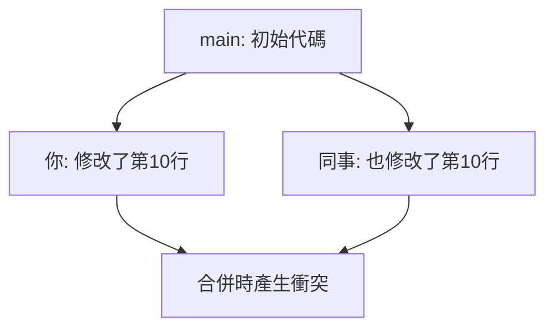

# 8.1.3 代碼打架了怎麼辦——衝突解決

當兩個人同時修改了同一個文件的同一部分，Git 無法自動判斷該保留哪個版本，這就產生了衝突。

## 衝突是如何產生的



**衝突產生的條件**：
- 兩個分支修改了**同一文件的同一區域**
- Git 無法自動決定保留哪個版本

**不會產生衝突的情況**：
- 修改不同文件
- 修改同一文件的不同區域
- 一方只是新增內容

## 衝突的表現形式

當衝突發生時，Git 會在文件中插入衝突標記：

```
<<<<<<< HEAD
你的修改內容
=======
對方的修改內容
>>>>>>> feat/other-branch
```

| 標記 | 含義 |
|------|------|
| `<<<<<<< HEAD` | 當前分支的內容開始 |
| `=======` | 分隔線 |
| `>>>>>>> branch` | 被合併分支的內容結束 |

## 解決衝突的步驟

### 步驟1：識別衝突文件

```bash
# 合併時出現衝突
git merge feat/login
# Auto-merging src/auth.ts
# CONFLICT (content): Merge conflict in src/auth.ts

# 查看衝突狀態
git status
# Unmerged paths:
#   both modified: src/auth.ts
```

### 步驟2：打開文件查看衝突

```typescript
// src/auth.ts
function login(user: string) {
<<<<<<< HEAD
  // 你的版本：使用 JWT
  return jwt.sign({ user });
=======
  // 同事的版本：使用 Session
  return session.create({ user });
>>>>>>> feat/session-auth
}
```

### 步驟3：手動解決衝突

根據業務需求，選擇保留哪個版本（或兩者結合）：

```typescript
// 解決後的代碼
function login(user: string) {
  // 最終決定：使用 JWT
  return jwt.sign({ user });
}
```

**刪除所有衝突標記**（`<<<<<<<`、`=======`、`>>>>>>>`）後保存文件。

### 步驟4：標記衝突已解決

```bash
# 將解決後的文件加入暫存區
git add src/auth.ts

# 完成合並
git commit -m "merge: 解決 auth 模塊衝突，採用 JWT 方案"
```

## 使用 IDE 解決衝突

現代 IDE（如 VS Code、Cursor）提供可視化的衝突解決工具：

```
┌─────────────────────────────────────────┐
│  Accept Current Change  │  當前分支版本  │
│  Accept Incoming Change │  被合併分支版本│
│  Accept Both Changes    │  保留兩者      │
│  Compare Changes        │  對比查看      │
└─────────────────────────────────────────┘
```

**推薦做法**：
1. 點擊 "Compare Changes" 查看差異
2. 理解兩邊的修改意圖
3. 選擇合適的方案或手動編輯

## 預防衝突的最佳實踐

1. **頻繁同步**：經常 pull 遠程更新，減少分支差異
2. **小步提交**：每次提交改動範圍小，衝突更容易解決
3. **分工明確**：團隊成員儘量避免同時修改同一文件
4. **及時溝通**：修改公共模塊前先知會隊友

## 複雜衝突處理技巧

### 放棄合併，回到合併前

```bash
git merge --abort
```

### 使用某一方的版本

```bash
# 使用當前分支的版本
git checkout --ours src/auth.ts

# 使用被合併分支的版本
git checkout --theirs src/auth.ts
```

### 查看衝突的詳細信息

```bash
# 查看衝突的三方對比
git diff --cc src/auth.ts

# 查看公共祖先的內容
git show :1:src/auth.ts  # 公共祖先
git show :2:src/auth.ts  # 當前分支
git show :3:src/auth.ts  # 被合併分支
```

## AI 協作指南

遇到複雜衝突時，可以請 AI 幫忙分析：

**示例 Prompt**：
> "這是我遇到的 Git 衝突：
> ```
> <<<<<<< HEAD
> function validateUser(user) { return user.email && user.password; }
> =======
> function validateUser(user) { return user.email?.trim() && user.password?.length > 6; }
> >>>>>>> feat/validation
> ```
> 請幫我分析兩個版本的差異，並建議如何合併？"

## 驗收清單

- [ ] 理解衝突產生的原因
- [ ] 能識別衝突標記並手動解決
- [ ] 能使用 IDE 的可視化工具解決衝突
- [ ] 知道如何放棄合併或選擇某一方版本
