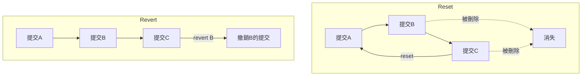
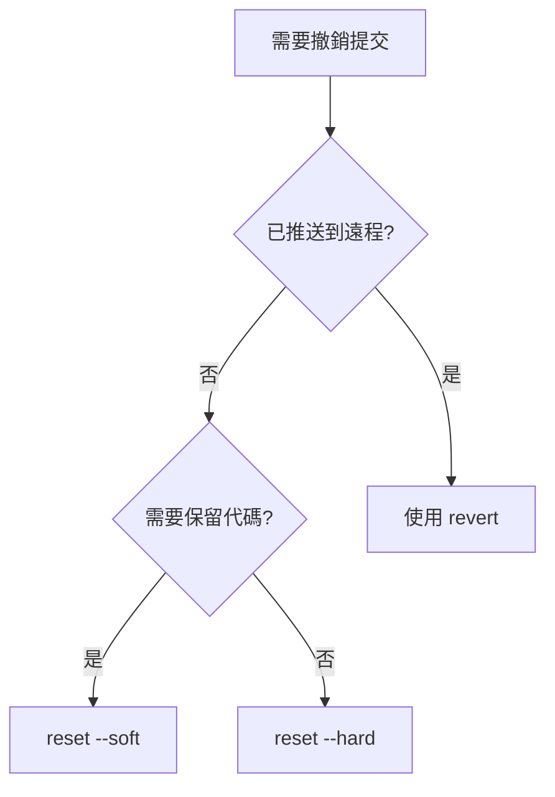

# 8.1.4 一鍵還原到昨天——版本回滾

代碼寫崩了？別慌，Git 的回滾功能就是你的後悔藥——但不同的藥治不同的病。

## reset vs revert：核心區別

| 特性 | git reset | git revert |
|------|-----------|------------|
| 原理 | 移動 HEAD 指針，"刪除"歷史 | 創建新提交來"撤銷"變更 |
| 歷史記錄 | 會改變歷史 | 保留完整歷史 |
| 已推送代碼 | 不推薦使用 | 安全使用 |
| 適用場景 | 本地未推送的提交 | 已推送到遠程的提交 |



## git reset：回到過去

### reset 的三種模式

```bash
# --soft: 保留工作區和暫存區的變更
git reset --soft HEAD~1

# --mixed (默認): 保留工作區，清空暫存區
git reset HEAD~1

# --hard: 工作區和暫存區全部丟棄（慎用！）
git reset --hard HEAD~1
```

| 模式 | 工作區 | 暫存區 | 提交歷史 |
|------|--------|--------|----------|
| --soft | 保留 | 保留 | 回退 |
| --mixed | 保留 | 清空 | 回退 |
| --hard | 清空 | 清空 | 回退 |

### 常見使用場景

```bash
# 場景1：撤銷最近一次提交，但保留代碼繼續修改
git reset --soft HEAD~1

# 場景2：撤銷最近3次提交
git reset --hard HEAD~3

# 場景3：回退到指定提交
git reset --hard abc1234

# 場景4：撤銷 git add，但保留文件修改
git reset HEAD file.ts
```

### 危險操作的補救

如果不小心 `reset --hard` 了，可以用 reflog 找回：

```bash
# 查看操作歷史
git reflog

# 找到丟失的提交 hash，然後恢復
git reset --hard abc1234
```

## git revert：創建"反向提交"

revert 不會刪除歷史，而是創建一個新提交來"抵消"之前的變更。

```bash
# 撤銷最近一次提交
git revert HEAD

# 撤銷指定提交
git revert abc1234

# 撤銷多個連續提交
git revert HEAD~3..HEAD

# 撤銷但不自動提交
git revert --no-commit abc1234
```

### revert 合併提交

合併提交需要指定保留哪個父分支：

```bash
# -m 1 表示保留主分支（第一個父提交）
git revert -m 1 merge-commit-hash
```

## 場景決策指南



### 場景對照表

| 場景 | 推薦命令 | 原因 |
|------|----------|------|
| 剛 commit 發現寫錯了 | `git reset --soft HEAD~1` | 保留代碼繼續修改 |
| 想徹底刪除最近幾次提交 | `git reset --hard HEAD~n` | 本地清理 |
| 已 push 的代碼有 bug | `git revert HEAD` | 不改變遠程歷史 |
| 想撤銷某個中間提交 | `git revert abc1234` | 精準撤銷單個提交 |
| 不小心合併了錯誤分支 | `git revert -m 1 merge` | 撤銷合併 |

## 其他回滾技巧

### 恢復單個文件到指定版本

```bash
# 恢復文件到上一個版本
git checkout HEAD~1 -- src/file.ts

# 恢復文件到指定提交
git checkout abc1234 -- src/file.ts
```

### 暫存當前工作

```bash
# 臨時保存當前工作
git stash

# 查看 stash 列表
git stash list

# 恢復最近的 stash
git stash pop

# 恢復指定的 stash
git stash apply stash@{1}
```

## AI 協作指南

**核心意圖**：告訴 AI 你的具體情況（是否已推送、是否需要保留代碼）。

**示例 Prompt**：
> "我剛 push 了一個提交到 main 分支，但發現代碼有嚴重 bug，需要立即撤銷這次提交，同時保留 Git 歷史完整性，應該怎麼做？"

## 驗收清單

- [ ] 理解 reset 和 revert 的區別
- [ ] 能根據場景選擇正確的回滾方式
- [ ] 知道如何用 reflog 找回誤刪的提交
- [ ] 能使用 stash 暫存工作進度
