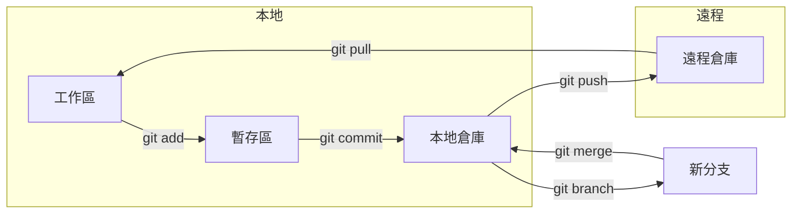

# 8.1 你的時光機和安全網——Git 基本流程

Git 是代碼的時光機——讓你隨時回到過去，也是安全網——讓你大膽嘗試而不怕失敗。

## 核心價值

Git 解決的不是"如何寫代碼"，而是"如何安全地管理代碼變化"：

- **版本追溯**：每次提交都是一個快照，可以隨時回退
- **並行開發**：通過分支，多人可以同時開發不同功能
- **變更審查**：通過 PR，代碼上線前必須經過審覈
- **衝突解決**：當多人修改同一文件時，提供合併機制

## Git 工作流全景

## 核心命令速查

| 場景 | 命令 | 說明 |
|------|------|------|
| 保存修改 | `git add .` | 將所有變更加入暫存區 |
| 提交快照 | `git commit -m "msg"` | 創建一個版本快照 |
| 推送遠程 | `git push` | 將本地提交推送到遠程 |
| 拉取更新 | `git pull` | 獲取遠程最新代碼 |
| 創建分支 | `git checkout -b feat/xx` | 創建並切換到新分支 |
| 合併分支 | `git merge feat/xx` | 將指定分支合併到當前分支 |
| 版本回退 | `git reset --hard HEAD~1` | 回退到上一個版本 |

## 本節結構

本節將從實際操作出發，帶你掌握 Git 的核心技能：

1. **基礎命令**：add/commit/push/pull 的日常使用
2. **分支操作**：創建、切換、合併、刪除分支
3. **衝突解決**：當代碼"打架"時如何處理
4. **版本回滾**：reset 和 revert 的區別與使用
5. **gitignore**：哪些文件不應該被版本控制

## 驗收清單

- [ ] 能獨立完成 clone → 修改 → commit → push 流程
- [ ] 能創建分支、切換分支、合併分支
- [ ] 能處理簡單的合併衝突
- [ ] 理解 reset 和 revert 的區別
- [ ] 能正確配置 .gitignore 文件
