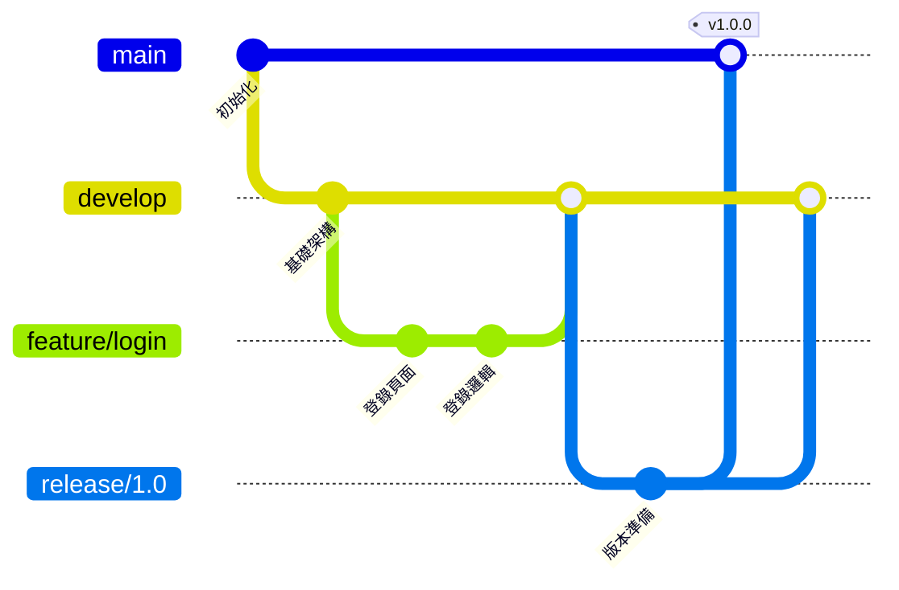
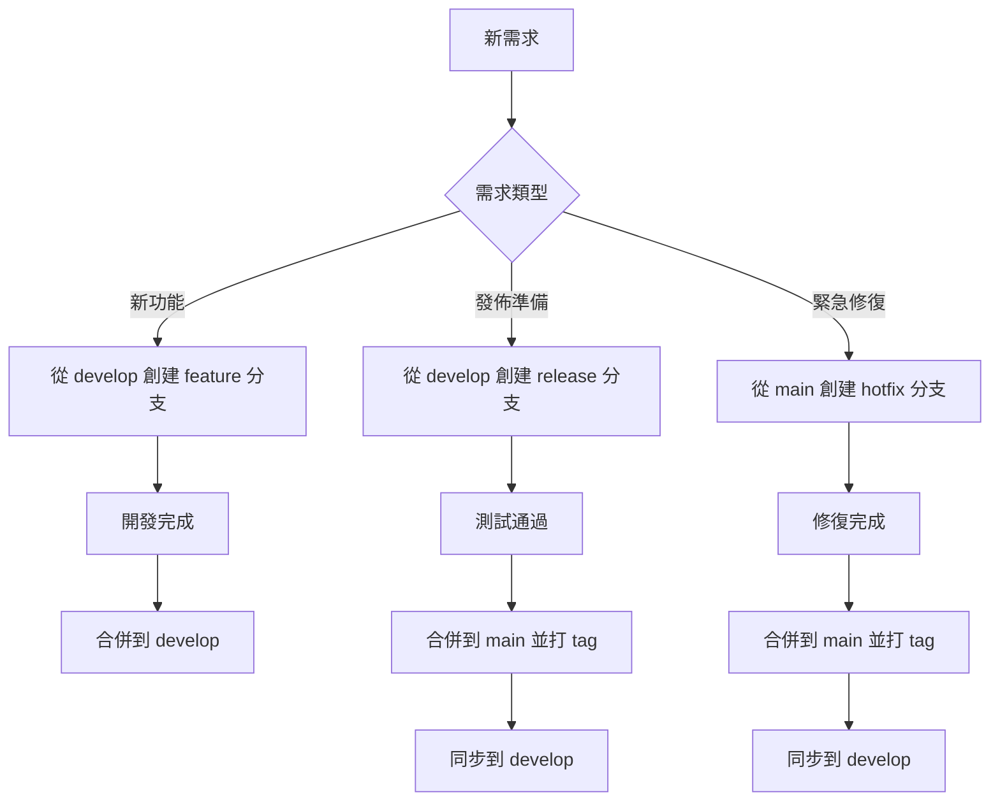

# 8.2.1 專業團隊的工作流——Git Flow

Git Flow 是一套成熟的分支管理規範，適合有明確版本發佈週期的項目。

## Git Flow 分支結構



## 五種分支類型

| 分支類型 | 命名規範 | 生命週期 | 來源 | 合併目標 |
|----------|----------|----------|------|----------|
| main | `main` | 永久 | - | - |
| develop | `develop` | 永久 | main | release |
| feature | `feature/*` | 臨時 | develop | develop |
| release | `release/*` | 臨時 | develop | main + develop |
| hotfix | `hotfix/*` | 臨時 | main | main + develop |

### 1. main 分支

- **作用**：生產環境代碼，始終保持可部署狀態
- **規則**：只接受 release 和 hotfix 的合併，禁止直接提交
- **標籤**：每次合併後打上版本標籤（如 `v1.0.0`）

### 2. develop 分支

- **作用**：開發主線，包含最新的開發進度
- **規則**：只接受 feature、release、hotfix 的合併
- **狀態**：可能包含未完成功能，不保證可部署

### 3. feature 分支

```bash
# 創建功能分支
git checkout develop
git checkout -b feature/user-profile

# 開發完成後合併回 develop
git checkout develop
git merge --no-ff feature/user-profile
git branch -d feature/user-profile
```

- **作用**：開發新功能
- **命名**：`feature/功能名稱`（如 `feature/user-login`）
- **生命週期**：功能開發期間

### 4. release 分支

```bash
# 準備發佈
git checkout develop
git checkout -b release/1.0.0

# 修復發現的問題、更新版本號...

# 發佈到 main
git checkout main
git merge --no-ff release/1.0.0
git tag -a v1.0.0 -m "Release 1.0.0"

# 同步回 develop
git checkout develop
git merge --no-ff release/1.0.0
git branch -d release/1.0.0
```

- **作用**：版本發佈準備，只做 bug 修復和版本號更新
- **命名**：`release/版本號`（如 `release/1.0.0`）
- **規則**：不允許添加新功能

### 5. hotfix 分支

```bash
# 緊急修復
git checkout main
git checkout -b hotfix/security-fix

# 修復問題...

# 合併到 main
git checkout main
git merge --no-ff hotfix/security-fix
git tag -a v1.0.1 -m "Hotfix: security issue"

# 同步到 develop
git checkout develop
git merge --no-ff hotfix/security-fix
git branch -d hotfix/security-fix
```

- **作用**：生產環境緊急 bug 修復
- **命名**：`hotfix/問題描述`（如 `hotfix/login-crash`）
- **規則**：修復後同時合併到 main 和 develop

## Git Flow 工作流程



## Git Flow 工具

可以使用 `git-flow` 擴展簡化操作：

```bash
# 安裝（macOS）
brew install git-flow

# 初始化
git flow init

# 開始功能開發
git flow feature start user-login

# 完成功能開發
git flow feature finish user-login

# 開始發佈
git flow release start 1.0.0

# 完成發佈
git flow release finish 1.0.0
```

## 適用場景與侷限

**適合**：
- 有明確版本發佈週期的產品
- 需要同時維護多個版本
- 團隊規模較大，需要嚴格流程

**不適合**：
- 持續部署的 Web 應用
- 小團隊快速迭代項目
- 只維護單一版本的產品

## AI 協作指南

**示例 Prompt**：
> "我們的項目使用 Git Flow，現在需要緊急修復一個生產環境的安全漏洞，請幫我列出完整的操作步驟。"

## 驗收清單

- [ ] 理解五種分支類型的作用
- [ ] 能正確執行 feature 分支的創建和合並
- [ ] 理解 release 和 hotfix 的區別
- [ ] 瞭解 Git Flow 的適用場景
