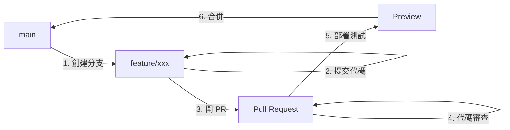
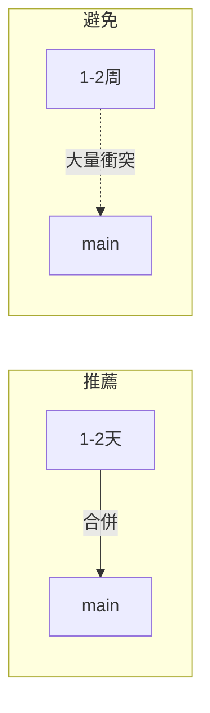

# 8.2.2 小團隊的敏捷工作流——GitHub Flow

GitHub Flow 只有一個核心原則：main 分支始終可部署。其餘一切從簡。

## GitHub Flow 核心流程



## 六步工作流

### 步驟1：從 main 創建分支

```bash
git checkout main
git pull origin main
git checkout -b feat/user-dashboard
```

**命名規範**：
- `feat/xxx` - 新功能
- `fix/xxx` - bug 修復
- `docs/xxx` - 文檔更新
- `refactor/xxx` - 代碼重構

### 步驟2：提交代碼

```bash
# 頻繁提交，每個提交都應該是一個邏輯單元
git add .
git commit -m "feat: 添加用戶儀表盤佈局"
git commit -m "feat: 完成數據獲取邏輯"
git commit -m "style: 調整儀表盤樣式"
```

### 步驟3：推送並創建 Pull Request

```bash
git push -u origin feat/user-dashboard
```

然後在 GitHub 上創建 PR，填寫：
- **標題**：簡潔描述變更內容
- **描述**：詳細說明改了什麼、爲什麼改
- **關聯 Issue**：如果有的話

### 步驟4：代碼審查

團隊成員審查代碼：
- 代碼質量
- 業務邏輯正確性
- 測試覆蓋
- 安全隱患

### 步驟5：部署預覽

現代 CI/CD 工具（如 Vercel）會自動爲每個 PR 創建預覽環境：

```
Preview: https://project-feat-user-dashboard.vercel.app
```

在預覽環境測試通過後，才能合併。

### 步驟6：合併到 main

審查通過後，通過 GitHub UI 合併 PR：
- **Merge commit**：保留完整歷史
- **Squash and merge**：壓縮爲單個提交（推薦）
- **Rebase and merge**：變基合併，保持線性歷史

合併後 main 會自動觸發生產部署。

## GitHub Flow vs Git Flow

| 特性 | GitHub Flow | Git Flow |
|------|-------------|----------|
| 分支數量 | 2 種（main + feature） | 5 種 |
| 複雜度 | 簡單 | 複雜 |
| 發佈節奏 | 持續部署 | 定期發佈 |
| 版本管理 | 無需 | 需要 |
| 適合團隊 | 小團隊 | 大團隊 |
| 最佳場景 | Web 應用 | 傳統軟件 |

## 緊急修復流程

GitHub Flow 中的緊急修復與普通功能開發流程相同：

```bash
# 1. 從 main 創建修復分支
git checkout main && git pull
git checkout -b fix/critical-bug

# 2. 修復問題
git add . && git commit -m "fix: 修復登錄失敗問題"

# 3. 推送並創建 PR
git push -u origin fix/critical-bug

# 4. 快速審查後合併
# 5. main 自動部署
```

## 最佳實踐

### 1. 保持分支短命



### 2. 小步提交

```bash
# 好的做法：每個提交聚焦一件事
git commit -m "feat: 添加用戶頭像組件"
git commit -m "feat: 集成頭像到用戶卡片"
git commit -m "test: 添加頭像組件測試"

# 避免：一個巨大的提交
git commit -m "feat: 添加用戶系統"  # 包含 50 個文件變更
```

### 3. 及時同步 main

```bash
# 開發過程中定期同步
git fetch origin main
git rebase origin/main
```

### 4. 使用 PR 模板

在倉庫根目錄創建 `.github/PULL_REQUEST_TEMPLATE.md`：

```markdown
## 變更類型
- [ ] 新功能
- [ ] Bug 修復
- [ ] 重構
- [ ] 文檔

## 變更描述
<!-- 描述你做了什麼變更 -->

## 測試
- [ ] 已添加/更新測試
- [ ] 本地測試通過

## 截圖（如適用）
```

## AI 協作指南

**示例 Prompt**：
> "我正在開發一個新功能，已經在 feat/user-profile 分支上提交了幾次代碼。現在發現 main 分支有新的更新，我想把 main 的更新同步到我的分支，同時保持提交歷史整潔，應該怎麼做？"

## 驗收清單

- [ ] 理解 GitHub Flow 的六步流程
- [ ] 能獨立完成從創建分支到合併的完整流程
- [ ] 瞭解 GitHub Flow 與 Git Flow 的區別
- [ ] 掌握分支同步和 PR 最佳實踐
