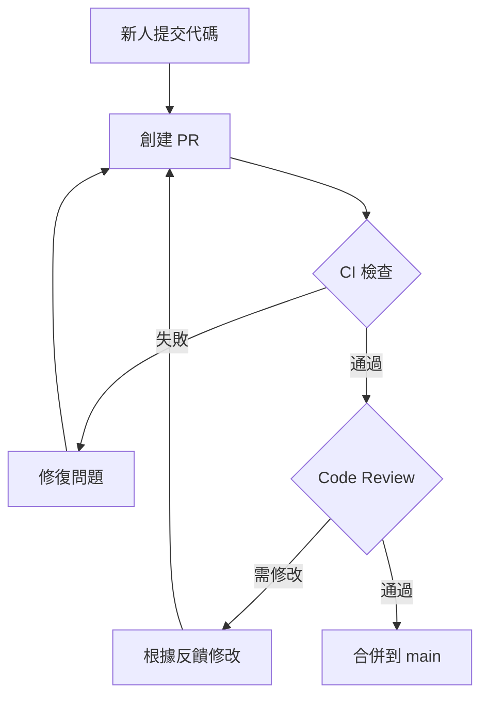

# 8.2.3 主分支不是誰都能動——分支保護

分支保護規則是團隊協作的"交通信號燈"——沒有規則，再好的流程也會被打破。

## 爲什麼需要分支保護

沒有分支保護時可能發生的問題：

- 有人直接 push 到 main，跳過代碼審查
- 未通過測試的代碼被合併
- 強制推送覆蓋他人代碼
- main 分支進入不可部署狀態

**分支保護的核心目標**：確保 main 分支上的代碼始終處於可部署狀態。

## GitHub 分支保護配置

### 進入設置

```
倉庫 → Settings → Branches → Add branch protection rule
```

### 核心保護規則

| 規則 | 作用 | 推薦 |
|------|------|------|
| Require a pull request | 禁止直接 push，必須通過 PR | 必選 |
| Require approvals | 需要指定數量的審批 | 至少 1 人 |
| Require status checks | CI 檢查必須通過 | 必選 |
| Require branches to be up to date | PR 必須與目標分支同步 | 推薦 |
| Require signed commits | 要求 GPG 簽名 | 可選 |
| Include administrators | 管理員也受規則約束 | 推薦 |

### 配置示例

```yaml
# 分支保護規則配置示意
Branch name pattern: main

Protection rules:
  - Require a pull request before merging: ✅
    - Required approving reviews: 1
    - Dismiss stale reviews: ✅
    - Require review from code owners: ✅
  
  - Require status checks to pass: ✅
    - Required checks:
      - build
      - test
      - lint
    - Require branches to be up to date: ✅
  
  - Do not allow bypassing: ✅
```

## 狀態檢查集成

分支保護可以與 CI/CD 集成，確保代碼質量：

```yaml
# .github/workflows/ci.yml
name: CI

on:
  pull_request:
    branches: [main]

jobs:
  build:
    runs-on: ubuntu-latest
    steps:
      - uses: actions/checkout@v4
      - uses: actions/setup-node@v4
        with:
          node-version: '20'
      - run: pnpm install
      - run: pnpm build

  test:
    runs-on: ubuntu-latest
    steps:
      - uses: actions/checkout@v4
      - uses: actions/setup-node@v4
      - run: pnpm install
      - run: pnpm test

  lint:
    runs-on: ubuntu-latest
    steps:
      - uses: actions/checkout@v4
      - uses: actions/setup-node@v4
      - run: pnpm install
      - run: pnpm lint
```

配置後，PR 頁面會顯示檢查狀態：

```
┌─────────────────────────────────────────┐
│ ✅ build — All checks have passed       │
│ ✅ test — All checks have passed        │
│ ✅ lint — All checks have passed        │
├─────────────────────────────────────────┤
│ ✅ Ready to merge                       │
└─────────────────────────────────────────┘
```

## Code Owners 配置

通過 `CODEOWNERS` 文件指定代碼負責人：

```bash
# .github/CODEOWNERS

# 默認審查者
* @team-lead

# 前端代碼
/src/components/ @frontend-team
/src/app/ @frontend-team

# 後端代碼
/src/api/ @backend-team
/prisma/ @backend-team

# 基礎設施
/.github/ @devops-team
/docker/ @devops-team

# 文檔
/docs/ @docs-team
```

配置後，修改對應目錄的代碼會自動請求相關負責人審查。

## 保護規則實踐場景

### 場景1：新人加入團隊



### 場景2：緊急修復

即使緊急情況，也應遵循流程：

1. 創建 hotfix 分支
2. 快速修復並提交
3. 創建 PR，標記爲 `urgent`
4. 請求快速審查（可在羣裏 @審查者）
5. 審查通過後合併

**不推薦**：臨時禁用分支保護（會留下安全隱患）

## 常見問題

### Q: 管理員可以繞過保護嗎？

如果啓用了 "Include administrators"，則管理員也必須遵循規則。

### Q: 如何處理 CI 檢查偶爾失敗？

1. 確保 CI 配置穩定可靠
2. 使用重試機制
3. 必要時可以 "Re-run" 失敗的檢查

### Q: 緊急情況無人審批怎麼辦？

1. 設置多個可審批人
2. 建立緊急聯繫機制
3. 考慮設置自動合併（不推薦用於 main）

## AI 協作指南

**示例 Prompt**：
> "請幫我配置一個 GitHub Actions workflow，用於在 PR 時運行 Next.js 項目的構建、測試和類型檢查，並將這些作爲分支保護的必需檢查。"

## 驗收清單

- [ ] 理解分支保護的必要性
- [ ] 能在 GitHub 上配置基本的分支保護規則
- [ ] 瞭解 CI 狀態檢查的集成方式
- [ ] 知道如何配置 CODEOWNERS
