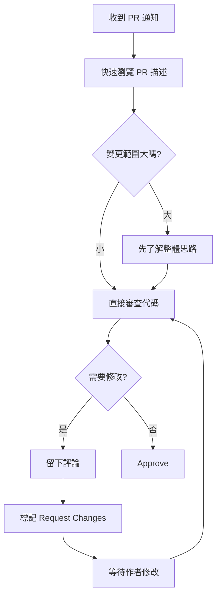

# 8.2.4 同事幫你看代碼——代碼審查

代碼審查不是挑刺大會，而是團隊知識共享和質量保障的核心環節。

## 代碼審查的價值

| 價值 | 說明 |
|------|------|
| 發現 Bug | 兩雙眼睛比一雙更容易發現問題 |
| 知識傳遞 | 審查者學習作者的思路，反之亦然 |
| 代碼質量 | 維護團隊一致的代碼風格和架構 |
| 減少風險 | 降低單點故障，多人瞭解代碼 |

## PR 模板配置

在倉庫中創建 `.github/PULL_REQUEST_TEMPLATE.md`：

```markdown
## 變更類型

- [ ] 新功能 (feat)
- [ ] Bug 修復 (fix)
- [ ] 代碼重構 (refactor)
- [ ] 樣式調整 (style)
- [ ] 文檔更新 (docs)
- [ ] 測試相關 (test)
- [ ] 構建配置 (build)

## 變更描述

<!-- 簡要描述你做了什麼變更，爲什麼需要這個變更 -->

## 關聯 Issue

<!-- 如果有的話，填寫關聯的 Issue 編號 -->
Closes #

## 自測清單

- [ ] 代碼符合項目規範
- [ ] 已添加必要的測試
- [ ] 本地測試全部通過
- [ ] 已更新相關文檔

## 截圖 / 錄屏（如適用）

<!-- 如果是 UI 變更，請附上截圖或錄屏 -->

## 其他說明

<!-- 任何需要審查者特別注意的地方 -->
```

## 審查者清單

### 功能正確性

- [ ] 代碼邏輯是否正確實現了需求
- [ ] 邊界條件是否處理得當
- [ ] 錯誤處理是否完善
- [ ] 是否考慮了併發/競態問題

### 代碼質量

- [ ] 代碼是否清晰易讀
- [ ] 命名是否準確描述了意圖
- [ ] 函數/組件是否職責單一
- [ ] 是否有重複代碼可以抽取

### 安全性

- [ ] 是否有 SQL 注入風險
- [ ] 用戶輸入是否經過驗證
- [ ] 敏感數據是否正確處理
- [ ] 是否有硬編碼的密鑰

### 性能

- [ ] 是否有明顯的性能問題
- [ ] 數據庫查詢是否高效
- [ ] 是否有 N+1 查詢問題
- [ ] 前端是否避免了不必要的渲染

### 測試

- [ ] 是否有足夠的測試覆蓋
- [ ] 測試用例是否覆蓋邊界情況
- [ ] 測試是否易於維護

## 審查評論規範

### 評論類型標記

```markdown
[必須] 這裏有內存泄漏，需要在 useEffect 的清理函數中取消訂閱

[建議] 可以考慮用 useMemo 優化這個計算

[疑問] 爲什麼選擇在這裏處理而不是在服務層？

[贊] 這個封裝很優雅！

[提示] FYI：這個庫最新版本有 breaking change
```

### 評論最佳實踐

**要做**：
- 解釋問題的原因，而不僅僅指出問題
- 提供具體的改進建議
- 肯定代碼中做得好的地方
- 區分必須修改和可選建議

**避免**：
- 使用貶低性語言
- 僅說"這樣不對"而不說原因
- 追求完美主義而阻塞合併
- 評論與代碼無關的問題

## 高效審查流程



## 審查時間管理

| 原則 | 說明 |
|------|------|
| 及時響應 | 24 小時內完成首次審查 |
| 分批審查 | 每天固定時間處理 PR，避免頻繁打斷 |
| 優先級 | 緊急修復 > 阻塞他人 > 普通功能 |
| 溝通 | 大型 PR 先溝通，避免來回修改 |

## 作者最佳實踐

### 創建 PR 前

- 自己先 Review 一遍代碼
- 確保 CI 檢查通過
- 寫清楚 PR 描述
- 控制 PR 大小（推薦 < 400 行變更）

### 響應評論

```markdown
# 同意並已修改
已修復，採用了你建議的 useMemo 方案

# 解釋原因
保留原方案，因爲這裏的計算複雜度很低，useMemo 反而會增加內存開銷

# 需要討論
這個問題比較複雜，能否線下討論一下？
```

## AI 輔助代碼審查

可以讓 AI 幫助進行初步審查：

**示例 Prompt**：
> "請審查以下代碼變更，關注以下幾點：
> 1. 是否有明顯的 bug 或邏輯錯誤
> 2. 是否有安全隱患
> 3. 是否有性能問題
> 4. 代碼風格是否符合 React/TypeScript 最佳實踐
>
> ```tsx
> // 你的代碼...
> ```"

## 驗收清單

- [ ] 瞭解代碼審查的價值
- [ ] 能配置 PR 模板
- [ ] 掌握審查評論的規範
- [ ] 理解作者和審查者各自的職責
