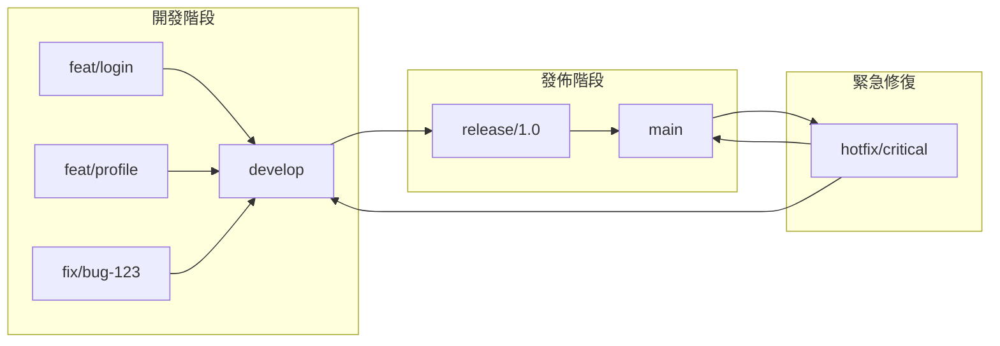

# 8.2 爲什麼不能隨便提交代碼——分支策略

直接往 main 分支提交代碼，就像在高速公路上隨意變道——看似方便，實則危險。

## 爲什麼需要分支策略

沒有分支策略的團隊常常遇到這些問題：

- 未經測試的代碼直接上線，導致生產事故
- 多人同時開發，代碼頻繁衝突
- 出了問題不知道是哪次提交引入的
- 緊急 bug 修復被未完成的功能代碼阻塞

**分支策略的本質是隔離風險**——讓不同階段的代碼在不同的"車道"上行駛。

## 分支策略全景

## 兩種主流分支模型

| 模型 | 適用場景 | 複雜度 | 分支數量 |
|------|----------|--------|----------|
| Git Flow | 傳統軟件、定期發佈 | 高 | 多 |
| GitHub Flow | 持續部署、Web 應用 | 低 | 少 |

**推薦**：對於 Next.js 全棧項目，**GitHub Flow** 更爲合適——簡單、快速、適合持續部署。

## 本節結構

1. **Git Flow**：功能/發佈/熱修復分支的完整工作流
2. **GitHub Flow**：適合小團隊的簡化分支模型
3. **分支保護**：如何強制 PR 和狀態檢查
4. **代碼審查**：PR 模板和 Review 最佳實踐

## 核心原則

無論選擇哪種模型，都應遵循以下原則：

1. **main 分支始終可部署**：main 上的代碼隨時可以上線
2. **功能開發在獨立分支**：一個功能一個分支，互不干擾
3. **通過 PR 合併代碼**：所有代碼必須經過審查才能進入主分支
4. **小步快跑**：分支生命週期越短越好，避免大規模合併

## 驗收清單

- [ ] 理解分支策略的必要性
- [ ] 能根據項目特點選擇合適的分支模型
- [ ] 知道如何配置分支保護規則
- [ ] 掌握 PR 和代碼審查的基本流程
