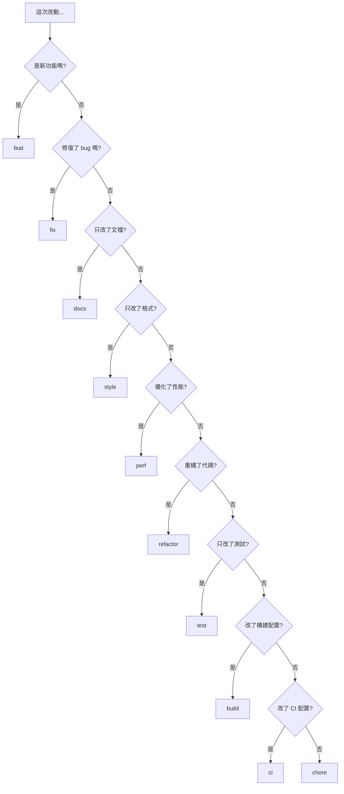

# 8.3.2 feat 和 fix 是什麼意思——類型分類

不同類型的變更使用不同的 type 前綴——這是 Conventional Commits 的核心。

## 類型速查表

| Type | 說明 | 觸發版本變更 | 示例 |
|------|------|--------------|------|
| feat | 新功能 | minor (1.x.0) | 添加用戶登錄 |
| fix | 修復 bug | patch (1.0.x) | 修復登錄失敗 |
| docs | 文檔更新 | 無 | 更新 README |
| style | 代碼格式 | 無 | 調整縮進 |
| refactor | 重構 | 無 | 優化代碼結構 |
| perf | 性能優化 | patch | 優化查詢速度 |
| test | 測試相關 | 無 | 添加單元測試 |
| build | 構建相關 | 無 | 升級依賴版本 |
| ci | CI 配置 | 無 | 修改 workflow |
| chore | 雜項 | 無 | 更新 .gitignore |
| revert | 回滾 | 取決於原提交 | 撤銷某次提交 |

## 詳細說明

### feat - 新功能

用於添加新功能或特性，會影響用戶體驗或 API：

```bash
feat: 添加用戶註冊功能
feat(auth): 支持 GitHub 第三方登錄
feat(api): 新增獲取用戶列表接口
```

**判斷標準**：用戶/調用方能感知到的新能力。

### fix - Bug 修復

修復代碼中的錯誤或問題：

```bash
fix: 修復首頁白屏問題
fix(auth): 修復 token 過期後無法刷新的問題
fix(ui): 修復移動端按鈕點擊區域過小
```

**判斷標準**：修復了一個已存在的問題。

### docs - 文檔

僅涉及文檔的變更：

```bash
docs: 更新安裝說明
docs(api): 添加接口使用示例
docs(readme): 補充項目架構說明
```

**判斷標準**：只改了 .md 文件或代碼註釋。

### style - 代碼格式

不影響代碼邏輯的格式調整：

```bash
style: 統一使用單引號
style: 調整代碼縮進爲 2 空格
style: 移除多餘的空行
```

**判斷標準**：純格式調整，運行結果完全不變。

### refactor - 重構

既不是新功能也不是 bug 修復的代碼重構：

```bash
refactor: 提取公共驗證邏輯
refactor(auth): 使用策略模式重構登錄流程
refactor: 將類組件改爲函數組件
```

**判斷標準**：優化代碼結構，但功能行爲不變。

### perf - 性能優化

提升性能的代碼變更：

```bash
perf: 使用虛擬列表優化長列表渲染
perf(api): 添加數據庫查詢緩存
perf: 圖片懶加載優化首屏速度
```

**判斷標準**：專門爲了提升性能的改動。

### test - 測試

添加或修改測試代碼：

```bash
test: 添加用戶服務單元測試
test(e2e): 補充登錄流程端到端測試
test: 修復測試用例中的 mock 數據
```

**判斷標準**：只涉及測試代碼。

### build - 構建

影響構建系統或外部依賴的變更：

```bash
build: 升級 Next.js 到 14.0
build: 添加 webpack 別名配置
build(deps): 更新 prisma 到最新版本
```

**判斷標準**：package.json 依賴變更或構建配置修改。

### ci - 持續集成

CI 配置文件和腳本的變更：

```bash
ci: 添加 GitHub Actions 部署流程
ci: 配置自動化測試 workflow
ci: 添加代碼覆蓋率檢查
```

**判斷標準**：只涉及 CI/CD 配置。

### chore - 雜項

其他不影響源代碼或測試的變更：

```bash
chore: 更新 .gitignore
chore: 添加 EditorConfig 配置
chore: 清理無用的註釋代碼
```

**判斷標準**：不屬於以上任何類型。

### revert - 回滾

撤銷之前的提交：

```bash
revert: revert "feat(auth): 添加 Google 登錄"

This reverts commit abc1234.
```

## 類型選擇決策樹



## 常見誤區

| 誤區 | 正確做法 |
|------|----------|
| 用 fix 表示"修改" | fix 只用於修復 bug |
| 用 feat 表示"完成功能" | feat 只用於新增功能 |
| 用 refactor 表示"修改代碼" | refactor 只用於不改變行爲的重構 |
| 用 chore 作爲萬能類型 | 優先使用更具體的類型 |

## 驗收清單

- [ ] 能準確區分 feat 和 fix
- [ ] 理解 refactor 與 fix 的區別
- [ ] 知道 style 和 refactor 的界限
- [ ] 能根據變更內容選擇正確的類型
