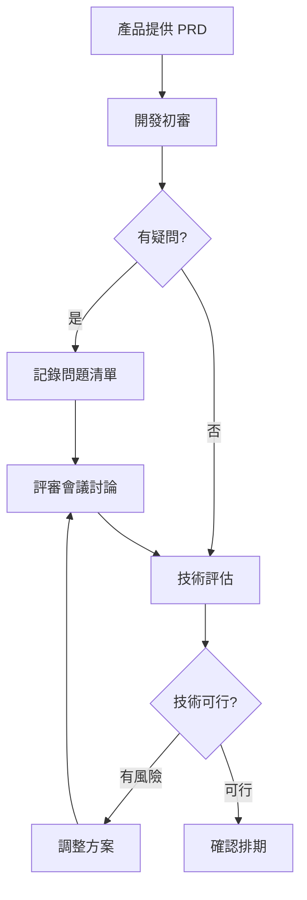

# 8.5.1 做之前先確認——需求對齊

做錯了方向，代碼寫得再漂亮也是浪費——需求對齊是開發的第一步。

## 需求對齊的目標

| 目標 | 說明 |
|------|------|
| 理解一致 | 產品、開發、測試對需求理解一致 |
| 邊界清晰 | 明確要做什麼、不做什麼 |
| 驗收明確 | 完成標準有明確定義 |
| 風險識別 | 提前發現技術難點和依賴 |

## PRD 關鍵要素

一份好的 PRD（產品需求文檔）應該包含：

### 1. 背景與目標

```markdown
## 背景
用戶反饋登錄流程太複雜，流失率高。

## 目標
簡化登錄流程，將登錄轉化率提升 10%。

## 成功指標
- 登錄完成時間從 30s 降到 15s
- 登錄頁面跳出率降低 20%
```

### 2. 用戶故事

```markdown
## 用戶故事

作爲【新用戶】
我想要【通過手機驗證碼快速登錄】
以便【無需記住密碼即可訪問服務】

驗收標準：
- 輸入手機號後 5 秒內收到驗證碼
- 驗證碼有效期 5 分鐘
- 錯誤 3 次後需等待 1 分鐘
```

### 3. 功能清單

| 功能 | 優先級 | 狀態 |
|------|--------|------|
| 手機驗證碼登錄 | P0 | 待開發 |
| 記住登錄狀態 | P0 | 待開發 |
| 第三方登錄(微信) | P1 | 待排期 |
| 郵箱登錄 | P2 | 暫緩 |

### 4. 原型/交互稿

- 頁面原型鏈接
- 交互說明
- 特殊狀態處理

## 需求評審流程



## 評審檢查清單

### 產品角度

- [ ] 需求背景和目標是否清晰？
- [ ] 用戶場景是否完整？
- [ ] 優先級是否合理？
- [ ] 有沒有遺漏的邊界情況？

### 開發角度

- [ ] 技術上是否可行？
- [ ] 是否有外部依賴？
- [ ] 工作量評估是否合理？
- [ ] 是否影響現有功能？

### 測試角度

- [ ] 驗收標準是否明確？
- [ ] 測試用例能否覆蓋？
- [ ] 性能要求是否明確？

## 簡化版需求記錄

對於個人項目或小團隊，可以用簡化的 Feature List：

```markdown
# Feature: 用戶登錄優化

## 要做的
- [ ] 手機驗證碼登錄
- [ ] 登錄態保持 7 天
- [ ] 登錄失敗錯誤提示

## 不做的
- 第三方登錄（下期）
- 找回密碼（現有流程）

## 驗收標準
- 驗證碼 5 秒內送達
- 登錄後跳轉到首頁
- 錯誤信息清晰可理解

## 技術備註
- 使用阿里雲短信服務
- JWT 實現登錄態
- 需要後端接口配合
```

## AI 輔助需求分析

**示例 Prompt**：
> "我要做一個用戶登錄功能，支持手機驗證碼和密碼兩種方式。請幫我：
> 1. 列出需要考慮的邊界情況
> 2. 拆分成具體的開發任務
> 3. 估算每個任務的開發時間"

## 常見問題

### Q: 需求變更怎麼辦？

1. 評估變更影響
2. 記錄變更原因
3. 調整排期和資源
4. 同步給所有相關方

### Q: 需求不明確怎麼辦？

1. 列出所有疑問點
2. 約會議或文檔確認
3. 明確答案後同步更新 PRD
4. 如果持續不明確，先做確定的部分

## 驗收清單

- [ ] 理解 PRD 的關鍵要素
- [ ] 能編寫簡化版的 Feature List
- [ ] 知道需求評審的檢查點
- [ ] 理解如何處理需求變更
