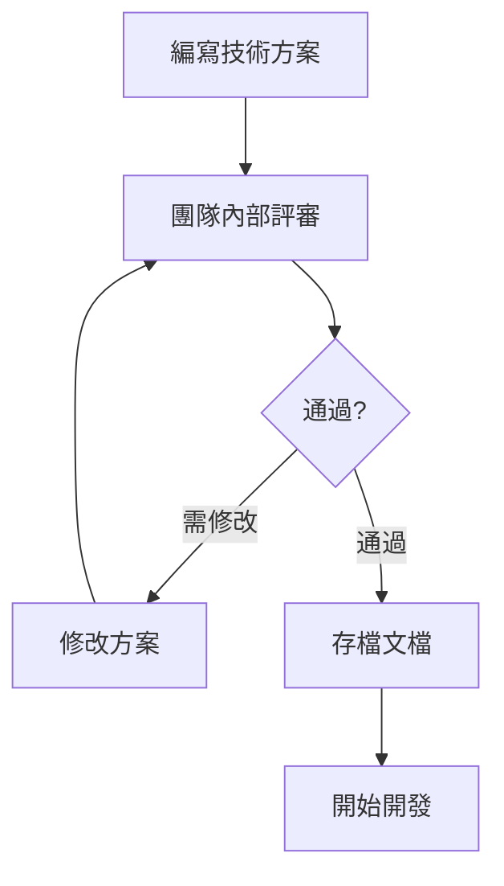

# 8.5.2 技術方案靠不靠譜——技術評審

代碼寫到一半發現方案走不通，是最浪費時間的事——技術評審讓你提前避坑。

## 技術評審的目標

| 目標 | 說明 |
|------|------|
| 方案可行 | 確保技術方案能落地 |
| 風險識別 | 提前發現潛在問題 |
| 知識共享 | 團隊成員瞭解系統設計 |
| 優化方案 | 集思廣益改進設計 |

## 什麼情況需要技術評審

| 場景 | 需要評審 | 示例 |
|------|----------|------|
| 新系統 | 是 | 新項目架構設計 |
| 重大重構 | 是 | 數據庫遷移、框架升級 |
| 複雜功能 | 是 | 支付系統、權限系統 |
| 簡單功能 | 否 | 加個按鈕、改個文案 |
| 性能優化 | 視情況 | 涉及架構變更需要 |

## 技術方案文檔模板

### ADR (Architecture Decision Record)

```markdown
# ADR-001: 用戶認證方案選型

## 狀態
已採納

## 背景
需要實現用戶認證功能，支持多端登錄、token 刷新等場景。

## 決策
採用 JWT + Refresh Token 方案，配合 NextAuth.js 實現。

## 方案對比

| 方案 | 優點 | 缺點 |
|------|------|------|
| Session | 簡單、可隨時失效 | 需要服務端存儲、擴展性差 |
| JWT | 無狀態、擴展性好 | Token 泄露風險、無法主動失效 |
| JWT + Refresh | 平衡安全與體驗 | 實現複雜度略高 |

## 實現方案

### 1. Token 設計
- Access Token: 有效期 15 分鐘
- Refresh Token: 有效期 7 天，存儲在 HttpOnly Cookie

### 2. 刷新機制
- 前端攔截 401 響應
- 自動使用 Refresh Token 獲取新的 Access Token
- Refresh Token 失效則跳轉登錄頁

### 3. 安全措施
- Access Token 存儲在內存
- Refresh Token 使用 HttpOnly Cookie
- 支持單點登出（Redis 黑名單）

## 後果
- 需要引入 Redis 存儲 Token 黑名單
- 前端需要實現 Token 刷新邏輯
- 預估開發週期 3 天
```

### 技術設計文檔（簡版）

```markdown
# 技術設計：消息通知系統

## 1. 需求概述
實現站內消息通知，支持系統通知和用戶消息。

## 2. 架構設計

```
┌──────────┐     ┌──────────┐     ┌──────────┐
│  Producer │ --> │  Queue   │ --> │ Consumer │
│  (API)   │     │  (Redis) │     │ (Worker) │
└──────────┘     └──────────┘     └──────────┘
                                       │
                                       ▼
                               ┌──────────────┐
                               │   Database   │
                               └──────────────┘
```

## 3. 數據模型

```prisma
model Notification {
  id        String   @id @default(cuid())
  userId    String
  type      String   // system, mention, reply
  content   Json
  read      Boolean  @default(false)
  createdAt DateTime @default(now())
}
```

## 4. API 設計

- GET /api/notifications - 獲取通知列表
- PATCH /api/notifications/:id/read - 標記已讀
- DELETE /api/notifications/:id - 刪除通知

## 5. 風險與對策

| 風險 | 對策 |
|------|------|
| 消息量大導致性能問題 | 分頁查詢 + 索引優化 |
| 消息丟失 | Redis 持久化 + 重試機制 |
| 併發寫入 | 消息隊列削峯 |

## 6. 排期
- 基礎功能：2 天
- 消息隊列：1 天
- 測試上線：1 天
```

## 技術評審流程



## 評審檢查清單

### 可行性

- [ ] 技術方案是否完整？
- [ ] 是否有技術風險？
- [ ] 依賴的服務是否可用？
- [ ] 有沒有更簡單的方案？

### 性能

- [ ] 預估的 QPS 是多少？
- [ ] 數據量增長後能否支撐？
- [ ] 有沒有潛在的性能瓶頸？

### 安全

- [ ] 敏感數據如何存儲？
- [ ] 接口是否需要鑑權？
- [ ] 有沒有注入風險？

### 可維護性

- [ ] 方案是否易於理解？
- [ ] 後續擴展是否方便？
- [ ] 是否有過度設計？

## AI 輔助技術評審

**示例 Prompt**：
> "我設計了一個消息隊列方案，使用 Redis 的 List 結構實現。請幫我評審：
> 1. 可能存在的技術風險
> 2. 性能瓶頸在哪裏
> 3. 有沒有更好的替代方案"

## 驗收清單

- [ ] 能編寫基本的技術方案文檔
- [ ] 理解 ADR 的結構和用途
- [ ] 知道技術評審的關鍵檢查點
- [ ] 能識別方案中的潛在風險
