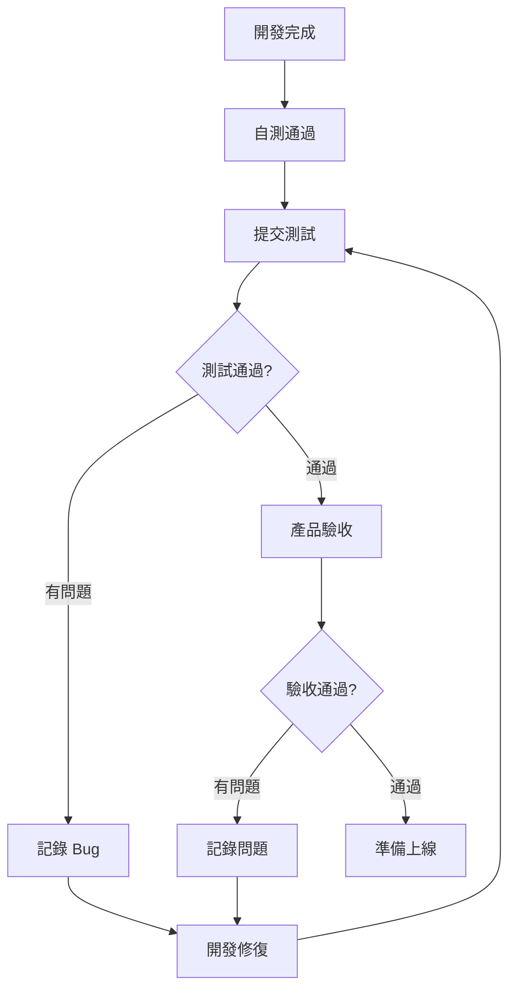

# 8.5.3 做完了怎麼算——驗收標準

"做完了"不等於"做好了"——明確的驗收標準讓雙方都有共識。

## 驗收標準的作用

| 問題 | 後果 | 解決方案 |
|------|------|----------|
| 標準模糊 | 做完不知道算不算完 | 量化驗收標準 |
| 邊界不清 | 反覆返工修改 | 明確邊界條件 |
| 質量不一 | 每次交付質量波動 | 統一質量門禁 |

## 驗收標準分類

### 1. 功能驗收

**核心問題**：功能是否按需求正確實現？

```markdown
## 登錄功能驗收標準

### 正常流程
- [ ] 輸入正確手機號+驗證碼，登錄成功
- [ ] 登錄後正確跳轉到首頁
- [ ] 登錄態保持 7 天

### 異常流程
- [ ] 手機號格式錯誤，提示"手機號格式不正確"
- [ ] 驗證碼錯誤，提示"驗證碼錯誤"
- [ ] 連續錯誤 3 次，鎖定 1 分鐘
- [ ] 驗證碼過期，提示"驗證碼已過期"

### 邊界條件
- [ ] 空手機號提交，禁用提交按鈕
- [ ] 驗證碼非 6 位數字，提交按鈕禁用
- [ ] 弱網環境下有 loading 狀態
```

### 2. 性能驗收

**核心問題**：系統是否夠快、夠穩定？

| 指標 | 標準 | 說明 |
|------|------|------|
| 頁面加載 | < 3s | 首屏完全加載時間 |
| API 響應 | < 500ms | 95 分位響應時間 |
| 併發能力 | > 100 QPS | 單實例壓測結果 |
| 錯誤率 | < 0.1% | 生產環境監控 |

### 3. 兼容性驗收

```markdown
## 瀏覽器兼容性

### 必須支持
- [ ] Chrome 最新兩個版本
- [ ] Safari 最新兩個版本
- [ ] Firefox 最新版本

### 移動端
- [ ] iOS Safari 15+
- [ ] Android Chrome 最新版

### 可降級
- [ ] IE（不支持，顯示升級提示）
```

### 4. 安全驗收

```markdown
## 安全檢查清單

### 認證授權
- [ ] 未登錄無法訪問受保護頁面
- [ ] 無法訪問其他用戶數據
- [ ] Token 過期後正確處理

### 輸入驗證
- [ ] XSS 攻擊防護
- [ ] SQL 注入防護
- [ ] CSRF 防護

### 敏感數據
- [ ] 密碼不明文存儲
- [ ] 敏感信息不記錄日誌
- [ ] HTTPS 傳輸
```

## 驗收流程



## 自動化測試作爲驗收

用自動化測試替代部分人工驗收：

### 單元測試

```typescript
describe('登錄表單驗證', () => {
  it('手機號格式不正確時顯示錯誤', () => {
    render(<LoginForm />);
    fireEvent.change(screen.getByPlaceholderText('手機號'), {
      target: { value: '123' }
    });
    expect(screen.getByText('手機號格式不正確')).toBeInTheDocument();
  });

  it('驗證碼長度不足時提交按鈕禁用', () => {
    render(<LoginForm />);
    fireEvent.change(screen.getByPlaceholderText('驗證碼'), {
      target: { value: '12' }
    });
    expect(screen.getByRole('button', { name: '登錄' })).toBeDisabled();
  });
});
```

### E2E 測試

```typescript
// Playwright 測試
test('用戶登錄流程', async ({ page }) => {
  await page.goto('/login');
  
  await page.fill('[name="phone"]', '13800138000');
  await page.click('button:has-text("獲取驗證碼")');
  
  // 等待驗證碼發送
  await expect(page.locator('text=60秒後重新獲取')).toBeVisible();
  
  await page.fill('[name="code"]', '123456');
  await page.click('button:has-text("登錄")');
  
  // 驗證跳轉到首頁
  await expect(page).toHaveURL('/');
});
```

## 驗收文檔模板

```markdown
# 功能驗收報告

## 基本信息
- 功能名稱：用戶登錄優化
- 開發人員：張三
- 測試人員：李四
- 驗收日期：2024-01-15

## 功能驗收

| 驗收項 | 結果 | 備註 |
|--------|------|------|
| 手機驗證碼登錄 | ✅ 通過 | - |
| 錯誤提示 | ✅ 通過 | - |
| 登錄態保持 | ✅ 通過 | - |
| 鎖定機制 | ⚠️ 有問題 | 鎖定時間顯示不準確 |

## 性能驗收

| 指標 | 要求 | 實際 | 結果 |
|------|------|------|------|
| 頁面加載 | < 3s | 2.1s | ✅ 通過 |
| 接口響應 | < 500ms | 180ms | ✅ 通過 |

## 待解決問題
1. [ ] 鎖定倒計時顯示不準確

## 驗收結論
- [x] 功能基本完成，有小問題待修復
- [ ] 可以上線（待問題修復後）
```

## AI 輔助驗收

**示例 Prompt**：
> "我實現了一個用戶登錄功能，支持手機驗證碼登錄。請幫我生成：
> 1. 功能測試用例清單
> 2. 邊界條件測試點
> 3. 安全檢查項"

## 驗收清單

- [ ] 能編寫明確的驗收標準
- [ ] 理解功能、性能、安全驗收的區別
- [ ] 能用自動化測試替代部分驗收
- [ ] 知道如何記錄驗收結果
