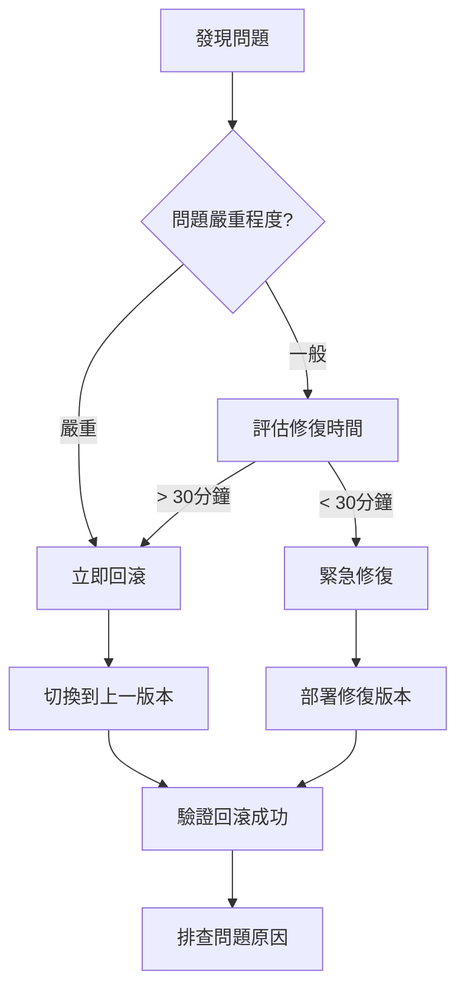

# 8.5.4 上線的標準流程——部署流程

上線不是終點而是起點——規範的部署流程讓你上線安心、出問題能快速回滾。

## 部署核心原則

| 原則 | 說明 | 實踐 |
|------|------|------|
| 可重複 | 每次部署結果一致 | 使用 Docker |
| 可回滾 | 出問題能快速恢復 | 保留舊版本 |
| 可觀測 | 知道系統運行狀態 | 日誌+監控 |
| 自動化 | 減少人工操作 | CI/CD |

## 部署方式對比

| 方式 | 優點 | 缺點 | 適用場景 |
|------|------|------|----------|
| Vercel | 零配置、自動 CI | 功能限制、價格 | 前端/輕量 API |
| Docker | 環境一致、可移植 | 需要服務器 | 後端服務 |
| 1Panel | 可視化、易管理 | 學習成本 | 自託管項目 |
| K8s | 高可用、自動擴容 | 複雜度高 | 大規模部署 |

## 1Panel 部署 Next.js

### 1. 準備 Dockerfile

```dockerfile
# Dockerfile
FROM node:20-alpine AS base

# 安裝依賴
FROM base AS deps
WORKDIR /app
COPY package.json pnpm-lock.yaml ./
RUN corepack enable pnpm && pnpm install --frozen-lockfile

# 構建
FROM base AS builder
WORKDIR /app
COPY --from=deps /app/node_modules ./node_modules
COPY . .
RUN corepack enable pnpm && pnpm build

# 生產鏡像
FROM base AS runner
WORKDIR /app
ENV NODE_ENV=production

RUN addgroup --system --gid 1001 nodejs
RUN adduser --system --uid 1001 nextjs

COPY --from=builder /app/public ./public
COPY --from=builder --chown=nextjs:nodejs /app/.next/standalone ./
COPY --from=builder --chown=nextjs:nodejs /app/.next/static ./.next/static

USER nextjs
EXPOSE 3000
ENV PORT=3000
ENV HOSTNAME="0.0.0.0"

CMD ["node", "server.js"]
```

### 2. 配置 next.config.js

```javascript
/** @type {import('next').NextConfig} */
const nextConfig = {
  output: 'standalone',
};

module.exports = nextConfig;
```

### 3. 1Panel 創建應用

1. 進入 1Panel → 應用商店 → 創建自定義應用
2. 填寫應用信息
3. 上傳 Dockerfile 或配置 Git 倉庫
4. 配置環境變量
5. 啓動應用

### 4. 配置反向代理

在 1Panel 中配置 Nginx：

```nginx
server {
    listen 80;
    server_name your-domain.com;
    
    location / {
        proxy_pass http://localhost:3000;
        proxy_http_version 1.1;
        proxy_set_header Upgrade $http_upgrade;
        proxy_set_header Connection 'upgrade';
        proxy_set_header Host $host;
        proxy_cache_bypass $http_upgrade;
    }
}
```

## GitHub Actions 自動部署

```yaml
# .github/workflows/deploy.yml
name: Deploy

on:
  push:
    branches: [main]

jobs:
  deploy:
    runs-on: ubuntu-latest
    steps:
      - uses: actions/checkout@v4

      - name: Build Docker image
        run: docker build -t myapp:latest .

      - name: Push to Registry
        run: |
          echo "${{ secrets.DOCKER_PASSWORD }}" | docker login -u "${{ secrets.DOCKER_USERNAME }}" --password-stdin
          docker tag myapp:latest ${{ secrets.DOCKER_REGISTRY }}/myapp:latest
          docker push ${{ secrets.DOCKER_REGISTRY }}/myapp:latest

      - name: Deploy to Server
        uses: appleboy/ssh-action@v1.0.0
        with:
          host: ${{ secrets.SERVER_HOST }}
          username: ${{ secrets.SERVER_USER }}
          key: ${{ secrets.SSH_PRIVATE_KEY }}
          script: |
            docker pull ${{ secrets.DOCKER_REGISTRY }}/myapp:latest
            docker stop myapp || true
            docker rm myapp || true
            docker run -d --name myapp -p 3000:3000 \
              --env-file /root/.env.production \
              ${{ secrets.DOCKER_REGISTRY }}/myapp:latest
```

## 部署檢查清單

### 部署前

- [ ] 代碼已合併到 main 分支
- [ ] 所有測試通過
- [ ] 環境變量配置正確
- [ ] 數據庫遷移準備就緒
- [ ] 通知相關人員

### 部署中

- [ ] 監控部署進度
- [ ] 檢查日誌輸出
- [ ] 驗證服務啓動

### 部署後

- [ ] 訪問關鍵頁面驗證
- [ ] 檢查監控指標
- [ ] 確認日誌正常
- [ ] 保留回滾能力

## 回滾策略



### Docker 回滾

```bash
# 查看歷史版本
docker images myapp

# 回滾到指定版本
docker stop myapp
docker rm myapp
docker run -d --name myapp -p 3000:3000 myapp:previous-tag
```

## 監控與告警

### 基礎監控

```yaml
# docker-compose.yml 添加健康檢查
services:
  app:
    image: myapp:latest
    healthcheck:
      test: ["CMD", "curl", "-f", "http://localhost:3000/api/health"]
      interval: 30s
      timeout: 10s
      retries: 3
```

### 健康檢查 API

```typescript
// app/api/health/route.ts
export async function GET() {
  try {
    // 檢查數據庫連接
    await prisma.$queryRaw`SELECT 1`;
    
    return Response.json({
      status: 'healthy',
      timestamp: new Date().toISOString(),
    });
  } catch (error) {
    return Response.json(
      { status: 'unhealthy', error: error.message },
      { status: 503 }
    );
  }
}
```

## AI 協作指南

**示例 Prompt**：
> "我要將 Next.js 項目部署到我的服務器（Ubuntu 22.04），使用 Docker。請幫我：
> 1. 編寫多階段構建的 Dockerfile
> 2. 配置 GitHub Actions 自動部署
> 3. 設置 Nginx 反向代理和 HTTPS"

## 驗收清單

- [ ] 能編寫 Next.js 的 Dockerfile
- [ ] 理解 CI/CD 自動部署流程
- [ ] 知道部署前後的檢查要點
- [ ] 掌握回滾策略和監控基礎
