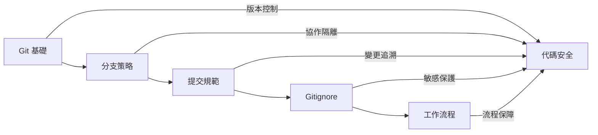

# 8 ｜項目規則與協作

代碼寫得再好，沒有版本管理和協作規範，最終也會變成一團亂麻。

## 爲什麼需要項目規則？

在個人開發階段，你可能覺得"我一個人開發，隨便寫寫就行"。但當你遇到以下情況時，就會深刻理解規範的價值：

- 昨天的代碼今天跑不了，卻不知道改了什麼
- 多人協作時互相覆蓋對方的代碼
- 密鑰泄露到 GitHub 公開倉庫
- 不知道某個功能是誰開發的、爲什麼這麼寫

**項目規則的本質是降低協作成本**——包括與他人協作，也包括與"未來的自己"協作。

## 本章核心內容

```
┌─────────────────────────────────────────────────────────────┐
│                     項目規則與協作                            │
├─────────────────────────────────────────────────────────────┤
│  8.1 Git 基礎        │  版本控制的基本操作與回滾機制          │
│  8.2 分支策略        │  多人協作的分支管理與保護規則          │
│  8.3 提交規範        │  Conventional Commits 與自動化       │
│  8.4 Gitignore       │  敏感文件與構建產物的排除策略          │
│  8.5 工作流程        │  對齊→評審→驗收→上線的完整閉環        │
└─────────────────────────────────────────────────────────────┘
```

## 章節邏輯關係



## 學習目標

完成本章後，你將能夠：

| 能力 | 具體表現 |
|------|----------|
| Git 操作 | 熟練使用 add/commit/push/pull，處理衝突和回滾 |
| 分支管理 | 理解 Git Flow 和 GitHub Flow，配置分支保護 |
| 提交規範 | 使用 Conventional Commits，配置 commitlint |
| 安全意識 | 正確配置 .gitignore，避免敏感信息泄露 |
| 協作流程 | 掌握 PRD 評審、技術評審、驗收上線全流程 |

## AI 協作提示

在項目協作中，AI 可以幫助你：

- 生成規範的 commit message
- 編寫 PR 描述和 review 意見
- 配置 .gitignore 模板
- 起草 PRD 和技術方案文檔

**關鍵術語**：`git flow`、`conventional commits`、`branch protection`、`code review`、`.gitignore`
