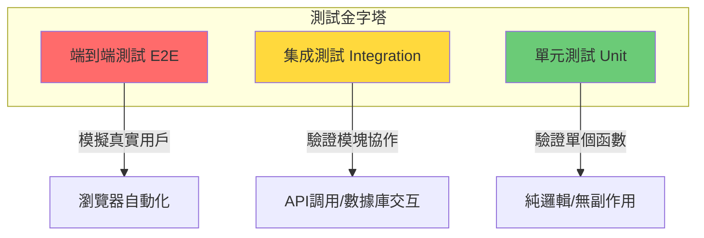

# 9.1.1 測試也分三六九等——測試分層：單元/集成/端到端測試

**不同類型的測試解決不同層面的問題，混淆它們的邊界是測試效率低下的根源。**

## 測試金字塔的三個層級



## 三種測試類型詳解

### 單元測試：最小粒度的驗證

單元測試針對**單個函數或類**進行測試，不涉及外部依賴。

```typescript
// utils/price.ts
export function calculateDiscount(price: number, rate: number): number {
  if (rate < 0 || rate > 1) {
    throw new Error('折扣率必須在 0-1 之間');
  }
  return Math.round(price * (1 - rate) * 100) / 100;
}

// __tests__/utils/price.test.ts
import { calculateDiscount } from '@/utils/price';

describe('calculateDiscount', () => {
  it('應正確計算折扣價格', () => {
    expect(calculateDiscount(100, 0.2)).toBe(80);
    expect(calculateDiscount(99.99, 0.1)).toBe(89.99);
  });

  it('應拒絕無效的折扣率', () => {
    expect(() => calculateDiscount(100, -0.1)).toThrow();
    expect(() => calculateDiscount(100, 1.5)).toThrow();
  });
});
```

**適用場景**：
- 純函數、工具函數
- 數據轉換、格式化邏輯
- 業務規則計算

### 集成測試：驗證模塊協作

集成測試驗證**多個模塊之間的協作**，通常涉及數據庫、API 調用等。

```typescript
// services/order.service.ts
export class OrderService {
  constructor(private prisma: PrismaClient) {}

  async createOrder(userId: string, items: CartItem[]) {
    return this.prisma.$transaction(async (tx) => {
      const order = await tx.order.create({
        data: {
          userId,
          status: 'PENDING',
          items: { create: items.map(item => ({ ...item })) },
        },
      });
      
      // 扣減庫存
      for (const item of items) {
        await tx.product.update({
          where: { id: item.productId },
          data: { stock: { decrement: item.quantity } },
        });
      }
      
      return order;
    });
  }
}

// __tests__/services/order.service.test.ts
describe('OrderService', () => {
  let prisma: PrismaClient;
  let orderService: OrderService;

  beforeAll(async () => {
    prisma = new PrismaClient();
    orderService = new OrderService(prisma);
  });

  beforeEach(async () => {
    // 清理並準備測試數據
    await prisma.order.deleteMany();
    await prisma.product.deleteMany();
    await prisma.product.create({
      data: { id: 'prod-1', name: '測試商品', price: 100, stock: 10 },
    });
  });

  it('應創建訂單並扣減庫存', async () => {
    const order = await orderService.createOrder('user-1', [
      { productId: 'prod-1', quantity: 2, price: 100 },
    ]);

    expect(order.status).toBe('PENDING');
    
    const product = await prisma.product.findUnique({ where: { id: 'prod-1' } });
    expect(product?.stock).toBe(8); // 10 - 2 = 8
  });
});
```

**適用場景**：
- 服務層業務邏輯
- 數據庫操作
- 外部 API 調用（使用 Mock）

### 端到端測試：模擬真實用戶

E2E 測試通過瀏覽器自動化，**模擬真實用戶操作**。

```typescript
// e2e/checkout.spec.ts (Playwright)
import { test, expect } from '@playwright/test';

test('用戶應能完成結賬流程', async ({ page }) => {
  // 登錄
  await page.goto('/login');
  await page.fill('[name="email"]', 'test@example.com');
  await page.fill('[name="password"]', 'password123');
  await page.click('button[type="submit"]');
  
  // 添加商品到購物車
  await page.goto('/products/1');
  await page.click('button:has-text("加入購物車")');
  
  // 結賬
  await page.goto('/cart');
  await page.click('button:has-text("結賬")');
  
  // 驗證訂單創建成功
  await expect(page).toHaveURL(/\/orders\/\d+/);
  await expect(page.locator('h1')).toContainText('訂單已創建');
});
```

**適用場景**：
- 核心用戶流程（註冊、登錄、支付）
- 關鍵業務路徑
- 跨頁面交互

## 三種測試的對比

| 特性 | 單元測試 | 集成測試 | E2E 測試 |
|------|---------|---------|---------|
| 執行速度 | 毫秒級 | 秒級 | 分鐘級 |
| 維護成本 | 低 | 中 | 高 |
| 發現問題 | 邏輯錯誤 | 集成錯誤 | 用戶體驗問題 |
| 定位問題 | 精確 | 較精確 | 模糊 |
| 覆蓋範圍 | 小 | 中 | 大 |
| 依賴環境 | 無 | 數據庫/Mock | 完整環境 |

## AI 協作指南

當你需要爲現有代碼添加測試時，可以這樣與 AI 溝通：

> **核心意圖**：告訴 AI 你要測試的是哪個層級的代碼
>
> **需求定義公式**：
> - 單元測試：`爲這個純函數寫單元測試，覆蓋正常輸入和邊界條件`
> - 集成測試：`爲這個服務層方法寫集成測試，需要準備測試數據和清理邏輯`
> - E2E 測試：`爲用戶登錄流程寫 Playwright 測試，包含成功和失敗場景`

**關鍵術語**：`describe`、`it`、`expect`、`beforeEach`、`afterEach`、`mock`

## 本節小結

理解測試分層的核心在於：**每種測試類型都有其最佳應用場景**。單元測試快速精確但覆蓋面窄，E2E 測試覆蓋面廣但維護成本高，集成測試則在兩者之間取得平衡。對於 Vibe Coding 開發者來說，把精力集中在服務層的集成測試上，是性價比最高的選擇。
