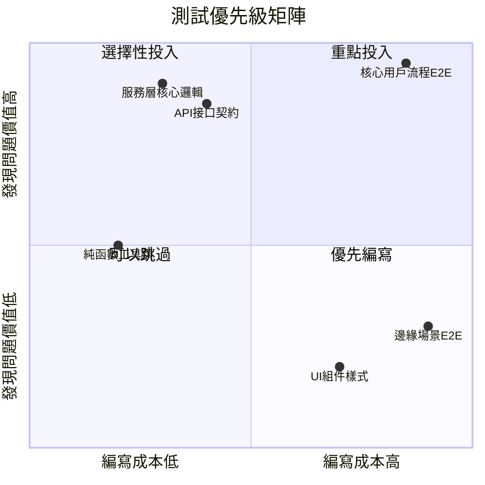
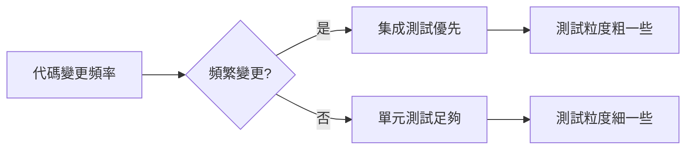

# 9.1.2 時間花在刀刃上——測試優先級：投入產出比分析

**測試的目的不是追求 100% 覆蓋率，而是用最少的投入獲得最大的質量保障。**

## 測試投入產出比矩陣



## 優先級排序原則

### 第一優先級：服務層業務邏輯

服務層是業務規則的聚集地，bug 在這裏造成的損失最大。

```typescript
// 高優先級測試：訂單金額計算
describe('OrderService.calculateTotal', () => {
  it('應正確計算訂單總額（含折扣）', async () => {
    const total = await orderService.calculateTotal({
      items: [
        { price: 100, quantity: 2 },
        { price: 50, quantity: 1 },
      ],
      discountCode: 'SAVE10',
    });
    
    // 250 * 0.9 = 225
    expect(total).toBe(225);
  });

  it('應處理庫存不足的邊界情況', async () => {
    await expect(
      orderService.createOrder({ productId: 'prod-1', quantity: 999 })
    ).rejects.toThrow('庫存不足');
  });
});
```

### 第二優先級：API 接口契約

API 是對外承諾，一旦變更影響面廣。

```typescript
// 高優先級測試：API 響應格式
describe('POST /api/orders', () => {
  it('應返回標準響應格式', async () => {
    const response = await request(app)
      .post('/api/orders')
      .send({ items: [{ productId: 'prod-1', quantity: 1 }] });

    expect(response.status).toBe(201);
    expect(response.body).toMatchObject({
      success: true,
      data: {
        id: expect.any(String),
        status: 'PENDING',
        createdAt: expect.any(String),
      },
    });
  });

  it('應正確處理參數校驗失敗', async () => {
    const response = await request(app)
      .post('/api/orders')
      .send({ items: [] }); // 空數組

    expect(response.status).toBe(400);
    expect(response.body.error.code).toBe('VALIDATION_ERROR');
  });
});
```

### 第三優先級：純函數工具類

投入產出比高，編寫簡單，運行快速。

```typescript
// 中優先級測試：工具函數
describe('formatCurrency', () => {
  it('應正確格式化人民幣', () => {
    expect(formatCurrency(1234.5, 'CNY')).toBe('¥1,234.50');
    expect(formatCurrency(0, 'CNY')).toBe('¥0.00');
  });

  it('應處理負數', () => {
    expect(formatCurrency(-100, 'CNY')).toBe('-¥100.00');
  });
});
```

### 低優先級：UI 組件與樣式

UI 變化頻繁，測試維護成本高，優先考慮視覺迴歸測試。

## 判斷測試價值的快速檢查表

| 檢查項 | 高價值 | 低價值 |
|-------|-------|-------|
| 涉及金錢計算 | ✅ | |
| 涉及用戶權限 | ✅ | |
| 涉及數據持久化 | ✅ | |
| 對外 API 接口 | ✅ | |
| 純展示性 UI | | ✅ |
| 臨時/實驗性功能 | | ✅ |
| 頻繁變化的代碼 | | ✅ |

## 測試覆蓋率的正確理解

```
┌─────────────────────────────────────────────────────┐
│                  覆蓋率的真相                         │
├─────────────────────────────────────────────────────┤
│                                                     │
│  ❌ 誤區：追求 100% 覆蓋率                            │
│  ✅ 正解：核心路徑 100%，邊緣場景 50%                  │
│                                                     │
│  代碼覆蓋率 80% + 業務場景覆蓋率 100%                  │
│  = 實際質量保障 > 95%                                │
│                                                     │
└─────────────────────────────────────────────────────┘
```

## 實戰：如何識別高價值測試點

### 場景分析法

1. **問自己**：如果這段代碼出錯，最壞的結果是什麼？
2. **評估影響**：影響用戶數量 × 問題嚴重程度
3. **確定優先級**：影響越大，測試優先級越高

```typescript
// 高影響場景：支付金額計算
// 如果出錯 → 多收/少收用戶的錢 → 必須測試

// 低影響場景：用戶頭像圓角
// 如果出錯 → 稍微醜一點 → 可以不測
```

### 變更頻率法



- **頻繁變更的代碼**：使用粗粒度的集成測試，減少維護成本
- **穩定的核心邏輯**：使用細粒度的單元測試，精確定位問題

## AI 協作指南

讓 AI 幫你識別測試優先級：

> **核心意圖**：分析代碼並推薦測試優先級
>
> **提示詞模板**：
> ```
> 分析以下代碼，按照測試價值從高到低排序，並說明理由：
> 1. 哪些函數/方法必須測試
> 2. 哪些可以選擇性測試
> 3. 哪些可以暫時跳過
> 
> [粘貼代碼]
> ```

**關鍵術語**：`業務關鍵路徑`、`邊界條件`、`錯誤處理`、`數據完整性`

## 本節小結

測試優先級的核心原則是：**先保障核心業務正確，再逐步擴展覆蓋範圍**。把 80% 的測試精力投入到 20% 最關鍵的代碼上，這就是懶人測試策略的精髓。記住，沒有測試的代碼不一定有 bug，但有測試的關鍵代碼一定更可靠。
