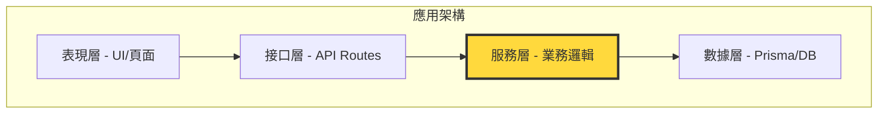

# 9.1.3 業務邏輯是核心——服務層測試：業務邏輯驗證重點

**服務層是業務規則的大本營，測好服務層等於守住了應用的核心。**

## 爲什麼服務層測試最重要



服務層承擔着以下核心職責：

| 職責 | 示例 | 測試重要性 |
|------|------|-----------|
| 業務規則驗證 | 訂單金額 ≥ 最低起送價 | ⭐⭐⭐ |
| 狀態流轉控制 | 訂單：待支付 → 已支付 → 配送中 | ⭐⭐⭐ |
| 跨實體協調 | 下單時同時扣庫存、生成支付單 | ⭐⭐⭐ |
| 權限判斷 | 用戶只能操作自己的訂單 | ⭐⭐⭐ |
| 數據聚合 | 計算購物車總價（含優惠券） | ⭐⭐ |

## 服務層測試的核心模式

### 模式一：業務規則驗證

```typescript
// services/order.service.ts
export class OrderService {
  private readonly MIN_ORDER_AMOUNT = 20; // 最低起送價

  async createOrder(userId: string, items: CartItem[]): Promise<Order> {
    const totalAmount = this.calculateTotal(items);
    
    if (totalAmount < this.MIN_ORDER_AMOUNT) {
      throw new BusinessError('ORDER_BELOW_MINIMUM', 
        `訂單金額不能低於 ${this.MIN_ORDER_AMOUNT} 元`);
    }
    
    return this.prisma.order.create({
      data: { userId, items: { create: items }, totalAmount },
    });
  }
}

// __tests__/services/order.service.test.ts
describe('OrderService.createOrder', () => {
  it('應拒絕低於最低起送價的訂單', async () => {
    const items = [{ productId: 'prod-1', price: 10, quantity: 1 }];
    
    await expect(
      orderService.createOrder('user-1', items)
    ).rejects.toThrow('訂單金額不能低於 20 元');
  });

  it('應接受達到最低起送價的訂單', async () => {
    const items = [{ productId: 'prod-1', price: 25, quantity: 1 }];
    
    const order = await orderService.createOrder('user-1', items);
    
    expect(order.totalAmount).toBe(25);
    expect(order.status).toBe('PENDING');
  });
});
```

### 模式二：狀態流轉測試

```typescript
// services/order.service.ts
export class OrderService {
  private readonly STATUS_TRANSITIONS: Record<OrderStatus, OrderStatus[]> = {
    PENDING: ['PAID', 'CANCELLED'],
    PAID: ['SHIPPING', 'REFUNDING'],
    SHIPPING: ['DELIVERED'],
    DELIVERED: ['REFUNDING'],
    CANCELLED: [],
    REFUNDING: ['REFUNDED'],
    REFUNDED: [],
  };

  async updateStatus(orderId: string, newStatus: OrderStatus): Promise<Order> {
    const order = await this.prisma.order.findUnique({ where: { id: orderId } });
    
    if (!order) {
      throw new NotFoundError('ORDER_NOT_FOUND');
    }
    
    const allowedStatuses = this.STATUS_TRANSITIONS[order.status];
    if (!allowedStatuses.includes(newStatus)) {
      throw new BusinessError('INVALID_STATUS_TRANSITION',
        `不能從 ${order.status} 變更爲 ${newStatus}`);
    }
    
    return this.prisma.order.update({
      where: { id: orderId },
      data: { status: newStatus },
    });
  }
}

// __tests__/services/order.service.test.ts
describe('OrderService.updateStatus', () => {
  it('應允許合法的狀態流轉', async () => {
    // 準備：創建待支付訂單
    const order = await createTestOrder({ status: 'PENDING' });
    
    // 執行：變更爲已支付
    const updated = await orderService.updateStatus(order.id, 'PAID');
    
    // 驗證
    expect(updated.status).toBe('PAID');
  });

  it('應拒絕非法的狀態流轉', async () => {
    const order = await createTestOrder({ status: 'DELIVERED' });
    
    // 已送達的訂單不能直接變爲已支付
    await expect(
      orderService.updateStatus(order.id, 'PAID')
    ).rejects.toThrow('不能從 DELIVERED 變更爲 PAID');
  });

  it('應覆蓋所有狀態流轉路徑', async () => {
    // 完整的狀態流轉鏈測試
    const order = await createTestOrder({ status: 'PENDING' });
    
    await orderService.updateStatus(order.id, 'PAID');
    await orderService.updateStatus(order.id, 'SHIPPING');
    await orderService.updateStatus(order.id, 'DELIVERED');
    
    const finalOrder = await prisma.order.findUnique({ where: { id: order.id } });
    expect(finalOrder?.status).toBe('DELIVERED');
  });
});
```

### 模式三：跨實體協調測試

```typescript
// __tests__/services/order.service.test.ts
describe('OrderService 跨實體操作', () => {
  it('下單應同時扣減庫存', async () => {
    // 準備：創建商品
    await prisma.product.create({
      data: { id: 'prod-1', name: '測試商品', stock: 10 },
    });
    
    // 執行：下單
    await orderService.createOrder('user-1', [
      { productId: 'prod-1', quantity: 3 },
    ]);
    
    // 驗證：庫存應減少
    const product = await prisma.product.findUnique({ where: { id: 'prod-1' } });
    expect(product?.stock).toBe(7);
  });

  it('取消訂單應恢復庫存', async () => {
    // 準備
    const order = await createTestOrder({
      items: [{ productId: 'prod-1', quantity: 3 }],
    });
    
    // 執行
    await orderService.cancelOrder(order.id);
    
    // 驗證
    const product = await prisma.product.findUnique({ where: { id: 'prod-1' } });
    expect(product?.stock).toBe(10); // 恢復原庫存
  });

  it('庫存不足時下單應失敗', async () => {
    await prisma.product.create({
      data: { id: 'prod-1', stock: 2 },
    });
    
    await expect(
      orderService.createOrder('user-1', [
        { productId: 'prod-1', quantity: 5 }, // 超過庫存
      ])
    ).rejects.toThrow('庫存不足');
  });
});
```

## 服務層測試的最佳實踐

### 測試數據準備策略

```typescript
// test/helpers/factory.ts
export async function createTestUser(overrides: Partial<User> = {}) {
  return prisma.user.create({
    data: {
      id: `user-${Date.now()}`,
      email: `test-${Date.now()}@example.com`,
      name: 'Test User',
      ...overrides,
    },
  });
}

export async function createTestOrder(overrides: Partial<CreateOrderInput> = {}) {
  const user = await createTestUser();
  
  return prisma.order.create({
    data: {
      userId: user.id,
      status: 'PENDING',
      totalAmount: 100,
      ...overrides,
    },
  });
}
```

### 測試隔離與清理

```typescript
// __tests__/services/order.service.test.ts
describe('OrderService', () => {
  beforeEach(async () => {
    // 每個測試前清理數據
    await prisma.orderItem.deleteMany();
    await prisma.order.deleteMany();
    await prisma.product.deleteMany();
    await prisma.user.deleteMany();
  });

  afterAll(async () => {
    await prisma.$disconnect();
  });

  // 測試用例...
});
```

## AI 協作指南

爲服務層編寫測試時，可以這樣與 AI 溝通：

> **核心意圖**：爲服務層方法生成全面的測試用例
>
> **需求定義公式**：
> ```
> 爲 [服務名].[方法名] 編寫測試用例：
> 1. 正常流程測試（happy path）
> 2. 邊界條件測試（如空數組、零值、最大值）
> 3. 錯誤處理測試（如權限不足、數據不存在）
> 4. 狀態流轉測試（如適用）
> ```

**關鍵術語**：`beforeEach`、`afterEach`、`transaction`、`rollback`、`factory`

## 本節小結

服務層測試是投入產出比最高的測試類型。它直接驗證業務規則的正確性，覆蓋了狀態流轉、跨實體協調等關鍵場景。通過良好的測試數據準備和清理策略，可以確保測試的可靠性和可維護性。記住：**測好服務層，就等於給業務邏輯上了保險**。
