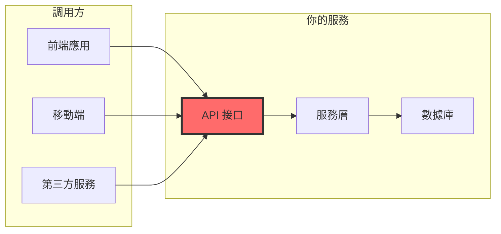

# 9.1.4 接口是門面——API 測試：接口契約與邊界條件

**API 是你對外的承諾，測試就是確保這個承諾不會被打破。**

## 爲什麼 API 測試至關重要



API 測試的價值：

| 測試目標 | 作用 | 示例 |
|---------|------|------|
| 響應格式 | 確保前端能正確解析 | `{ success: true, data: {...} }` |
| 狀態碼 | 確保錯誤類型正確 | 400/401/403/404/500 |
| 參數校驗 | 阻止非法請求 | 必填項、格式、範圍 |
| 邊界條件 | 處理極端情況 | 空數組、超長字符串 |

## API 測試的核心模式

### 模式一：響應格式驗證

```typescript
// app/api/orders/route.ts
export async function POST(request: Request) {
  try {
    const body = await request.json();
    const order = await orderService.createOrder(body);
    
    return Response.json({
      success: true,
      data: order,
    }, { status: 201 });
  } catch (error) {
    if (error instanceof ValidationError) {
      return Response.json({
        success: false,
        error: { code: 'VALIDATION_ERROR', message: error.message },
      }, { status: 400 });
    }
    throw error;
  }
}

// __tests__/api/orders.test.ts
describe('POST /api/orders', () => {
  it('成功創建訂單應返回 201 和標準格式', async () => {
    const response = await request(app)
      .post('/api/orders')
      .send({
        items: [{ productId: 'prod-1', quantity: 2 }],
      });

    expect(response.status).toBe(201);
    expect(response.body).toMatchObject({
      success: true,
      data: {
        id: expect.any(String),
        status: 'PENDING',
        createdAt: expect.any(String),
      },
    });
  });

  it('響應應包含分頁信息（列表接口）', async () => {
    const response = await request(app).get('/api/orders?page=1&limit=10');

    expect(response.body).toMatchObject({
      success: true,
      data: expect.any(Array),
      pagination: {
        page: 1,
        limit: 10,
        total: expect.any(Number),
        totalPages: expect.any(Number),
      },
    });
  });
});
```

### 模式二：參數校驗測試

```typescript
// __tests__/api/orders.test.ts
describe('POST /api/orders 參數校驗', () => {
  it('缺少必填字段應返回 400', async () => {
    const response = await request(app)
      .post('/api/orders')
      .send({}); // 缺少 items

    expect(response.status).toBe(400);
    expect(response.body.error.code).toBe('VALIDATION_ERROR');
    expect(response.body.error.message).toContain('items');
  });

  it('items 爲空數組應返回 400', async () => {
    const response = await request(app)
      .post('/api/orders')
      .send({ items: [] });

    expect(response.status).toBe(400);
    expect(response.body.error.message).toContain('至少包含一個商品');
  });

  it('quantity 爲負數應返回 400', async () => {
    const response = await request(app)
      .post('/api/orders')
      .send({
        items: [{ productId: 'prod-1', quantity: -1 }],
      });

    expect(response.status).toBe(400);
    expect(response.body.error.message).toContain('數量必須大於 0');
  });

  it('productId 格式錯誤應返回 400', async () => {
    const response = await request(app)
      .post('/api/orders')
      .send({
        items: [{ productId: '', quantity: 1 }], // 空字符串
      });

    expect(response.status).toBe(400);
  });
});
```

### 模式三：認證與授權測試

```typescript
// __tests__/api/orders.test.ts
describe('訂單 API 權限控制', () => {
  it('未登錄用戶應返回 401', async () => {
    const response = await request(app)
      .get('/api/orders')
      // 不帶 Authorization header

    expect(response.status).toBe(401);
    expect(response.body.error.code).toBe('UNAUTHORIZED');
  });

  it('用戶只能查看自己的訂單', async () => {
    // 創建兩個用戶的訂單
    const user1Order = await createOrderForUser('user-1');
    const user2Order = await createOrderForUser('user-2');

    // user-1 嘗試訪問 user-2 的訂單
    const response = await request(app)
      .get(`/api/orders/${user2Order.id}`)
      .set('Authorization', `Bearer ${user1Token}`);

    expect(response.status).toBe(403);
    expect(response.body.error.code).toBe('FORBIDDEN');
  });

  it('管理員可以查看所有訂單', async () => {
    const response = await request(app)
      .get('/api/admin/orders')
      .set('Authorization', `Bearer ${adminToken}`);

    expect(response.status).toBe(200);
  });
});
```

### 模式四：邊界條件測試

```typescript
// __tests__/api/orders.test.ts
describe('邊界條件測試', () => {
  it('應處理超長字符串', async () => {
    const longString = 'a'.repeat(10000);
    
    const response = await request(app)
      .post('/api/orders')
      .send({
        items: [{ productId: 'prod-1', quantity: 1 }],
        note: longString, // 超長備註
      });

    // 應該截斷或拒絕，而不是崩潰
    expect([400, 201]).toContain(response.status);
  });

  it('應處理超大數字', async () => {
    const response = await request(app)
      .post('/api/orders')
      .send({
        items: [{ productId: 'prod-1', quantity: Number.MAX_SAFE_INTEGER }],
      });

    expect(response.status).toBe(400);
  });

  it('應處理特殊字符', async () => {
    const response = await request(app)
      .post('/api/orders')
      .send({
        items: [{ productId: 'prod-1', quantity: 1 }],
        note: '<script>alert("xss")</script>',
      });

    // 應該轉義或拒絕
    if (response.status === 201) {
      expect(response.body.data.note).not.toContain('<script>');
    }
  });

  it('應處理併發請求', async () => {
    // 同時發起多個請求
    const requests = Array(10).fill(null).map(() =>
      request(app)
        .post('/api/orders')
        .send({ items: [{ productId: 'prod-1', quantity: 1 }] })
    );

    const responses = await Promise.all(requests);
    
    // 所有請求都應該正常處理
    responses.forEach(res => {
      expect([201, 400]).toContain(res.status); // 成功或庫存不足
    });
  });
});
```

## API 測試清單模板

```typescript
// 爲每個 API 端點創建測試時，檢查以下項目：

describe('[METHOD] /api/[resource]', () => {
  // 1. 正常流程
  it('正常請求應返回正確的狀態碼和數據格式');
  
  // 2. 參數校驗
  it('缺少必填參數應返回 400');
  it('參數格式錯誤應返回 400');
  it('參數值超出範圍應返回 400');
  
  // 3. 認證授權
  it('未認證請求應返回 401');
  it('無權限請求應返回 403');
  
  // 4. 資源不存在
  it('資源不存在應返回 404');
  
  // 5. 業務異常
  it('業務規則違反應返回適當的錯誤碼');
  
  // 6. 邊界條件
  it('空數組/空字符串應正確處理');
  it('超大數據應正確處理');
});
```

## 使用 Supertest 進行 API 測試

```typescript
// jest.setup.ts
import { createServer } from 'http';
import { parse } from 'url';
import next from 'next';

const dev = process.env.NODE_ENV !== 'production';
const app = next({ dev });
const handle = app.getRequestHandler();

let server: ReturnType<typeof createServer>;

beforeAll(async () => {
  await app.prepare();
  server = createServer((req, res) => {
    const parsedUrl = parse(req.url!, true);
    handle(req, res, parsedUrl);
  });
  await new Promise<void>((resolve) => server.listen(0, resolve));
});

afterAll(() => {
  server.close();
});

export { server };
```

## AI 協作指南

爲 API 編寫測試時，可以這樣與 AI 溝通：

> **核心意圖**：爲 API 端點生成全面的測試用例
>
> **需求定義公式**：
> ```
> 爲 [METHOD] /api/[path] 編寫測試：
> - 請求體示例：[JSON]
> - 預期響應格式：[JSON]
> - 需要覆蓋的場景：正常流程、參數校驗、權限控制、錯誤處理
> ```

**關鍵術語**：`supertest`、`request`、`expect`、`toMatchObject`、`status code`

## 本節小結

API 測試是確保對外接口穩定可靠的關鍵手段。通過驗證響應格式、參數校驗、權限控制和邊界條件，可以在問題到達用戶之前將其攔截。記住：**API 的每一次變更都應該有對應的測試來保護**。使用測試清單模板，確保每個端點都得到全面覆蓋。
