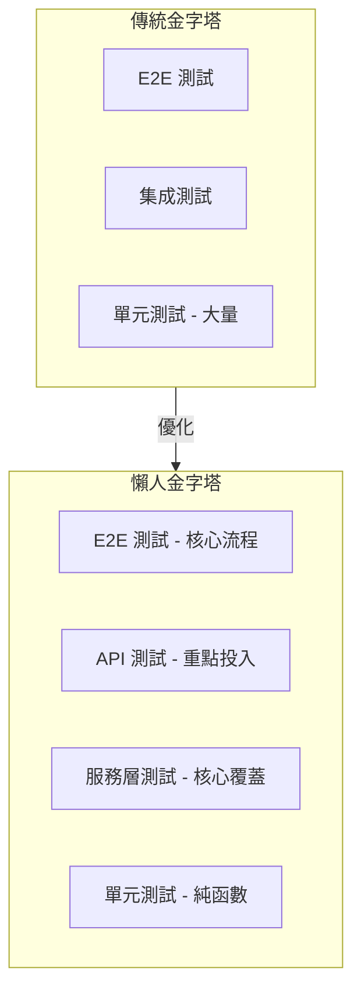

# 9.1 懶人的測試金字塔——優先測服務層與 API

**測試金字塔的精髓不是"寫更多測試"，而是"在正確的層級寫測試"。**

## 單人開發者的測試困境

作爲獨立開發者，你面臨一個現實問題：時間有限，但質量不能妥協。傳統的測試金字塔告訴你要寫大量單元測試，但現實是：

- 業務邏輯快速迭代，單元測試維護成本高
- UI 頻繁變化，E2E 測試脆弱易碎
- 測試覆蓋率數字好看，但 bug 照樣上線

## 懶人金字塔：重新分配測試投資

## 核心策略：聚焦服務層與 API

| 測試類型 | 投入比例 | 覆蓋目標 | ROI |
|---------|---------|---------|-----|
| 單元測試 | 20% | 純函數、工具函數 | 中 |
| 服務層測試 | 40% | 業務邏輯、數據處理 | 高 |
| API 測試 | 30% | 接口契約、邊界條件 | 高 |
| E2E 測試 | 10% | 核心用戶流程 | 中 |

## 爲什麼這樣分配

1. **服務層是業務核心**：所有業務規則都在這裏，測好服務層就等於測好了核心邏輯
2. **API 是對外契約**：API 穩定，前端、移動端、第三方都能放心對接
3. **單元測試聚焦純函數**：有副作用的代碼用集成測試覆蓋更實際
4. **E2E 只保核心流程**：登錄、支付、核心業務流程，其他交給手動測試

## 本節導覽

| 小節 | 內容 |
|------|------|
| 9.1.1 | 測試分層：理解單元、集成、E2E 的邊界 |
| 9.1.2 | 測試優先級：投入產出比分析 |
| 9.1.3 | 服務層測試：業務邏輯驗證重點 |
| 9.1.4 | API 測試：接口契約與邊界條件 |

## 本節小結

懶人金字塔的核心不是偷懶，而是**把有限的精力投入到最有價值的地方**。服務層測試保障業務邏輯正確，API 測試保障接口契約穩定，這兩者加起來就能覆蓋 80% 的常見問題。
