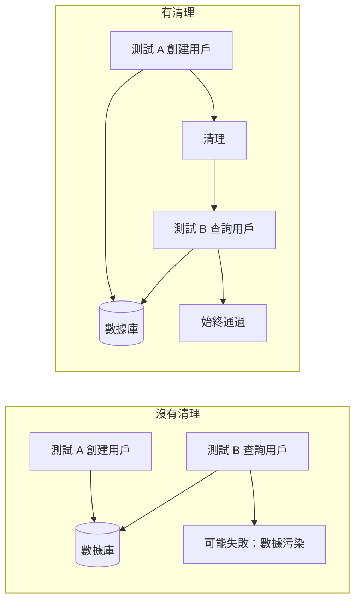
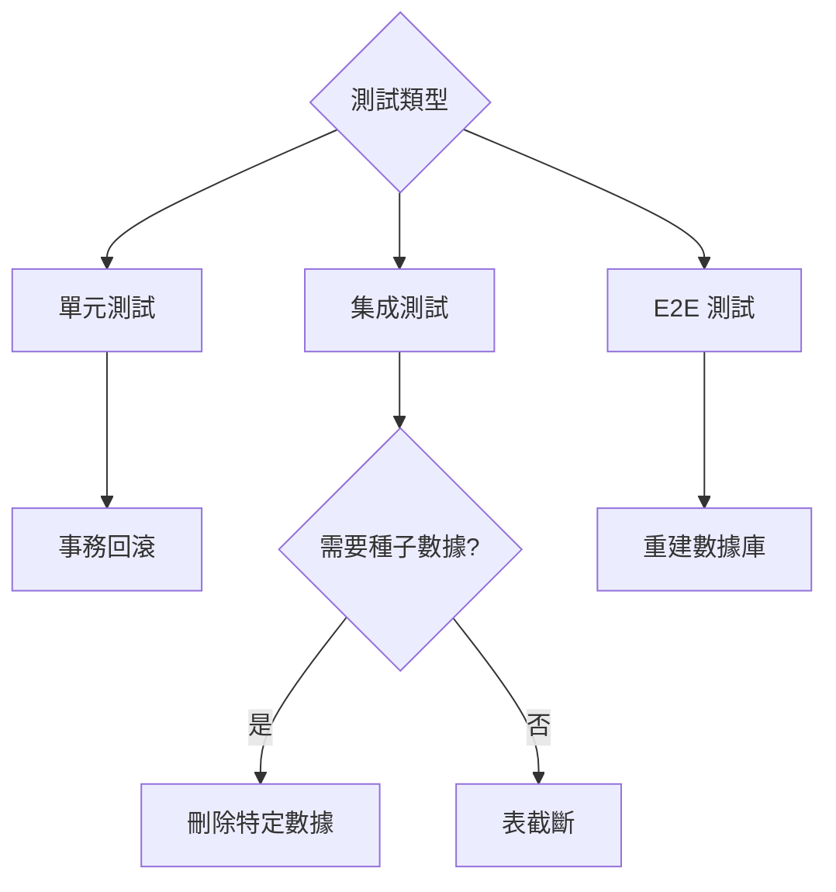

# 9.2.4 每次測試都是全新的——數據清理：測試間的狀態隔離

**測試之間相互影響是測試不穩定的首要原因，數據清理是解決這個問題的關鍵。**

## 爲什麼需要數據清理



## 數據清理策略

| 策略 | 原理 | 適用場景 | 性能 |
|------|------|---------|------|
| 事務回滾 | 每個測試在事務中運行，結束後回滾 | 單元測試、集成測試 | 快 |
| 表截斷 | 清空所有表數據 | 測試套件之間 | 中 |
| 刪除特定數據 | 只刪除測試創建的數據 | 需要保留種子數據 | 中 |
| 重建數據庫 | 每次測試前重建整個數據庫 | 完整 E2E 測試 | 慢 |

## 策略一：事務回滾（推薦）

```typescript
// test/helpers/transaction.ts
import { PrismaClient } from '@prisma/client';

const prisma = new PrismaClient();

export async function withTransaction<T>(
  fn: (tx: PrismaClient) => Promise<T>
): Promise<T> {
  return prisma.$transaction(async (tx) => {
    const result = await fn(tx as unknown as PrismaClient);
    // 拋出錯誤觸發回滾
    throw new RollbackError(result);
  }).catch((error) => {
    if (error instanceof RollbackError) {
      return error.result;
    }
    throw error;
  });
}

class RollbackError<T> extends Error {
  constructor(public result: T) {
    super('Transaction rollback');
  }
}
```

```typescript
// __tests__/user.service.test.ts
import { withTransaction } from '@/test/helpers/transaction';

describe('UserService', () => {
  it('應創建用戶', async () => {
    await withTransaction(async (tx) => {
      const user = await userService.create(tx, {
        email: 'test@example.com',
        name: 'Test User',
      });
      
      expect(user.email).toBe('test@example.com');
      // 事務結束後自動回滾，數據不會保留
    });
  });
});
```

## 策略二：beforeEach 清理

```typescript
// test/helpers/cleanup.ts
import { PrismaClient } from '@prisma/client';

const prisma = new PrismaClient();

// 按依賴順序刪除（先刪除有外鍵引用的表）
const tablesToClean = [
  'OrderItem',
  'Order',
  'Product',
  'User',
];

export async function cleanDatabase() {
  for (const table of tablesToClean) {
    await prisma.$executeRawUnsafe(`TRUNCATE TABLE "${table}" CASCADE`);
  }
}

// 或者使用 deleteMany（更安全但較慢）
export async function cleanDatabaseSafe() {
  await prisma.orderItem.deleteMany();
  await prisma.order.deleteMany();
  await prisma.product.deleteMany();
  await prisma.user.deleteMany();
}
```

```typescript
// __tests__/order.service.test.ts
import { cleanDatabase } from '@/test/helpers/cleanup';

describe('OrderService', () => {
  beforeEach(async () => {
    await cleanDatabase();
  });

  it('應創建訂單', async () => {
    // 每個測試都從乾淨狀態開始
    const user = await createTestUser();
    const order = await orderService.create(user.id, items);
    expect(order.status).toBe('PENDING');
  });
});
```

## 策略三：使用 Prisma 的軟重置

```typescript
// test/helpers/reset.ts
import { execSync } from 'child_process';

export function resetDatabase() {
  execSync('dotenv -e .env.test -- npx prisma migrate reset --force --skip-seed', {
    stdio: 'inherit',
  });
}
```

## Jest 配置最佳實踐

```typescript
// jest.setup.ts
import { PrismaClient } from '@prisma/client';

const prisma = new PrismaClient();

// 全局清理：每個測試文件開始前
beforeAll(async () => {
  await prisma.$connect();
});

// 全局清理：每個測試文件結束後
afterAll(async () => {
  await prisma.$disconnect();
});

// 可選：每個測試前清理
// beforeEach(async () => {
//   await cleanDatabase();
// });
```

```typescript
// jest.config.ts
export default {
  // 串行運行測試，避免併發衝突
  maxWorkers: 1,
  // 或使用 runInBand
  // runInBand: true,
  
  setupFilesAfterEnv: ['<rootDir>/jest.setup.ts'],
};
```

## 處理外鍵約束

```typescript
// test/helpers/cleanup.ts

// 方法一：禁用外鍵檢查（PostgreSQL）
export async function cleanWithDisabledFK() {
  await prisma.$executeRaw`SET session_replication_role = 'replica'`;
  
  await prisma.orderItem.deleteMany();
  await prisma.order.deleteMany();
  await prisma.user.deleteMany();
  
  await prisma.$executeRaw`SET session_replication_role = 'origin'`;
}

// 方法二：使用 CASCADE（PostgreSQL）
export async function truncateWithCascade() {
  const tables = ['User', 'Order', 'OrderItem'];
  
  for (const table of tables) {
    await prisma.$executeRawUnsafe(`TRUNCATE TABLE "${table}" CASCADE`);
  }
}

// 方法三：按正確順序刪除
export async function deleteInOrder() {
  // 先刪除子表（有外鍵的表）
  await prisma.orderItem.deleteMany();
  await prisma.order.deleteMany();
  // 再刪除父表
  await prisma.user.deleteMany();
}
```

## 保留種子數據的清理

```typescript
// test/helpers/cleanup.ts

// 只清理測試創建的數據（通過 ID 前綴識別）
export async function cleanTestData() {
  await prisma.user.deleteMany({
    where: {
      id: { startsWith: 'test-' },
    },
  });
}

// 或使用創建時間
export async function cleanRecentData() {
  const oneMinuteAgo = new Date(Date.now() - 60 * 1000);
  
  await prisma.user.deleteMany({
    where: {
      createdAt: { gte: oneMinuteAgo },
    },
  });
}
```

## 並行測試的數據隔離

```typescript
// test/helpers/isolated-db.ts
import { v4 as uuid } from 'uuid';

export function createIsolatedContext() {
  const testId = uuid();
  
  return {
    testId,
    createUser: (data: Partial<User>) => ({
      id: `test-${testId}-${uuid()}`,
      ...data,
    }),
    cleanup: async () => {
      await prisma.user.deleteMany({
        where: { id: { contains: testId } },
      });
    },
  };
}

// 使用
describe('UserService', () => {
  const ctx = createIsolatedContext();
  
  afterAll(async () => {
    await ctx.cleanup();
  });
  
  it('應創建用戶', async () => {
    const userData = ctx.createUser({ name: 'Test' });
    // ...
  });
});
```

## 清理策略選擇



## 本節小結

數據清理的核心目標是**確保每個測試都在可預測的初始狀態下運行**。事務回滾是性能最好的方案，適合大多數場景；表截斷適合需要完全重置的場景；刪除特定數據適合需要保留種子數據的場景。選擇合適的策略，讓測試既快速又穩定。
